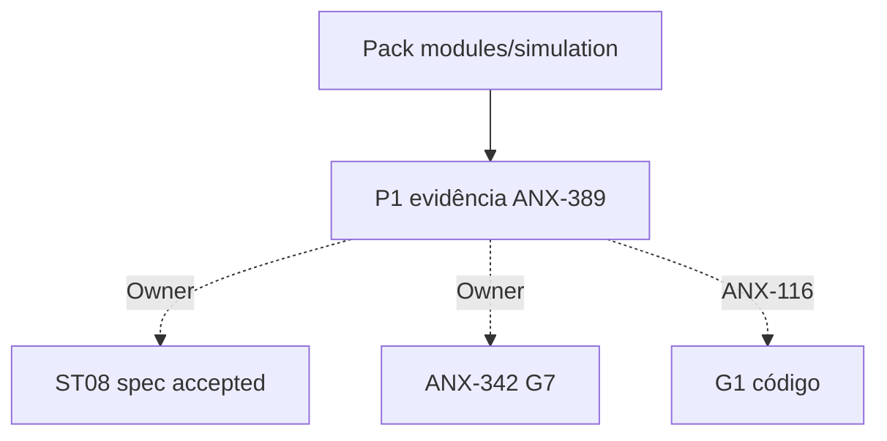

# R10 — Pacote G0 (handoff): `modules/simulation`

**Rodada:** R10  
**Data:** 2026-09-11  
**Issues:** ANX-389 (pack P1) · ANX-115 (debate histórico) · **ANX-116** (impl — **não** executada)  
**Callers:** [R09-dev-plan.md](./R09-dev-plan.md) · [ROUNDS.md](./ROUNDS.md). Sem código de produto.

## G0 — Escopo documental / G1 futuro

### In scope

| Área | Entrega |
| --- | --- |
| Domínio | TwinManifest, ScenarioSnapshot, SimulationRun, SandboxCheckpoint |
| Contratos | `@anxionos/contracts/simulation/*` + eventos v1 R04 |
| Persistência | PostgreSQL `simulation_manifests`, `simulation_runs`, `simulation_snapshots`, `simulation_command_journal` + journal/outbox (ADR0004) |
| Object store | resultRef (hash) |
| Sandbox | SQLite **non-auth** por run |
| Grafo | projector `graph:simulation:v1` isolado |
| API | `/v1/simulation` esboço R04 |
| Testes | G3-SIM-01..05 ; G5-SIM-01..05 |

### Out of scope

| Item | Destino |
| --- | --- |
| Certification / promote | evaluation |
| Order / Fill REAL | execution |
| StrategyVersion verdade | strategies |
| Pasta experiments/ | PC 21 — não criar |
| Neo4j driver | graph |
| D-GOV-010 | risk P06 |
| Spec 001–005 accepted | Owner + checklist (ST08 0/23) |
| ANX-342 G7 | Owner — **não** marcar done |
| G7 código | Owner + ANX-116 |

## Non-goals

- Nenhuma migration ST08 neste pack.
- Twin **não** escreve capital/execution.
- Completed ≠ CERTIFIED.
- Credenciais no sandbox **proibido**.
- Sem pasta `approvals/` / `policies/`.

## Ownership (fecho)

| Superfície | Dono |
| --- | --- |
| Run / Snapshot / Manifest / Checkpoint | **simulation** |
| PG verdade do run | **simulation** |
| SQLite | sandbox only |
| adapter-gateway | **KEEP** |

## Oráculos G3 / G5

| ID | Gate | Esperado |
| --- | --- | --- |
| G3-SIM-01 | G3 | requested → started+completed/failed |
| G3-SIM-02 | G3 | hash mismatch FAILED |
| G3-SIM-03 | G3 | sem certification.* |
| G3-SIM-04 | G3 | boundaries sem execution/infra |
| G3-SIM-05 | G3 | sem order.* |
| G5-SIM-01 | G5 | 403 cross-tenant |
| G5-SIM-02 | G5 | REAL egress bloqueado |
| G5-SIM-03 | G5 | hash mismatch |
| G5-SIM-04 | G5 | ST04 SQLite |
| G5-SIM-05 | G5 | T01 DENY |

## PC-G0 avaliação (debate)

| ID | Status |
| --- | --- |
| PC-G0-01..03 | R1–R10 fat neste diretório |
| PC-G0-04 | spec 004 **draft** |
| PC-G0-05 | R06–R08 sem bloqueio documental |
| PC-G0-06 | ANX-115 contrato P08 |
| PC-G0-07 | Top 5 riscos R07 |
| PC-G0-08 | graph:simulation:v1 isolado |
| PC-G0-09 | RLS application-only defer P09 |
| PC-G0-10 | Impl issue ANX-116 existe — **não** é este slice |

**Veredito P1:** pack G0 **documental completo** (profundidade agents/billing). **Não** autoriza G1. Specs **draft**. Twin não escreve capital/execution.

## Saída R10

G0 debate P1. ANX-389 permanece evidência — não G7 de produto. ANX-342 permanece `todo`. Specs 001–005 **draft**.
