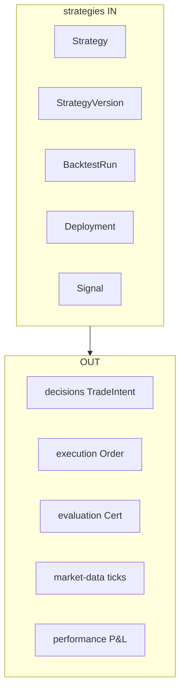

# R02 — Fronteiras: `modules/strategies`

**Componente:** modules/strategies  
**Rodada:** R2 — Scope boundary  
**Pacote SDD:** P06  
**Data:** 2026-09-08  
**Issue debate estrutura:** ANX-42 · debate módulo: **ANX-89** · contrato P06: **ANX-58**

**KEEP adapter-gateway** se já exportado. Pack ANX-389 — não `done`.

## In / Out (R2)

**In:** StrategyVersion, Deployment, Signal, BacktestRun. **Out:** não decisions TradeIntent, não execution, não REAL/live v1.

## Non-goals

Não spec `accepted`. Não ST08 live. Não ANX-389 `done`. Sem promoção automática.

## Ownership

| Superfície | Dono |
| --- | --- |
| Strategy lifecycle | **strategies** |
| adapter-gateway | **KEEP** |
| TradeIntent | **decisions** |

## Objetivo da rodada

Fechar fronteiras **possui / não possui** entre strategies e vizinhos (**market-data**, **agents**, **decisions**, **evaluation**, **simulation**, **execution**, **portfolios**, **risk**, **graph**); ratificar ciclo de vida StrategyVersion vs Deployment vs Signal; proibir promoção automática e paths **REAL/live** em v1.

## Fontes aplicadas

| Fonte | Uso em R2 |
| --- | --- |
| [R01-context.md](./R01-context.md) | Inventário e perguntas abertas |
| spec 003 Strategy Factory | Estados, BacktestRun, TaskRequirementsSnapshot |
| spec 005 connections | inferenceRequirements; binding fixo |
| [market-data/R02-boundaries.md](../market-data/R02-boundaries.md) | Preços asOf — strategies não replica catálogo |
| ANX-58 | Ciclo P06 SIMULATED/PAPER sem REAL |

## Debate R2 (síntese)

**Arquiteto:** strategies é a Strategy Factory (spec 003): versão parametrizada, backtest referenciado, deployment PAPER/SIMULATED, signal com TTL.

**Crítico:** O que não entra? TradeIntent, ordens, certificação, ticks, P&L, pasta products/.

**Security:** T01 em publish/deploy/signal; REAL fail-closed.

## O módulo POSSUI

Strategy, StrategyVersion, BacktestRun, Deployment, Signal.

## O módulo NÃO POSSUI

| Item | Dono correto |
| --- | --- |
| TradeIntent, Decision | decisions |
| Ordens, fills | execution |
| Certification / promoção auto | evaluation |
| Preços, instrument registry | market-data |
| P&L, attribution | performance |
| Product marketplace | PC 10 composto — **sem pasta** |
| Approval / D-GOV-010 | governance / risk P06 |

## Non-goals

- Não criar `products/`, `approvals/`, `policies/`.
- Não emitir `execution.order.*`.
- Não gravar ticks nem P&L.
- LIVE/REAL v1 bloqueado.

## Decisão: possui / não possui

| Dado / comportamento | Dono |
| --- | --- |
| Strategy, StrategyVersion, BacktestRun, Deployment, Signal | **strategies** |
| TradeIntent, Decision | **decisions** |
| Ordens, fills | **execution** |
| Certification, Evaluation | **evaluation** |
| Preços, instrument registry | **market-data** |
| P&L, attribution | **performance** |

## Invariantes R02 (`ST-R02-INV-*`)

| ID | Regra |
| --- | --- |
| ST-R02-INV-01 | StrategyVersion publicada imutável — nova versão para alteração |
| ST-R02-INV-02 | Signal sem `expiresAt` → rejeição |
| ST-R02-INV-03 | Deployment sem TaskRequirementsSnapshot válido → bloqueado |
| ST-R02-INV-04 | strategies não emite `execution.order.*` |
| ST-R02-INV-05 | `executionMode=REAL` rejeitado v1 |
| ST-R02-INV-06 | Promoção exige evaluation ou workflow governance |
| ST-R02-INV-07 | BacktestRun fixa datasetId+revision |

## Critérios de aceite — R02

| # | Critério | Status |
| --- | --- | --- |
| AC-R02-01 | Tabela possui/não possui | ✅ |
| AC-R02-02 | Signal vs TradeIntent | ✅ |
| AC-R02-03 | REAL/live proibido v1 | ✅ |

→ **R03** ([R03-domain-sketch.md](./R03-domain-sketch.md))
