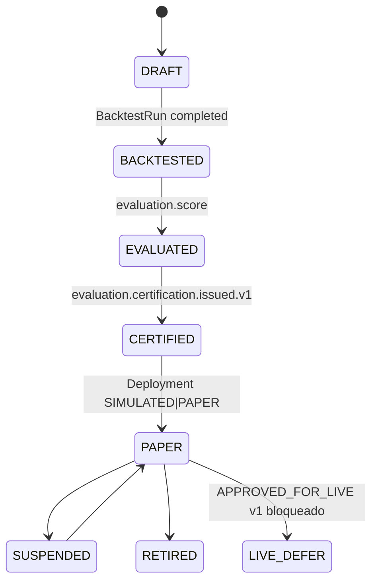

# R03 — Esboço de domínio: `modules/strategies`

**Rodada:** R3 — Domain model  
**Data:** 2026-09-11  
**Issue pack:** ANX-389 · histórico ANX-89  
**Pré-requisito:** [R02-boundaries.md](./R02-boundaries.md) · spec 003 Strategy Factory (**draft**) · [thin debate](../../../../notes/anxionos-thin-strategies-debate.md)  
**Mapeamento ADR0002:** dono físico `backend/modules/strategies/` — **não** criar pasta `products/` (PC 10).  
**Callers:** [R02-boundaries.md](./R02-boundaries.md) (próxima rodada) · [R04-contracts-events.md](./R04-contracts-events.md) · [ROUNDS.md](./ROUNDS.md).

## Debate R3 (síntese atribuída)

**Arquiteto:** Cinco agregados v1 — `Strategy`, `StrategyVersion`, `BacktestRun`, `Deployment`, `Signal`. Promoção CERTIFIED/PAPER não nasce neste módulo.

**Executor:** Ports de persistência + `StrategiesUnitOfWork` (estado + journal + outbox). Runner de backtest é **port** para simulation — não processa ticks aqui.

**Crítico:** Publish ≠ promote. `CERTIFIED` só via `evaluation.certification.issued.v1`. `APPROVED_FOR_LIVE` **defer v1**.

**Security:** Signal sem PII; hashes de parâmetros. Binding snapshot imutável após activate.

## Agregado: Strategy

Container tenant-scoped (org/agency). Não é Product Company “Product” (PC 10).

| Campo | Tipo | Notas |
| --- | --- | --- |
| id | StrategyId | UUID |
| organizationId | UUID | Tenancy lógico — sem FK cross-module |
| agencyId | UUID? | Escopo Agency |
| displayName | string | |
| status | StrategyLifecycle | DRAFT…RETIRED |
| activeVersionId | StrategyVersionId? | |
| revision | number | Optimistic concurrency |

## Agregado: StrategyVersion

`sourceHash`, `rulesHash`, `parametersHash` imutáveis após publish. Status: `draft | published | deprecated`.

Lifecycle spec 003: `DRAFT → BACKTESTED → EVALUATED → CERTIFIED → PAPER → (APPROVED_FOR_LIVE|ACTIVE defer v1) → SUSPENDED|RETIRED`

**ST-R03-01:** mutar published = nova versão + `strategies.version.published.v1`.

## Agregado: BacktestRun

Pin `datasetId`+`revision`, seed, `resultRef` (object store). **ST-R03-02:** não é SimulationRun.

## Agregado: Deployment

`portfolioId` lógico, `TaskRequirementsSnapshot`, `executionMode` **SIMULATED | PAPER**, binding snapshot (IDs **sem secret**). **ST-R03-03:** binding imutável após activated.

## Agregado: Signal

`generatedAt`, **`expiresAt` obrigatório**, `instrumentRefs`, `valueRef`. Não é TradeIntent.

## Ports (domain/)

| Port | Responsabilidade |
| --- | --- |
| StrategyRepository | CRUD + lifecycle |
| StrategyVersionRepository | draft/publish/deprecate |
| BacktestRunRepository | pin + resultRef |
| DeploymentRepository | activate/suspend |
| SignalRepository | emit + expiry |
| StrategiesUnitOfWork | estado + journal + outbox |
| MarketDataPort | getPriceAsOf — não replica catálogo |
| BacktestRunnerPort | job sandbox (simulation) |
| EvaluationReadPort | certification events |
| TraversalEvaluator | T01 grants `strategies.*` |
| AgencyScopePort | organizations |
| AgentBindingLookup | agents — IDs sem secret |

## Comandos application

| Comando | Idempotência | Evento |
| --- | --- | --- |
| RegisterStrategy | (organizationId, displayName) | `strategies.strategy.registered.v1` |
| PublishStrategyVersion | (strategyId, versionNumber) | `strategies.version.published.v1` |
| RequestBacktest | (versionId, datasetPin) | `strategies.backtest.requested.v1` |
| CompleteBacktest | (backtestId, resultRef) | `strategies.backtest.completed.v1` |
| ActivateDeployment | (strategyVersionId, snapshot) | `strategies.deployment.activated.v1` |
| EmitSignal | (deploymentId, instrumentRefs, expiresAt) | `strategies.signal.emitted.v1` |

## Invariantes

| ID | Regra |
| --- | --- |
| ST-R03-INV-SV-01 | hash imutável pós-publish |
| ST-R03-INV-SIG-01 | Signal sem `expiresAt` → rejeição |
| ST-R03-INV-DEP-01 | binding snapshot imutável |
| ST-R03-INV-DEP-02 | `executionMode=REAL` rejeitado v1 |
| ST-R03-INV-UOW | mutação + journal + outbox mesma transação PG |
| ST-R03-INV-PROMOTE | CERTIFIED só após evaluation event |

## Saída R3

Domain sketch v1 aprovado para R4. Spec 003 permanece **draft**. ST08 migrations 0/23.
