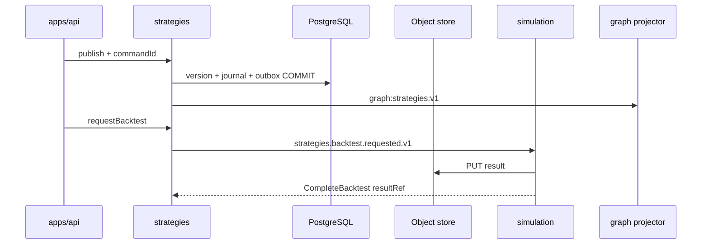

# R05 — Armazenamento: `modules/strategies`

**Rodada:** R5  
**Data:** 2026-09-11  
**Issue pack:** ANX-389 · histórico ANX-89  
**Callers:** [R04-contracts-events.md](./R04-contracts-events.md) · [R06-dependencies.md](./R06-dependencies.md) · [ROUNDS.md](./ROUNDS.md).  
**Engines ADR0004:** PostgreSQL autoritativo; Neo4j só projector; **sem** Timescale neste módulo; **sem** pgvector; SQLite **não** autoritativo.  
**Fonte:** `brain/notes/anxionos-storage-ownership.md` (**draft**; ST08 **0/23**).  
Instrução do Owner: fatten R05–R07 (e thin R) ao padrão governance/agents; spec 001–005 permanecem draft.

## Princípios

| Princípio | Decisão |
| --- | --- |
| Verdade transacional | PostgreSQL `strategies_*` |
| Blobs backtest | Object store `resultRef` — não BYTEA de série |
| Grafo | `graph:strategies:v1` |
| Journal/outbox | `@anxionos/eventing` mesma transação |
| Idempotência | `strategies_command_journal` |
| FK cross-module | **Não** |
| Segredos em eventos | **Proibido** |
| Timescale | **Não** — P&L em performance |

## Tabelas PostgreSQL (alvo G1 — sem migration neste pack)

| Tabela | Propósito |
| --- | --- |
| `strategies_strategies` | Strategy; revision; active_version_id |
| `strategies_versions` | UNIQUE (strategy_id, version_number); hashes; trigger published imutável |
| `strategies_backtest_runs` | dataset pin, seed, result_ref |
| `strategies_deployments` | execution_mode CHECK ('SIMULATED','PAPER'); binding_snapshot imutável |
| `strategies_signals` | expires_at NOT NULL; instrument_refs; value_ref |
| `strategies_command_journal` | command_id PK |

**ST-R05-01:** sem Timescale aqui. **ST-R05-02:** trigger bloqueia UPDATE published. **ST-R05-03:** CHECK impede REAL. **ST-R05-04:** RLS defer P09.

## Neo4j

| Evento | Projeção |
| --- | --- |
| registered | nó Strategy |
| version.published | HAS_VERSION (hashes) |
| deployment.activated | DEPLOYED_ON (id lógico) |
| signal.emitted | EMITS_SIGNAL (expiresAt) — sem ticks |

## Alternativas rejeitadas

Backtest só SQLite; versão só Neo4j; FK portfolios/agents; Timescale de P&L em strategies.

## Saída R5

Modelo v1 para R6. **Nenhuma migration.** ST08 0/23.
