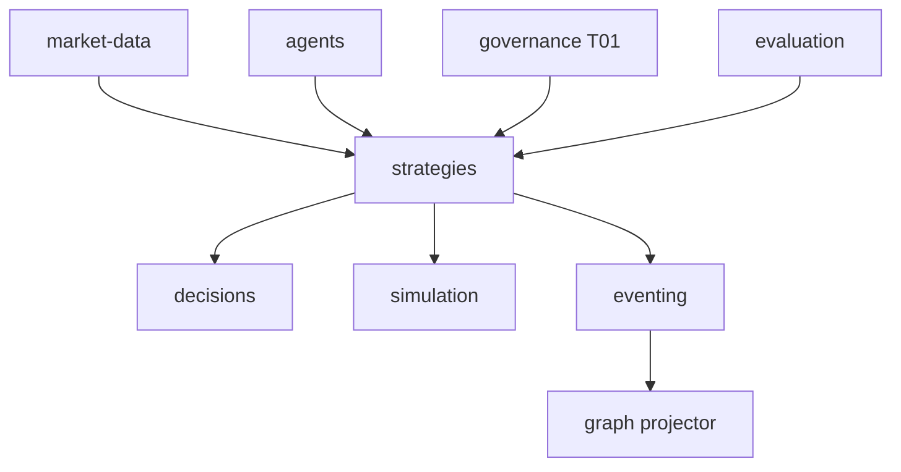

# R06 — Dependências: `modules/strategies`

**Rodada:** R6  
**Data:** 2026-09-11  
**Issue pack:** ANX-389 · histórico ANX-89 · ANX-87 · ANX-82 · ANX-58  
**Callers:** [R05-storage-pg.md](./R05-storage-pg.md) · [R07-risks.md](./R07-risks.md) · [ROUNDS.md](./ROUNDS.md). Sem API runtime neste artefato.

## Decisões-chave

| ID | Decisão |
| --- | --- |
| ST-R06-01 | MarketDataPort fail-closed; **não** replica catálogo |
| ST-R06-02 | AgencyScopePort — sem FK cross-schema |
| ST-R06-03 | T01 pré-publish/deploy/signal; timeout → DENY |
| ST-R06-04 | Graph SDK só leitura — nunca neo4j-driver |
| ST-R06-05 | Journal/outbox mesma transação PG |
| ST-R06-06 | Projector no **graph** `graph:strategies:v1` |
| ST-R06-07 | Não emite `execution.order.*` |
| ST-R06-08 | BacktestRunnerPort → simulation |
| ST-R06-09 | CERTIFIED só evaluation events |
| ST-R06-10 | AgentBindingLookup — IDs sem secret |
| ST-R06-11 | Bootstrap após ANX-88 market-data + agents |

## Upstream

| Módulo | Port | Uso |
| --- | --- | --- |
| identity | PrincipalLookup | actor |
| organizations | AgencyScopePort | tenancy |
| governance | TraversalEvaluator | T01 `strategies.*` |
| graph | GraphContextPort | T04/T05 |
| market-data | MarketDataPort | preços asOf |
| agents | AgentBindingLookup | snapshot |
| evaluation | CertificationConsumer | CERTIFIED |
| connections | via agents | MODEL ids |
| packages/eventing | journal + outbox | |
| packages/contracts | strategies/* | |

## Downstream

| Consumidor | Contrato |
| --- | --- |
| decisions | `strategies.signal.emitted.v1` |
| portfolios | `strategies.deployment.activated.v1` |
| risk | signals + mode |
| simulation | `strategies.backtest.requested.v1` |
| evaluation | version.published / backtest.completed |
| performance | ids/hashes — não P&L |
| graph | `graph:strategies:v1` |
| audit | subscriber |

Não depende de execution, capital, billing, partners. Sem pasta `products/`. D-GOV-010 fica em **risk P06**.

## Imports proibidos

`execution/infrastructure/**`, `decisions/infrastructure/**`, `simulation/infrastructure/**`, `graph/infrastructure/**`, `neo4j-driver`, LLM SDK/secrets em `domain/`.

## Saída R6

Mapa v1 fechado para R7.
