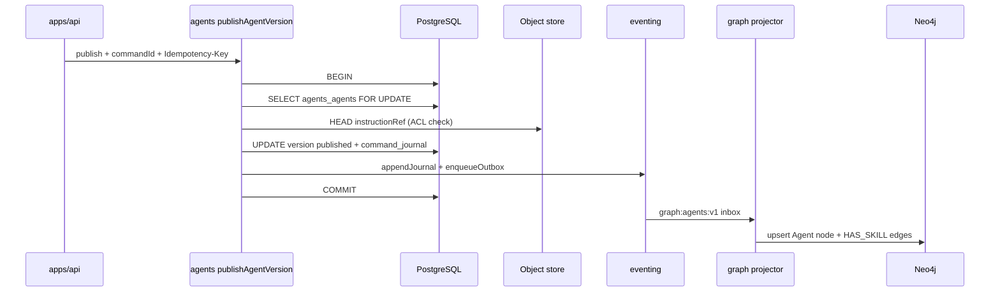

# R05 — Armazenamento: `modules/agents`

**Componente:** modules/agents  
**Rodada:** R5 — PostgreSQL, journal/outbox, projeção Neo4j  
**Pacote SDD:** P04  
**Data:** 2026-09-08  
**Issues:** ANX-42 (debate estrutura) · ANX-82 (R06–R10)  
**Pré-requisito:** [R04-contracts-events.md](./R04-contracts-events.md) · [R03-domain-sketch.md](./R03-domain-sketch.md) · `brain/project-docs/specs/002-agents-knowledge/spec.md`

## Participantes

| Papel | Agente |
| --- | --- |
| Orquestrador | Orquestrador (CTO) |
| Executor | code-architect |
| Crítico | critic-reviewer |
| Code Review | code-reviewer |
| QA | QA |
| Security | security-reviewer |
| Red Team | Red Team (Ryn) |
| Arquiteto | architect |

Roster obrigatório: [DEBATE-ROSTER.md](../../DEBATE-ROSTER.md).

## Objetivo da rodada

Definir o modelo de persistência autoritativo de **agents** após [R04-contracts-events.md](./R04-contracts-events.md): tabelas PostgreSQL (`agents_agents`, `agents_agent_versions`, `agents_skills`, `agents_bindings`, `agents_command_journal`), alinhamento journal/outbox com `packages/eventing`, armazenamento de instruções via `ObjectRef` (não inline), projeção Neo4j pelo consumer `graph:agents:v1` e exclusões SQLite — espelhando [organizations/R05-storage.md](../../modules/organizations/R05-storage.md) e [orchestration/R05-storage-pg.md](../orchestration/R05-storage-pg.md).

## Fontes aplicadas

| Fonte | Uso em R5 |
| --- | --- |
| [R04-contracts-events.md](./R04-contracts-events.md) | EventTypes, idempotência HTTP, ObjectRef |
| [R03-domain-sketch.md](./R03-domain-sketch.md) | Agregados, INV-AGT-01..08 |
| [R06-dependencies.md](./R06-dependencies.md) | AGT-R06-05 bootstrap, graph projector |
| `brain/notes/anxionos-storage-ownership.md` | Matriz agents: PG + Neo4j |
| [graph/R05-cache-projection.md](../graph/R05-cache-projection.md) | Inbox dedup, projeção pós-ack |
| `backend/packages/eventing/` | `domain_journal`, `outbox` |

## Debate R5 (diálogo atribuído)

**Arquiteto:** PostgreSQL confirma cinco tabelas núcleo v1 com prefixo `agents_`. `AgentVersion` imutável após `published` — UPDATE bloqueado por trigger ou check constraint + application guard. Instruções/skills em object store referenciado — não BYTEA de prompt no PG.

**Security:** Colunas `instruction_ref`, `definition_ref` guardam metadados — conteúdo sensível em bucket com ACL tenant. **Proibido** em outbox/journal: prompt, API key, OAuth state, PII não redacted.

**Crítico:** `agents_command_journal` obrigatório para HTTP com `Idempotency-Key` — espelha organizations. Publish natural key `(agentId, versionNumber)` complementa `command_id`.

**Executor:** Transação única publish: `SELECT FOR UPDATE` em `agents_agents` + INSERT version status published + bump `active_version_id` + command_journal + journal + outbox. `ensureAgentsSchema(pool)` após organizations no bootstrap.

**Code Review:** Migration `0000` tabelas + enums; `0001` índices parciais `published` versions e bindings `effective_until IS NULL`.

**QA:** Testes P0 documentais: rollback se outbox falha; idempotência `command_id`; publish duplo retorna replay; DRAINING bloqueado com Runs pendentes (port mock).

**Red Team:** Vetor: SQL injection via `displayName` — mitigação Drizzle parametrizado + Zod max length. Vetor: ler prompt de outro tenant via `instructionRef` — mitigação ACL object store + tenancy no path.

**Síntese Orquestrador:** Modelo de armazenamento v1 fechado; zero código até greenlight; R06 já cobre dependências; R07 riscos.

---

## Princípios de autoridade

| Princípio | Decisão |
| --- | --- |
| Fonte de verdade transacional | PostgreSQL (`agents_*`) |
| Conteúdo de instrução/skill | Object store (S3-compatible) via `ObjectRef` — não PG TEXT |
| Grafo institucional | Neo4j — projeção derivada de eventos `ownerDomain: agents` |
| Journal de eventos | Tabela compartilhada `domain_journal` |
| Outbox | Tabela compartilhada `outbox` — mesma transação que mutação |
| Idempotência HTTP | Tabela dedicada `agents_command_journal` |
| Idempotência domínio publish | `(agent_id, version_number)` quando status já `published` |
| SQLite | **Permitido** apenas cache público opcional (brain/notes) — **não** estado institucional |
| FK cross-module | **Não** — `organization_id`, `principal_id` referências lógicas |
| Segredos em eventos | **Proibido** — ver R04 AGT-R04-02 |

Fluxo de escrita (publish version):

---

## PostgreSQL — enums

Prefixo: `agents_*`.

| Enum Drizzle | Valores | Uso |
| --- | --- | --- |
| `agents_agent_kind` | `AGENCY`, `PLATFORM` | [R03](./R03-domain-sketch.md) |
| `agents_lifecycle_status` | `DRAFT`..`ARCHIVED` | Agent status |
| `agents_version_status` | `draft`, `published`, `deprecated` | AgentVersion |
| `agents_autonomy_level` | `L0`..`L4` | Snapshot — L3/L4 runtime blocked |
| `agents_binding_scope_type` | `AGENCY`, `ORGANIZATION`, `PLATFORM` | AgentBinding |
| `agents_skill_status` | `active`, `deprecated` | Skill catalog |

---

## PostgreSQL — tabela `agents_agents`

| Coluna | Tipo | Notas |
| --- | --- | --- |
| `id` | UUID PK | `agentId` |
| `organization_id` | UUID NOT NULL | Tenancy |
| `agency_id` | UUID NULL | Quando kind AGENCY |
| `kind` | `agents_agent_kind` NOT NULL | Imutável após insert |
| `display_name` | VARCHAR(256) NOT NULL | |
| `status` | `agents_lifecycle_status` NOT NULL | |
| `active_version_id` | UUID NULL FK → `agents_agent_versions` | Set on publish |
| `revision` | INT NOT NULL DEFAULT 0 | Optimistic concurrency |
| `created_at` | TIMESTAMPTZ NOT NULL | |
| `updated_at` | TIMESTAMPTZ NOT NULL | |

Índices: `(organization_id, status)`, `(agency_id)` partial WHERE agency_id IS NOT NULL.

---

## PostgreSQL — tabela `agents_agent_versions`

| Coluna | Tipo | Notas |
| --- | --- | --- |
| `id` | UUID PK | |
| `agent_id` | UUID NOT NULL FK → `agents_agents` | |
| `version_number` | INT NOT NULL | UNIQUE (agent_id, version_number) |
| `status` | `agents_version_status` NOT NULL | |
| `instruction_ref` | JSONB NOT NULL | `ObjectRef` — sem conteúdo inline |
| `skill_refs` | JSONB NOT NULL DEFAULT '[]' | Array de `{skillId, schemaVersion}` |
| `capability_manifest_hash` | VARCHAR(128) NOT NULL | SHA-256 do manifest publicado |
| `model_slots` | JSONB NOT NULL DEFAULT '[]' | Binding IDs only — sem secret |
| `autonomy_level` | `agents_autonomy_level` NOT NULL | |
| `published_at` | TIMESTAMPTZ NULL | Set once |
| `created_at` | TIMESTAMPTZ NOT NULL | |

**Decisão AGT-R05-01:** Trigger `BEFORE UPDATE` rejeita mutação de row `published` exceto transição para `deprecated`.

---

## PostgreSQL — tabela `agents_skills`

| Coluna | Tipo | Notas |
| --- | --- | --- |
| `id` | UUID PK | |
| `organization_id` | UUID NOT NULL | Tenant-scoped catalog |
| `name` | VARCHAR(128) NOT NULL | UNIQUE (organization_id, name) |
| `schema_version` | VARCHAR(32) NOT NULL | |
| `definition_ref` | JSONB NOT NULL | ObjectRef |
| `status` | `agents_skill_status` NOT NULL | |
| `revision` | INT NOT NULL | |
| `created_at` | TIMESTAMPTZ NOT NULL | |

---

## PostgreSQL — tabela `agents_bindings`

| Coluna | Tipo | Notas |
| --- | --- | --- |
| `id` | UUID PK | |
| `agent_id` | UUID NOT NULL | |
| `scope_type` | `agents_binding_scope_type` NOT NULL | |
| `scope_id` | UUID NOT NULL | |
| `reporting_agent_id` | UUID NULL | TREE hierarchy |
| `effective_from` | TIMESTAMPTZ NOT NULL | |
| `effective_until` | TIMESTAMPTZ NULL | |
| `revision` | INT NOT NULL | |

Índice parcial: `(agent_id, scope_type, scope_id)` WHERE `effective_until IS NULL`.

---

## PostgreSQL — tabela `agents_command_journal`

| Coluna | Tipo | Notas |
| --- | --- | --- |
| `command_id` | UUID PK | From `Idempotency-Key` |
| `command_type` | VARCHAR(64) NOT NULL | |
| `response_hash` | VARCHAR(128) NOT NULL | Replay body |
| `created_at` | TIMESTAMPTZ NOT NULL | TTL cleanup job P1 |

Espelha `organizations_command_journal` — ver organizations R05.

---

## Neo4j — projeção (graph module)

Consumer: `graph:agents:v1` (ownerDomain `agents`).

| Evento | Nó / aresta | Propriedades projetadas |
| --- | --- | --- |
| `agents.agent.registered.v1` | `Agent` | `displayName`, `kind`, `status`, `revision` |
| `agents.agent_version.published.v1` | atualiza `Agent` | `activeVersionId`, `capabilityManifestHash`, `autonomyLevel` |
| `agents.skill.registered.v1` | `Skill` | `name`, `schemaVersion` |
| `agents.binding.created.v1` | `REPORTS_TO` / scope edge | sem PII |

**Proibido no grafo:** instruction text, prompts, secrets, model API keys.

---

## Alternativas consideradas

| Alternativa | Decisão |
| --- | --- |
| Prompt em BYTEA PostgreSQL | **Rejeitada** — object store + ref |
| Versionamento só em Neo4j | **Rejeitada** — PG autoritativo |
| SQLite para Agent cache local | **Opcional** read-through — não write path |
| FK para `organizations.agencies` | **Rejeitada** — referência lógica ADR0002 |

---

## Riscos e disposição

| ID | Risco | Sev | Disposição |
| --- | --- | --- | --- |
| R5-01 | Object store ACL misconfiguration | HIGH | Tenant prefix + integration test |
| R5-02 | Manifest hash drift vs PG | MED | Publish recalculates hash atomically |
| R5-03 | Orphan versions draft | LOW | Retention job P2 |

---

## AC checklist R5

| ID | Critério | Status |
| --- | --- | --- |
| AC-R5-01 | Tabelas `agents_*` documentadas | ✅ |
| AC-R5-02 | Journal/outbox transacional | ✅ |
| AC-R5-03 | `agents_command_journal` para HTTP | ✅ |
| AC-R5-04 | Version immutability após publish | ✅ |
| AC-R5-05 | Neo4j projector mapping | ✅ |
| AC-R5-06 | Sem secrets em PG event path | ✅ |

## Saída R5

✅ Armazenamento v1 aprovado; R06 dependências já documentado; R07 riscos na próxima rodada formal.

**Próximo:** [R07-risks.md](./R07-risks.md) — consolidar riscos cross-module agents.
