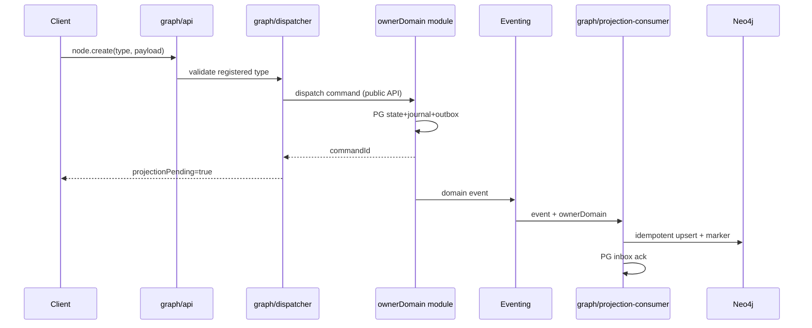

# R02 — Fronteiras: `modules/graph`

**Componente:** modules/graph  
**Rodada:** R2 — Scope boundary  
**Pacote SDD:** P03  
**Data:** 2026-09-07  
**Issue debate estrutura:** ANX-41 · **Issue mapa funcional:** ANX-43  
**Sessão Slack:** [Session E — #module-graph](./SLACK-TRANSCRIPTS.md#session-e--r02-boundaries)

## Objetivo da rodada

Fechar fronteiras **possui / não possui** do Graph Kernel contra **todos** os módulos ADR0002; isolar o adapter Neo4j; definir contrato do dispatcher `node.create/update`; classificar T01–T20 como **kernel puro**, **kernel composto** ou **híbrido registrado**; especificar imports proibidos e consumer `graph:organizations:v1`.

## Fontes aplicadas

| Fonte | Uso em R2 |
| --- | --- |
| [R01-context.md](./R01-context.md) | Inventário e perguntas abertas |
| [graph.md](../../system-capabilities/modules/graph.md) | Affordances humano+agente, T01–T20 sketch |
| `brain/notes/anxionos-backend-structure.md` | Graph Kernel L158–187, regras 1–12, tabela fronteiras L193–210 |
| `brain/notes/anxionos-graph-traversals-v1.md` | Semântica T01–T20, registry, isolamento |
| `brain/notes/anxionos-storage-ownership.md` | PG catálogo/rebuild vs Neo4j projeção |
| [organizations/R06-dependencies.md](../../modules/organizations/R06-dependencies.md) | Consumer `graph:organizations:v1` |
| Session D | CAP-D01..D04, backlog RB-D01 |

## Debate R2 (síntese atribuída)

**Arquiteto:** Graph Kernel é **projetor + query plane + dispatcher mutável** — não dono de capital, grants, tasks, modelos ou journal de domínio (backend-structure L187). Neo4j é projeção operacional reconstruível; PostgreSQL mantém grants, epochs, permits e catálogo Txx.

**Crítico:** "Kernel vs domínio" não pode virar import cruzado de repository. Domínios registram **sub-planos** via interface pública; Kernel compõe pipeline e injeta `visible()` em todo anchor — não só na raiz.

**Security:** Adapter Neo4j exclusivo em `graph/infrastructure/adapters/neo4j/`; agentes e módulos de negócio **nunca** recebem credencial Neo4j (regra 7). Service principals de `projection-consumer` autenticam Neo4j; workers de domínio não.

**Síntese Orquestrador:** RB-D01 **parcialmente resolvido** — split kernel/registrado, isolamento Neo4j e dispatcher fechados; `projectionPending` sync vs async e schemas GraphQuery v1 ficam para R04 (RB-D03).

---

## Decisão: Kernel vs domínio (RB-D01 — parcial ✅)

### Três camadas de responsabilidade

| Camada | Dono | Responsabilidade |
| --- | --- | --- |
| **Registry & envelope** | Graph Kernel | Catálogo T01–T20, `traversalId` → plano, scope injection, budgets, authorization envelope, cache keys com epochs |
| **Sub-planos registrados** | Módulo dono do domínio | Query plan lógico + edge allowlist via **interface pública** exportada em `index.ts` ou `graph/register-*.ts` |
| **Execução Neo4j** | Graph Kernel (adapter privado) | Tradução plano → Cypher parametrizado; **nenhum** módulo físico importa driver Neo4j |

### Classificação T01–T20 (v1 debate)

| Classe | Traversals | Comportamento |
| --- | --- | --- |
| **Kernel puro** | T01, T02, T03, T05, T06, T09, T10, T11, T12, T13, T14, T15, T19 | Plano inteiro em `graph/application/`; domínios só emitem eventos que alimentam projeção |
| **Kernel composto** | T04, T07, T17 | Kernel orquestra pipeline; sub-planos registrados por agents, capital, portfolios, connections, billing |
| **Híbrido registrado** | T08, T16, T18, T20 | Domínio strategies/connections/execution+accounting/partners registra plano + allowlist; Kernel executa com scope/budget |

**Regra:** mesmo traversals híbridos passam pelo **registry único** do Kernel — não há segundo entrypoint Cypher por módulo.

### Composição cross-module (ex.: T07)

```
Kernel T07 pipeline
  ├── CapitalUnderAgentPlan     (registrado por capital)
  ├── CanonicalPositionsPlan    (registrado por portfolios)
  └── Kernel merge + dedup + scope
```

Domínio **nunca** importa repository privado de outro módulo para compor traversal; composição é declarativa no catálogo T07.

---

## O módulo POSSUI (estado autoritativo e operacional)

| Agregado / artefato | Responsabilidade | Storage |
| --- | --- | --- |
| Catálogo T01–T20 | `traversalId`, `queryVersion`, input/output schema refs, permission requirements | PG `graph_traversal_catalog` |
| Registry de sub-planos | Binding módulo → planId → edge allowlist | PG + código registrado no bootstrap |
| Projection inbox state | `eventId`, consumer name, checkpoint, `projectionGeneration` | PG `graph_projection_inbox` |
| Rebuild control | Ordem por `ownerDomain`, cutoff checkpoint, generation alias | PG `graph_rebuild_jobs` |
| Neo4j projection | Nós, arestas, versões bitemporais, marcadores `eventId`/`checkpoint`/`ownerDomain` | Neo4j (adapter privado) |
| Authorization/context traversals | T01–T03, T05, envelope de leitura | Kernel application layer |
| Dispatcher mutável | `node.create/update/archive`, `relation.create/revoke/version` | Roteia comando ao owner — **não** persiste negócio |
| Workers | `projection-consumer`, `rebuild`, `consistency-check` | `graph/workers/` |

### Consumers de projeção (graph possui implementação)

| Consumer | OwnerDomain fonte | Eventos (v1) |
| --- | --- | --- |
| `graph:organizations:v1` | organizations | `organizations.agency.*`, `organizations.membership.*` — [R06](../../modules/organizations/R06-dependencies.md) |
| `graph:identity:v1` | identity | `identity.principal.*` (R04 identity) |
| `graph:governance:v1` | governance | `governance.grant.*` (mínimo T01 F0 — RB-D04) |
| `graph:<owner>:v1` | cada ownerDomain | Eventos versionados com `ownerDomain` no envelope |

Idempotência: `processWithInbox(eventId, consumerName)` — organizations R05/R06.

---

## O módulo NÃO POSSUI

| Item | Dono correto | Notas |
| --- | --- | --- |
| Capital, alocações, reservas | **capital** | T07 lê projeção; mutação via comando capital |
| Grants, mandatos, authorityEpoch, ALLOW/DENY efetivo | **governance** (+ revalidação PG) | T01–T03 **explicam**; grafo stale não é ALLOW |
| Goals, Tasks, Runs, delegação workflow | **orchestration** | T06 lê; mutação via orchestration |
| Agent, AgentVersion, skills | **agents** | T04/T05 contexto; Brain fachada em agents |
| Provider, AIAccount, inferência, usage autoritativo | **connections** | T16/T17; usage record único em connections |
| Orders, fills, reconciliação venue | **execution** | T11/T18 leitura; execution-go protocolo apenas |
| Ledger, taxas, saldos | **accounting** | T18 cases referenciam ownerDomain |
| Decisions, TradeIntent | **decisions** | T10 linhagem read-only via Kernel |
| Journal + outbox de domínios | **cada ownerDomain** | Graph consome eventos; não substitui journal |
| Credencial Neo4j para agentes/consumidores | **proibido** | ADR0002 regra 7; `/v1/graph` ou SDK |
| Cypher arbitrário ou DSL executável | **proibido** | `traversalId` registrado apenas (GK02) |
| Eventos de domínio `graph.*` de rebuild | **audit/operations** | CAP-D04 — status rebuild via audit/operations até R04 |
| Emitir grants ou suspender principal | **governance/identity** | Graph projeta fatos; não comanda donos |
| Secrets em nós, DTO, prompts | **packages/secrets** | Regra 11 — nunca em graph payload |

---

## Fronteira explícita: graph × todos os módulos (matriz resumida)

| Módulo | graph → módulo | módulo → graph | Proibido |
| --- | --- | --- | --- |
| **identity** | Consome `identity.principal.*` | Chama `/v1/graph` read-only se necessário | identity importar Neo4j |
| **organizations** | Consumer `graph:organizations:v1` | Eventos only; sem import síncrono | organizations escrever Neo4j |
| **governance** | Consumer grants; T01–T03 | Explain UI delega T03 ao Kernel | governance duplicar traversal |
| **agents** | T04/T05 downstream | `graph.context.buildForAgent` via API/SDK | agents credencial Neo4j |
| **orchestration** | T06/T13 | Impact antes de ChangeProposal | orchestration mutation via graph node |
| **knowledge** | Graph RAG refs (read) | Sem write direto no grafo | knowledge expandir scope via prompt |
| **connections** | T15/T16/T17; registra T16 plan | Inferência não bypassa T15 | connections adapter Neo4j |
| **capital/portfolios** | Registram sub-planos T07/T09 | Eventos → projeção | cross-import repository |
| **strategies** | Registra T08 plan | Deployment events | strategies Cypher direto |
| **decisions/risk/execution** | T01 handoff, T10/T11 read | risk revalida epoch PG em mutável | ALLOW só do grafo stale |
| **simulation** | T19 snapshot isolado | Diff não aplica domínio real | promote snapshot overwrite |
| **audit** | Lineage via Kernel API | Sem credencial Neo4j | segundo ledger em audit |
| **apps/api** | Monta rotas `/v1/graph/*` | Composition root wiring | regra de negócio na rota |

---

## Isolamento Neo4j adapter

### Localização única

```text
modules/graph/infrastructure/adapters/neo4j/
├── client.ts              # driver singleton, credenciais env/secrets port
├── query-executor.ts      # executa planos parametrizados — sem Cypher string de caller externo
├── projection-writer.ts   # upsert nó/aresta + marcadores
└── indexes/               # constraints/indexes Neo4j versionados
```

### Quem pode importar o adapter

| Origem | Veredito |
| --- | --- |
| `graph/infrastructure/**` | ✅ |
| `graph/application/projections/**` | ✅ via port, não driver direto em domain |
| `graph/workers/**` | ✅ |
| `apps/workers` (composition) | ✅ registra workers; não importa `neo4j/client` |
| **Qualquer outro módulo** | ❌ |
| **apps/api** | ❌ — monta API graph, não driver |
| **Agentes / SDK externo** | ❌ |

### Credenciais

- Neo4j URI/user/password: `packages/secrets` ou env injetado no composition root → adapter graph apenas.
- Service principal `graph-projection-consumer` e `graph-rebuild-worker` autenticam Neo4j.
- Agentes AGENCY/PLATFORM: **zero** credencial Neo4j — CAP-D01, ADR0002 #7.

---

## Dispatcher `node.create` / `node.update` (CAP-D02)

### Contrato v1 (debate — schemas formais em R04)

| Campo entrada | Obrigatório | Semântica |
| --- | --- | --- |
| `nodeType` | ✅ | Tipo registrado no schema graph — GK02 |
| `ownerDomain` | ✅ | Domínio dono do agregado |
| `payload` | ✅ | DTO validado contra schema do owner |
| `expectedRevision` | ✅ em update | Optimistic concurrency |
| `idempotencyKey` | recomendado | Dedup no owner |

| Campo saída | Semântica |
| --- | --- |
| `commandId` | ID do comando despachado ao owner |
| `ownerDomain` | Confirma roteamento |
| `projectionPending` | `true` até evento projetado (ver RB-D01 aberto parcial) |
| `acceptedAt` | Timestamp aceite pelo owner |

### Fluxo



**Invariantes:**

1. Kernel **rejeita** `nodeType`/`edgeType` não registrados — GK02.
2. Kernel **não** persiste estado de negócio em Neo4j no path de comando — só após evento do owner.
3. Falsa `node.update` contornando governance → dispatcher roteia ao owner registrado; edge desconhecida rejeitada.
4. Mutação sensível: caller deve revalidar `authorityEpoch`/`riskEpoch` em PG na mesma transação do efeito (CAP-D03).

### RB-D01 — item ainda aberto (→ R04)

| Pergunta | Status R02 | Próxima rodada |
| --- | --- | --- |
| `projectionPending` sync vs async no envelope HTTP | ⏳ Aberto | R04 — default **async** com poll/`node.get` até checkpoint; sync opt-in admin only |
| GraphQuery v1 schemas por Txx | ⏳ Aberto | R04 RB-D03 |
| Cache T01/T03/T15 cross-pod invalidation | ⏳ Aberto | R05 RB-D02 |

---

## Imports proibidos (cross-module)

| Origem (graph) | Destino | Veredito |
| --- | --- | --- |
| `graph/domain/**` | Elysia, Neo4j driver, NATS, Drizzle, módulos físicos | ❌ regra 1 |
| `graph/domain/**` | `capital/*`, `governance/*`, … repositories | ❌ regra 4 |
| `graph/application/**` | repository privado de outro módulo | ❌ regra 4 |
| `graph/application/**` | `neo4j/driver` direto (fora adapter) | ❌ — usar port |
| **Qualquer módulo** | `graph/infrastructure/adapters/neo4j/**` | ❌ |
| **Qualquer módulo** | tabelas `graph_*` diretamente | ❌ — API/eventos |
| **Agentes** | qualquer path Neo4j | ❌ regra 7 |
| `graph` | escrever tabelas `organizations_*`, `identity_*`, … | ❌ regra 4 |

**Permitido:**

- `graph` → `@anxionos/contracts`, `@anxionos/eventing`, `@anxionos/database`, `@anxionos/observability`, `@anxionos/secrets` (adapter only)
- `graph` → sub-planos via **funções registradas** exportadas por `capital/index.ts`, `strategies/index.ts`, etc. — interfaces tipadas, não infra
- `apps/api` → `@anxionos/graph` (API pública montada em rotas)
- `apps/workers` → registra `graph/workers/*` no composition root
- Domínios → **somente eventos** para graph; leitura via `/v1/graph` quando necessário

---

## Contrato público — `index.ts` (sketch)

### Exportado (planejado P03)

```typescript
// Registry bootstrap (composition root)
export { registerGraphModule, type GraphModuleDeps };

// Traversal dispatch (api layer wraps)
export type { TraversalId, GraphQueryEnvelope, GraphQueryResult };

// Projection consumers registration
export { ORGANIZATIONS_GRAPH_CONSUMER } from "./application/projections/organizations";
export type { GraphProjectionConsumer };

// Sub-plan registration (domains call at bootstrap)
export { registerTraversalSubPlan, type TraversalSubPlan };

// Admin (PLATFORM scope)
export { triggerRebuild, type RebuildJobSpec };
```

### O que **não** exportar

| Proibido | Motivo |
| --- | --- |
| `infrastructure/adapters/neo4j/*` | Isolamento AR04 |
| Cypher strings / query builders brutos | GK02 — traversalId only |
| Repositories Drizzle internos | Consumidores usam API |
| Handlers Elysia | Pertencem a `graph/api/` montados em apps |

---

## Stale projection e autoridade (CAP-D03)

| Contexto | Comportamento |
| --- | --- |
| Leitura UI (Graph Explorer, explain panel) | Pode retornar `stale: true` + `projectionGeneration` atrás do journal head |
| Agente mutável (`order.submit`, etc.) | **Nunca** ALLOW só do grafo — revalida epoch em PG na transação |
| T01 cache | Chave inclui `authorityEpoch`, `riskEpoch`, `intentHash` — invalidação pós-revogação |
| Erros | `FORBIDDEN_ACTION` não revela contagem de objetos privados |

---

## Impacto organizations R10 — `graph:organizations:v1`

| Item organizations | Efeito deste R02 |
| --- | --- |
| PC-G0-08 consumer especificado | ✅ graph **possui** implementação projector em P03 |
| organizations → graph somente eventos | ✅ **Confirmado** — sem import síncrono |
| Subconjunto E003/E008/E009/E016 | ✅ escopo v1 projector organizations |
| organizations G0 sem graph implantado | ✅ PG autoritativo; grafo pode atrasar |

---

## Decisões R02

| ID | Decisão | Status |
| --- | --- | --- |
| **GK-R02-01** | Registry único Kernel; T01–T03 kernel puro; T08/T16/T18/T20 híbridos registrados; composição T04/T07/T17 no Kernel | ✅ Aceito |
| **GK-R02-02** | Neo4j adapter exclusivo em `graph/infrastructure/adapters/neo4j/`; proibido import por qualquer outro módulo ou agente | ✅ Aceito |
| **GK-R02-03** | Dispatcher `node.create/update` roteia por `ownerDomain` registrado; Kernel não persiste negócio; rejeita tipos não registrados | ✅ Aceito |
| **GK-R02-04** | Consumer `graph:organizations:v1` implementado em graph; idempotência `eventId` + consumer name | ✅ Aceito |
| **GK-R02-05** | `projectionPending` default async — contrato HTTP detalhado em R04 | ✅ Aceito (R03) |

---

## Perguntas abertas para R03 (domain sketch)

1. Schema registry: `nodeType`/`edgeType` versionados — arquivo vs PG catálogo?
2. Sub-plan registration: bootstrap estático vs hot-reload em deploy?
3. Nó `Principal` vs `User` no Neo4j — um nó ou `AUTHENTICATES_AS`?
4. Merge semantics quando sub-plano capital e portfolios divergem em revision?
5. Admin rebuild API: PLATFORM only + audit manifest — operations OP01 read-only?

---

## Saída R2

✅ Boundary doc aprovado para debate — R03 domain sketch (schema registry) próximo.

**RB-D01:** parcialmente resolvido (split kernel/registrado, Neo4j isolation, dispatcher routing). Itens `projectionPending` sync/async e GraphQuery schemas → R04.

Próximas dependências: governance grant events mínimos (RB-D04) antes de T01 fixture F0 útil; packages/contracts GraphQuery v1 (RB-D05).
