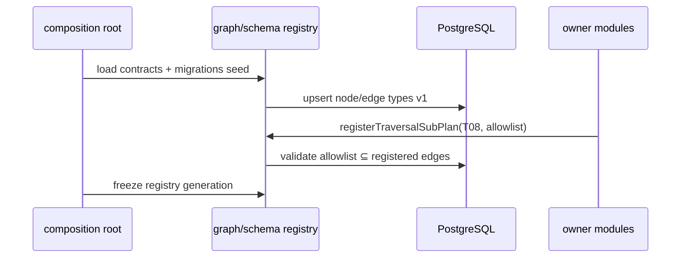

# R03 — Schema registry: `modules/graph`

**Componente:** modules/graph  
**Rodada:** R3 — Domain sketch / schema registry  
**Pacote SDD:** P03  
**Data:** 2026-09-07  
**Issue debate estrutura:** ANX-41 · **Issue mapa funcional:** ANX-43  
**Sessão Slack:** [Session F — R03 schema registry](./SLACK-TRANSCRIPTS.md#session-f--r03-schema-registry)

## Objetivo da rodada

Definir o **registry institucional** de `nodeType`/`edgeType` versionados, `ownerDomain` por tipo, estratégia de versionamento (PG + bootstrap), resolução **Principal vs User** no grafo, e mapeamento **T01–T20** → tipos/arestas allowlist. Fechar **GK-R02-05** (`projectionPending` async default). Responder perguntas abertas de [R02-boundaries.md](./R02-boundaries.md).

## Fontes aplicadas

| Fonte | Uso em R3 |
| --- | --- |
| [R02-boundaries.md](./R02-boundaries.md) | Fronteiras, classificação T01–T20, dispatcher, GK-R02-01..05 |
| [R01-context.md](./R01-context.md) | Inventário e armazenamento |
| `brain/notes/anxionos-graph-schema-v1.md` | Tipos, E001–E124, envelope, invariantes |
| `brain/notes/anxionos-graph-traversals-v1.md` | Planos T01–T20, fixture F0, registry fields |
| `brain/notes/anxionos-backend-structure.md` | `graph/domain/schema/`, regras 1–12 |
| [identity/R03-domain-sketch.md](../identity/R03-domain-sketch.md) | `Principal` PG vs projeção `User` |
| Session E | GK-R02-05 proposto → Session F aceita |

## Debate R3 (síntese atribuída)

**Arquiteto:** Registry **híbrido** — catálogo autoritativo em PG (`graph_schema_registry`), validadores Zod/JSON Schema gerados no bootstrap a partir de definições em `packages/contracts` + seed migrations. Código referencia `schemaVersion` inteiro; mudança semântica exige nova versão e consumer compatível.

**Executor:** `nodeType`/`edgeType` são strings estáveis (`User`, `HAS_MEMBERSHIP`); PK composta `(type, schemaVersion)`. Sub-planos registram **edge allowlist** por `traversalId`, não tipos novos sem ADR. Bootstrap estático no composition root — sem hot-reload em runtime v1.

**Crítico:** `User` no Neo4j ≠ `Principal` em PG — são projeções distintas ligadas por `identitySubject` / evento `identity.principal.registered`. Não fundir nós Principal e User; Membership aponta para `User` projetado (E009).

**Security:** Tipos `SECRET` nunca carregam payload sensível — só `objectRef`/`credentialRefId`. Registry rejeita registro de tipo com campo proibido. `projectionPending` **async** fecha janela TOCTOU — GK-R02-05 aceito.

**Síntese Orquestrador:** R03 aprovado; handoff R04 para GraphQuery envelope HTTP e schemas por Txx.

---

## Arquitetura do registry

### Três camadas

| Camada | Local | Responsabilidade |
| --- | --- | --- |
| **Contrato** | `packages/contracts/graph/schema/` | Definições Zod/TS: `NodeTypeDef`, `EdgeTypeDef`, refs JSON Schema exportáveis |
| **Catálogo PG** | `graph_schema_node_types`, `graph_schema_edge_types`, `graph_traversal_catalog` | Versão ativa, `ownerDomain`, status `active`/`deprecated`/`disabled`, checksum |
| **Runtime** | `graph/domain/schema/registry.ts` | Lookup O(1), rejeição GK02, binding traversal → allowlist |

### Fluxo de bootstrap (deploy)



**Regra:** sub-plano com `edgeType` não registrado → falha no bootstrap (fail-fast), não em query runtime.

### Versionamento

| Aspecto | Regra |
| --- | --- |
| **schemaVersion** | Inteiro ≥1 por `nodeType`/`edgeType`; bump em mudança semântica de payload ou cardinalidade |
| **Compatibilidade** | Aditivo (campo opcional) mantém versão; breaking → v2 + upcaster de evento + migração projector |
| **Deprecação** | Status `deprecated` — leitura OK, `node.create` rejeita; `disabled` bloqueia projeção nova |
| **Fonte de verdade** | PG catálogo para runtime/admin; git/contracts para review e CI diff |

Eventos referenciam `schemaVersion` no envelope de projeção; projector valida payload contra versão do evento, não só latest.

---

## Envelope comum (todos os tipos)

Derivado de `brain/notes/anxionos-graph-schema-v1.md` — aplicado a **todo** nó e aresta projetados.

### NodeKey

`(scopeType, scopeId, type, id)` — `id` UUID opaco; `scopeType` ∈ `PLATFORM | ORGANIZATION | AGENCY | USER | PUBLIC`.

### Campos obrigatórios (nó)

| Campo | Tipo | Notas |
| --- | --- | --- |
| `nodeKey` | NodeKey | Identidade estável |
| `schemaVersion` | int ≥1 | Versão do registry |
| `ownerDomain` | string | Domínio escritor autorizado |
| `status` | enum por tipo | draft/active/archived/… |
| `revision` | int ≥1 | Optimistic concurrency |
| `createdAt`, `recordedAt` | timestamp UTC | Bitemporal |
| `classification` | PUBLIC…SECRET | Propaga em derivação |
| `provenanceEventId` | eventId | Último evento que materializou |

Tipos `Versioned` adicionam `versionId`, `effectiveFrom`/`effectiveUntil`, `recordedFrom`/`recordedUntil`.

### Campos obrigatórios (aresta)

| Campo | Tipo | Notas |
| --- | --- | --- |
| `edgeId`, `edgeType` | string | `edgeType` registrado |
| `fromKey`, `toKey` | NodeKey | Endpoints tipados pela assinatura |
| `schemaVersion`, `revision` | int | Par com catálogo |
| `validFrom`/`validUntil`, `recordedFrom`/`recordedUntil` | timestamp | Semiaberto [from, until) |
| `eventId`, `actorPrincipalId`, `reasonCode` | | Auditoria |
| `publishedAccessGrantId` | UUID? | Obrigatório se cruza scopes privados |

---

## Resolução: Principal vs User (pergunta R02 #3)

| Conceito | Store | Tipo registry | Ligação |
| --- | --- | --- | --- |
| **Principal** | PG `identity` | *não* é `nodeType` no grafo v1 | `principalId` institucional |
| **User** | Neo4j projeção | `nodeType: User` | `ownerDomain: identity` |
| **Membership** | Neo4j | `nodeType: Membership` | E008/E009: `Membership → PRINCIPAL → User` |

**Decisão GK-R03-02:** Um nó `User` por `principalId` projetado; campo `identitySubject` = `principalId`. Autenticação BA (`authUserId`) **não** entra no grafo. Relação futura `AUTHENTICATES_AS` reservada para service principals (P02+) — fora v1.

---

## Registry de nodeType (v1 — por ownerDomain)

Escritor = domínio que emite evento de mutação; Graph Kernel **projeta** e **valida** no projector.

### Top 5 node types v1 (centralidade operacional)

| Rank | nodeType | ownerDomain | Papel no grafo |
| ---: | --- | --- | --- |
| 1 | **User** | identity | Ator humano projetado; anchor T01/T03/T04 |
| 2 | **Agency** | organizations | Escopo tenant; organograma, T06/T07/T09 |
| 3 | **AuthorityGrant** | governance | Autoridade ALLOW/DENY; T01–T03 kernel |
| 4 | **Agent** | agents | Agentes AGENCY/PLATFORM; T04/T05/T13 |
| 5 | **Portfolio** | portfolios | Exposição e NAV; T07/T09/T18 |

### Catálogo completo v1 (agrupado)

| ownerDomain | nodeTypes (v1) | schemaVersion inicial |
| --- | --- | ---: |
| **identity** | Platform, Organization, Agency, User, Department, Team, Membership, CompanyBlueprintVersion, OnboardingRun | 1 |
| **governance** | Role, Capability, AuthorityGrant, Delegation, PolicyVersion, MandateVersion, Approval, RiskCheck | 1 |
| **agents** | Agent, AgentVersion, Runtime, SkillVersion, Goal, Task, Run, Session, ToolInvocation | 1 |
| **knowledge** | Document, DocumentVersion, Evidence, Observation, Memory, KnowledgeClaim, DatasetVersion, KnowledgeCollection, EmbeddingSpace, ContextManifest | 1 |
| **market-data** | MarketDomain, Venue, Market, Asset, Instrument, MarketEvent, CorrelationObservation | 1 |
| **capital** | CapitalAccount, CapitalAllocation | 1 |
| **portfolios** | Portfolio, Position | 1 |
| **accounting** | LedgerEntry | 1 |
| **strategies** | Strategy, StrategyVersion, Signal, Deployment, BacktestRun, Certification | 1 |
| **decisions** | Decision, TradeIntent | 1 |
| **execution** | ExecutionEngine, Order, SubmissionAttempt, ExecutionReport, Fill, ReconciliationCase | 1 |
| **performance** | Outcome, PerformanceAttribution | 1 |
| **evaluation** | Evaluation, ReputationSnapshot, ChangeProposal, GraphSnapshot, SimulationRun | 1 |
| **operations** | Incident, DomainEventRef, AuditEvent, DataRetentionPolicy, ExportJob | 1 |
| **billing** | Subscription, Invoice | 1 |
| **partners** | Partner, Campaign, Referral, Commission, Payout | 1 |
| **connections** | Provider, AIProviderAccount, ProviderSubscription, Connection, Endpoint, CredentialRef, ConnectionPool, OwnerProviderPool, Model, ModelVersion, ModelReference, ModelGroupAssignment, ContextProfileVersion, ModelCapabilityEvidence, TaskSuitabilityProfileVersion, CatalogRelease, ModelOffering, OfferingAccessGrant, AgentModelBinding, TaskRequirementsSnapshot, TaskRoutingPolicyVersion, RoutingPolicyVersion, InferenceProfileVersion, ParameterSchemaVersion, EffectiveInferenceConfig, InferenceRequest, RoutingDecision, InferenceAttempt, UsageRecord | 1 |

**Nota:** `Agency` aparece em identity schema doc e organizations events — **ownerDomain de escrita** para mutação de negócio é `organizations`; identity projeta Platform/Organization/User. Projector `graph:organizations:v1` materializa Agency; `graph:identity:v1` materializa User/Platform. Conflito evitado por event ownership único por agregado (GK-R03-03).

---

## Registry de edgeType (v1 — assinaturas)

119 nomes de relação, 124 assinaturas tipadas (E001–E124). Cada entrada no PG:

| Campo catálogo | Exemplo |
| --- | --- |
| `edgeTypeId` | `E017` |
| `edgeType` | `TO_PRINCIPAL` |
| `fromNodeTypes` | `AuthorityGrant` |
| `toNodeTypes` | `User`, `Agent` |
| `cardinality` | `N/1` |
| `writerDomain` | `governance` |
| `schemaVersion` | `1` |
| `temporal` | `true` |
| `crossScopePolicy` | `grant_required` |

Assinaturas completas: `brain/notes/anxionos-graph-schema-v1.md#catálogo-de-relações`. Kernel não persiste aresta que viola assinatura ou vigência.

### Edge types críticos v1 (amostra)

| edgeType | from → to | writerDomain | Traversals principais |
| --- | --- | --- | --- |
| HAS_MEMBERSHIP | Agency → Membership | organizations | T05, neighbors |
| PRINCIPAL | Membership → User | organizations | T01 scope |
| TO_PRINCIPAL | AuthorityGrant → User/Agent | governance | T01–T03 |
| GRANTS_CAPABILITY | AuthorityGrant → Capability | governance | T01–T03 |
| MANAGED_BY | Portfolio → Agent | portfolios | T07 |
| HAS_DEPLOYMENT | Portfolio → Deployment | portfolios | T07, T08 |
| MATERIALIZES_ORDER | TradeIntent → Order | execution | T11 |
| SERVED_VIA | ModelOffering → Connection | connections | T14, T15 |
| HAS_ROUTING_DECISION | InferenceRequest → RoutingDecision | connections | T16 |

---

## Mapeamento T01–T20 → registry

| ID | Classe R02 | nodeTypes anchor | edgeTypes allowlist (principal) | Sub-plano registrado |
| --- | --- | --- | --- | --- |
| **T01** | Kernel puro | TradeIntent, Portfolio, CapitalAccount, User, Agent | TO_PRINCIPAL, GRANTS_CAPABILITY, ON_RESOURCE, DERIVES_GRANT, CONSTRAINED_BY, FOR_INTENT, CHECKED_BY | — |
| **T02** | Kernel puro | AuthorityGrant, PolicyVersion, MandateVersion | TO_PRINCIPAL, GRANTS_CAPABILITY, CONSTRAINED_BY | — |
| **T03** | Kernel puro | (mesmo T01) | (mesmo T01) | — |
| **T04** | Kernel composto | Agent, Capability, Task | HAS_AGENT, HAS_CAPABILITY, ASSIGNED_TO | agents: `AgentDiscoveryPlan` |
| **T05** | Kernel puro | Agent, Task, Portfolio, Memory, Evidence, ContextManifest | PURSUES_GOAL, ADVANCES_GOAL, HAS_MEMORY, INCLUDES_EVIDENCE, MANAGED_BY | — |
| **T06** | Kernel puro | Goal, Task | HAS_SUBGOAL, ADVANCES_GOAL, DEPENDS_ON_TASK | — |
| **T07** | Kernel composto | Agent, Portfolio, CapitalAccount, Position, Deployment | MANAGED_BY, EXECUTED_BY_AGENT, HAS_DEPLOYMENT, FROM_CAPITAL_ACCOUNT, TO_PORTFOLIO, FILLED_AS→… | capital: `CapitalUnderAgentPlan`; portfolios: `CanonicalPositionsPlan` |
| **T08** | Híbrido | Strategy, StrategyVersion, Deployment, Order | HAS_DEPLOYMENT, USES_STRATEGY_VERSION, EXECUTED_BY_AGENT, MATERIALIZES_ORDER | strategies: `StrategyDeploymentPlan` |
| **T09** | Kernel puro | Portfolio, Position, Instrument, Asset | ON_INSTRUMENT, REPRESENTS_ASSET, HAS_DEPLOYMENT | — |
| **T10** | Kernel puro | Decision, Evidence, ContextManifest, InferenceRequest | MADE_BY, BASED_ON, USES_CONTEXT, USES_INFERENCE, USES_STRATEGY_VERSION | — |
| **T11** | Kernel puro | Fill, Order, TradeIntent, Approval, RiskCheck | FILLED_AS, MATERIALIZES_ORDER, CHECKED_BY, FOR_INTENT, PROPOSES_INTENT | — |
| **T12** | Kernel puro | Outcome, PerformanceAttribution, Fill | ATTRIBUTES_OUTCOME, CONTRIBUTION_FROM | — |
| **T13** | Kernel puro | Agent, StrategyVersion, Task, Order, Portfolio | ASSIGNED_TO, HAS_DEPLOYMENT, PURSUES_GOAL, (impact edges tipados) | — |
| **T14** | Kernel puro | Connection, ModelOffering, AgentModelBinding, InferenceRequest | SERVED_VIA, HAS_MODEL_BINDING, HAS_ROUTING_DECISION | — |
| **T15** | Kernel puro | AgentModelBinding, ModelOffering, OfferingAccessGrant, Connection | HAS_MODEL_BINDING, SELECTS_MODEL, PERMITS_OFFERING, SERVED_VIA | — |
| **T16** | Híbrido | InferenceRequest, RoutingDecision, InferenceAttempt | HAS_ROUTING_DECISION, HAS_INFERENCE_ATTEMPT, ATTEMPTED_VIA | connections: `InferenceTracePlan` |
| **T17** | Kernel composto | UsageRecord, InferenceAttempt, Task, Agent | GENERATED_USAGE, HAS_INFERENCE_ATTEMPT, (task/agent edges) | billing ref read-only |
| **T18** | Híbrido | ReconciliationCase, Order, Fill, LedgerEntry | RECONCILES_RESOURCE, POSTS_LEDGER | execution + accounting: `ReconciliationPlan` |
| **T19** | Kernel puro | GraphSnapshot, ChangeProposal, AuthorityGrant | USES_SNAPSHOT, TESTS_CHANGE, CHANGES_RESOURCE | simulation snapshot isolado |
| **T20** | Híbrido | Referral, Commission, Payout, Invoice | ATTRIBUTED_TO, EARNED_FROM, SETTLES_COMMISSION | partners: `CommercialAttributionPlan` |

Cada linha em `graph_traversal_catalog` referencia: `inputSchemaRef`, `outputSchemaRef`, `edgeAllowlist[]`, `maxDepth`, `maxVisited`, `cacheable`, `permissionRequirements[]`.

---

## Dispatcher e projectionPending (GK-R02-05 fechado)

| Aspecto | Decisão v1 |
| --- | --- |
| **Default HTTP** | `projectionPending: true` na resposta de `node.create/update/archive` e `relation.*` |
| **Semântica** | Cliente **não** assume nó visível em Neo4j até evento projetado |
| **Poll** | `node.get(id, { minCheckpoint, minProjectionGeneration })` ou subscription futura |
| **Sync opt-in** | Header `X-Graph-Wait-Projection: true` + timeout curto — **PLATFORM/admin only** |
| **Erro** | Timeout sync → `PROJECTION_TIMEOUT` + `commandId` para reconciliação |

Detalhes de envelope GraphQuery → R04 (RB-D03).

---

## Sub-plan registration (pergunta R02 #2)

| Aspecto | Decisão |
| --- | --- |
| Mecanismo | `registerTraversalSubPlan({ traversalId, planId, edgeAllowlist, execute })` no bootstrap |
| Hot-reload | ❌ v1 — redeploy para alterar allowlist |
| Validação | Allowlist ⊆ `graph_schema_edge_types` ativos |
| Merge T07 | Kernel dedup por `NodeKey`; conflito de revision → `MERGE_CONFLICT` (R04) |

---

## Admin rebuild (pergunta R02 #5)

| Aspecto | Decisão |
| --- | --- |
| Quem | `PLATFORM` scope apenas |
| operations OP01 | Read-only lag/consistency dashboard — sem trigger rebuild |
| Audit | Manifest em audit/operations com `rebuildJobId`, cutoff, generation |

---

## Tabelas PG (sketch)

```sql
-- graph_schema_node_types
(node_type, schema_version, owner_domain, status, payload_schema_ref, checksum, activated_at)

-- graph_schema_edge_types  
(edge_type_id, edge_type, schema_version, from_node_types, to_node_types,
 writer_domain, cardinality, temporal, cross_scope_policy, status)

-- graph_traversal_catalog (existente R02, estendido)
(traversal_id, query_version, class, edge_allowlist, input_schema_ref,
 output_schema_ref, max_depth, max_visited, cacheable, fixture_version)
```

---

## Decisões R03

| ID | Decisão | Status |
| --- | --- | --- |
| **GK-R03-01** | Registry híbrido: contracts + PG catálogo; validação GK02 em runtime; bootstrap fail-fast | ✅ Aceito |
| **GK-R03-02** | `User` projetado no grafo; `Principal` só PG identity; E009 Membership→User | ✅ Aceito |
| **GK-R03-03** | Um escritor por agregado via `ownerDomain` no evento; Agency escrita por organizations | ✅ Aceito |
| **GK-R03-04** | T01–T20 mapeados a edge allowlist; híbridos registram sub-plano no bootstrap estático | ✅ Aceito |
| **GK-R02-05** | `projectionPending` **async default**; sync wait admin-only | ✅ Aceito (fechado em R03) |

---

## Perguntas abertas para R04

1. GraphQuery v1: schemas Zod exportados por Txx em `packages/contracts` — naming e versionamento de pacote.
2. `node.get` poll contract: query params `minCheckpoint` vs etag.
3. Merge conflict T07: retry policy e mensagem ao cliente.
4. `MERGE_CONFLICT` e `PROJECTION_TIMEOUT` — códigos HTTP e corpo estável.
5. RB-D04: eventos governance grant mínimos para fixture F0 T01.

---

## Saída R3

✅ Schema registry debate aprovado — R04 contracts/events próximo.

**Dependências:** packages/contracts graph schema seed; RB-D04 governance events; ANX-32 scaffold P03.
