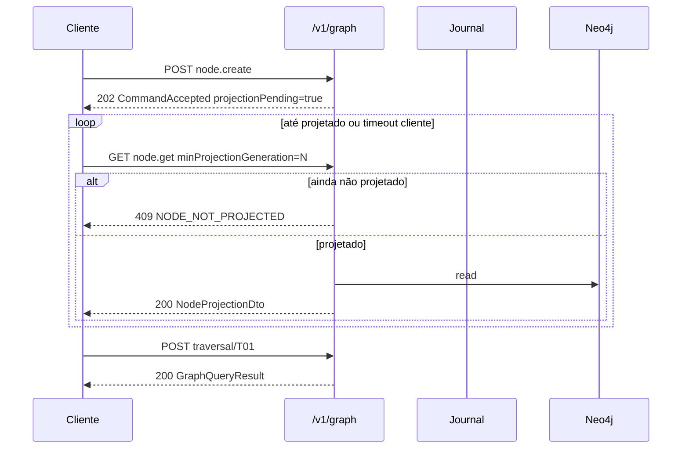

# R04 — Contratos GraphQuery v1 e HTTP: `modules/graph`

**Componente:** modules/graph  
**Rodada:** R4 — Contratos, envelope HTTP e poll  
**Pacote SDD:** P03  
**Data:** 2026-09-07  
**Issue debate estrutura:** ANX-41 · **Issue mapa funcional:** ANX-43  
**Sessão Slack:** [Session G — R04 GraphQuery contracts](./SLACK-TRANSCRIPTS.md#session-g--r04-graphquery-contracts)

## Objetivo da rodada

Fechar **GraphQuery v1** em `@anxionos/contracts`: envelope comum de leitura/traversal, contrato de **poll** pós-comando (`projectionPending`), códigos HTTP estáveis (`PROJECTION_TIMEOUT`, `NODE_NOT_PROJECTED`, `MERGE_CONFLICT`) e esboço de schemas Zod por **T01–T20**. Resolver perguntas abertas de [R03-schema-registry.md](./R03-schema-registry.md) e fechar **RB-D03** (parcial desde R03).

## Fontes aplicadas

| Fonte | Uso em R4 |
| --- | --- |
| [R03-schema-registry.md](./R03-schema-registry.md) | GK-R02-05 async, registry, T01–T20 allowlist |
| [R02-boundaries.md](./R02-boundaries.md) | Dispatcher, exports `GraphQueryEnvelope`, RB-D01 |
| `brain/notes/anxionos-graph-traversals-v1.md` | Semântica comum, saídas, fixture F0 |
| `brain/notes/anxionos-graph-schema-v1.md` | NodeKey, envelope nó/aresta |
| [identity/R04-contracts-events.md](../identity/R04-contracts-events.md) | Padrão `details.code` + HTTP |

## Debate R4 (síntese atribuída)

**Executor:** Pacote `@anxionos/contracts/graph/` com `envelope.ts`, `errors.ts`, `commands.ts`, `queries.ts`, `traversals/T01.ts`…`T20.ts`. `queryVersion: 1` fixo por traversalId em v1; bump semântico → `queryVersion: 2` no catálogo PG.

**Code Review:** Envelope de leitura separado do envelope de comando. Poll usa `minProjectionGeneration` (primário) + `If-None-Match` opcional com etag `W/"pg:{checkpoint}:neo:{projectionGeneration}"`. Sem `minCheckpoint` sozinho — checkpoint sozinho não garante Neo4j.

**Arquiteto:** GraphQuery é **read plane** — nunca muta. Mutations passam por dispatcher (`node.create` etc.) com resposta `CommandAccepted`. T07 merge: cliente recebe `MERGE_CONFLICT` com `conflicts[]` e retry com `If-Match: revision`.

**Crítico:** `NODE_NOT_PROJECTED` não é 404 genérico — distingue "nó nunca existiu" de "comando aceito, projeção pendente". T01 após `node.create` sem poll deve falhar fechado, não DENY silencioso que pareça revogação.

**Security:** Sync wait `X-Graph-Wait-Projection` só PLATFORM + timeout ≤5s default. Corpo de erro nunca inclui payload sensível de sub-plano. `MERGE_CONFLICT` expõe `commandId` e `nodeKey`, não conteúdo de posição.

**Síntese Orquestrador:** RB-D03 fechado para v1 documental; implementação ANX-32 segue estes contratos.

---

## Convenções transversais

| Aspecto | Decisão |
| --- | --- |
| Prefixo HTTP | `/v1/graph` |
| `schemaVersion` contracts | `0.1.0` (herda `packages/contracts`) |
| `queryVersion` | Inteiro por `traversalId`; v1 inicial para T01–T20 |
| Content-Type | `application/json` |
| Correlação | Header `X-Request-Id` ecoado em `meta.requestId` |
| Idempotência leitura | GET safe; POST traversal com mesmo `clientQueryId` → cache 24h opcional |
| Erros | Corpo RFC 7807-like: `{ error: { code, message, details } }` |

### Códigos de domínio (`error.code`)

| Código | HTTP | Quando |
| --- | --- | --- |
| `NODE_NOT_FOUND` | 404 | `nodeKey` inexistente após projeção estável |
| `NODE_NOT_PROJECTED` | 409 | Comando aceito; `projectionGeneration` < `minProjectionGeneration` solicitado |
| `PROJECTION_TIMEOUT` | 504 | Sync wait expirou antes do marker Neo4j |
| `MERGE_CONFLICT` | 409 | Sub-planos T07 (ou híbridos) divergem em `revision` para mesmo `NodeKey` |
| `TRAVERSAL_NOT_FOUND` | 404 | `traversalId` não registrado no catálogo |
| `TRAVERSAL_INPUT_INVALID` | 422 | Payload não passa schema Zod do Txx |
| `FORBIDDEN_SCOPE` | 403 | Principal sem visibilidade no scope injetado |
| `QUERY_LIMIT` | 200 | Budget excedido — corpo com `complete: false` (não erro HTTP) |
| `CURSOR_EXPIRED` | 410 | Paginação T09+ com cursor inválido |
| `STALE_BASELINE` | 409 | T19 apply com checkpoint desatualizado |
| `GRAPH_UNAVAILABLE` | 503 | Neo4j/PG catálogo indisponível |

**Nota:** `QUERY_LIMIT` retorna HTTP 200 com `complete: false` — traversal de exploração, não falha de infra.

---

## `packages/contracts` — layout proposto

```text
packages/contracts/src/graph/
├── types.ts              # NodeKey, ScopeContext, TemporalContext, branded IDs
├── envelope.ts           # GraphQueryEnvelope, GraphQueryResult, CommandAccepted
├── errors.ts             # graphErrorCodeSchema, error body helpers
├── commands.ts           # node.create/update, relation.* input schemas
├── queries.ts            # node.get, nodes.batchGet, poll params
├── traversals/
│   ├── index.ts          # traversalId union + registry refs
│   ├── T01.ts … T20.ts   # inputSchema + outputSchema por traversal
│   └── common.ts         # shared output fields (checkpoint, cursor, …)
└── index.ts
```

**Regra RB-D05:** `packages/contracts` **não** importa `modules/*`. Graph module importa contracts + implementa executors.

---

## Tipos compartilhados (`types.ts`)

```typescript
import { z } from "zod";

export const nodeKeySchema = z.object({
  scopeType: z.enum(["PLATFORM", "ORGANIZATION", "AGENCY", "USER", "PUBLIC"]),
  scopeId: z.string().uuid(),
  type: z.string().min(1).max(64), // nodeType registrado
  id: z.string().uuid(),
});

export const scopeContextSchema = z.object({
  principalId: z.string().uuid(),
  actingScope: z.object({
    scopeType: z.enum(["PLATFORM", "ORGANIZATION", "AGENCY", "USER"]),
    scopeId: z.string().uuid(),
  }),
});

export const temporalContextSchema = z.object({
  validAt: z.string().datetime(), // as-of lógico
  knownAt: z.string().datetime().optional(), // bitemporal T02
});

export const freshnessSchema = z.object({
  minProjectionGeneration: z.number().int().nonnegative().optional(),
  acceptStale: z.boolean().default(false), // UI badge; mutável deve ser false
});
```

---

## Envelope de leitura (`envelope.ts`)

### Request — `GraphQueryEnvelope`

Usado por `POST /v1/graph/traversal/{traversalId}` e variantes context/authority.

```typescript
export const graphQueryEnvelopeSchema = z.object({
  clientQueryId: z.string().uuid().optional(),
  scope: scopeContextSchema,
  temporal: temporalContextSchema,
  freshness: freshnessSchema.optional(),
  params: z.record(z.unknown()), // validado pelo schema do Txx específico
});

export type GraphQueryEnvelope = z.infer<typeof graphQueryEnvelopeSchema>;
```

### Response — `GraphQueryResult<T>`

```typescript
export const graphQueryMetaSchema = z.object({
  queryId: z.string().uuid(),
  traversalId: z.string(), // ex. "T01"
  queryVersion: z.number().int().positive(),
  requestId: z.string().optional(),
  validAt: z.string().datetime(),
  knownAt: z.string().datetime().optional(),
  projectionGeneration: z.number().int().nonnegative(),
  checkpoint: z.string(), // journal head opaque token
  complete: z.boolean(),
  reasons: z.array(z.string()).optional(),
  cursor: z.string().optional(),
  stale: z.boolean().optional(), // projectionGeneration < journal head
});

export const graphQueryResultSchema = z.object({
  meta: graphQueryMetaSchema,
  data: z.unknown(), // substituído por outputSchema do Txx em compile-time
});
```

Campos comuns derivados de `brain/notes/anxionos-graph-traversals-v1.md`.

---

## Comandos mutáveis (`commands.ts`)

### Resposta padrão — `CommandAccepted` (GK-R02-05)

Todas as rotas `node.create`, `node.update`, `node.archive`, `relation.create`, `relation.revoke`, `relation.version`:

```typescript
export const commandAcceptedSchema = z.object({
  commandId: z.string().uuid(),
  ownerDomain: z.string(),
  projectionPending: z.literal(true), // default v1 — sync é exceção
  acceptedAt: z.string().datetime(),
  nodeKey: nodeKeySchema.optional(), // quando aplicável
  expectedProjectionGeneration: z.number().int().nonnegative().optional(),
});

export type CommandAccepted = z.infer<typeof commandAcceptedSchema>;
```

**Sync opt-in (PLATFORM only):**

| Header | Valor | Comportamento |
| --- | --- | --- |
| `X-Graph-Wait-Projection` | `true` | Bloqueia até `projectionGeneration` ≥ esperado ou timeout |
| `X-Graph-Wait-Timeout-Ms` | `1000`–`5000` | Default 3000; acima de 5000 → 400 |

Sucesso sync: `200` com `projectionPending: false` + `projectedAt` + `projectionGeneration`.

Falha sync: `504` + `error.code: PROJECTION_TIMEOUT` + `details.commandId`.

---

## Poll contract — `node.get` (`queries.ts`)

### `GET /v1/graph/nodes/{nodeKey}`

Query params:

| Param | Tipo | Obrigatório | Semântica |
| --- | --- | --- | --- |
| `minProjectionGeneration` | int ≥0 | recomendado pós-comando | Falha `409 NODE_NOT_PROJECTED` se nó existe no journal mas Neo4j atrás |
| `validAt` | ISO datetime | não | Default `now()` |
| `knownAt` | ISO datetime | não | Bitemporal read |

Headers opcionais:

| Header | Semântica |
| --- | --- |
| `If-None-Match` | Etag `W/"pg:{checkpoint}:neo:{projectionGeneration}"` — `304` se ≥ min desejado |
| `If-Match` | `revision` do nó para read-after-write otimista |

### Resposta `NodeProjectionDto`

```typescript
export const nodeProjectionDtoSchema = z.object({
  nodeKey: nodeKeySchema,
  schemaVersion: z.number().int().positive(),
  ownerDomain: z.string(),
  status: z.string(),
  revision: z.number().int().positive(),
  projectionGeneration: z.number().int().nonnegative(),
  checkpoint: z.string(),
  recordedAt: z.string().datetime(),
  payload: z.record(z.unknown()), // validado contra nodeType schema
  stale: z.boolean(),
});

export const nodeGetResponseSchema = z.object({
  node: nodeProjectionDtoSchema,
  etag: z.string(),
});
```

### Fluxo poll pós-comando



**Decisão GK-R04-01:** `minProjectionGeneration` é o parâmetro **primário** de poll; `minCheckpoint` sozinho **não** é suportado em v1 (checkpoint é metadata de resposta, não gate de projeção).

**Backoff recomendado:** exponencial 50ms→500ms cap, jitter; máx 30 tentativas cliente ou 15s total antes de desistir e reconciliar via `commandId`.

---

## `MERGE_CONFLICT` — T07 e sub-planos compostos

Quando `CapitalUnderAgentPlan` e `CanonicalPositionsPlan` retornam o mesmo `NodeKey` com `revision` divergente:

```typescript
export const mergeConflictDetailsSchema = z.object({
  nodeKey: nodeKeySchema,
  conflicts: z.array(
    z.object({
      planId: z.string(), // ex. "CapitalUnderAgentPlan"
      commandId: z.string().uuid().optional(),
      revision: z.number().int().positive(),
      ownerDomain: z.string(),
    }),
  ).min(2),
  retryAfterMs: z.number().int().positive().default(250),
});

// HTTP 409
// error.code = "MERGE_CONFLICT"
// error.message = "Concurrent sub-plan revisions for the same NodeKey"
```

**Política GK-R04-02:** Kernel **não** escolhe vencedor. Cliente (ou orchestrator) reexecuta traversal após journals convergirem. Retry automático server-side: **máx 1** com backoff 250ms; segunda falha → 409 ao caller.

---

## Schemas por traversal (amostra v1)

Cada arquivo exporta `TxxInputSchema`, `TxxOutputSchema`, `TRAVERSAL_Txx_META`.

### T01 — `authorization.can` (kernel)

```typescript
// traversals/T01.ts
export const T01_INPUT_SCHEMA = z.object({
  actorId: z.string().uuid(),
  action: z.string().min(1),
  resourceNodeKey: nodeKeySchema,
  intentHash: z.string().min(1).optional(),
  validAt: z.string().datetime(),
  expectedAuthorityEpoch: z.number().int().nonnegative().optional(),
  expectedRiskEpoch: z.number().int().nonnegative().optional(),
});

export const T01_OUTPUT_SCHEMA = z.object({
  decision: z.enum(["ALLOW", "DENY", "REQUIRE_APPROVAL"]),
  authorityEpoch: z.number().int().nonnegative().optional(),
  riskEpoch: z.number().int().nonnegative().optional(),
  proof: z
    .object({
      grantIds: z.array(z.string().uuid()),
      mandateId: z.string().uuid().optional(),
      policyId: z.string().uuid().optional(),
      approvalId: z.string().uuid().optional(),
    })
    .optional(),
  denyReasons: z.array(z.string()).optional(),
});
```

### T03 — `authorization.explain`

Input igual T01; output adiciona `reasonTree: ReasonNode[]` com estágios visíveis apenas.

### T05 — `context.buildForAgent`

```typescript
export const T05_INPUT_SCHEMA = z.object({
  agentVersionId: z.string().uuid(),
  taskId: z.string().uuid(),
  tokenBudget: z.number().int().positive(),
  validAt: z.string().datetime(),
});

export const T05_OUTPUT_SCHEMA = z.object({
  manifest: z.object({
    tokenEstimate: z.number().int().nonnegative(),
    sections: z.array(
      z.object({
        kind: z.string(),
        refIds: z.array(z.string()),
        truncated: z.boolean(),
      }),
    ),
  }),
});
```

### T09 — exposição (cursor)

Output inclui `cursor` quando `complete: false`; próxima página repete envelope com `params.cursor`.

**Padrão naming:** `T{nn}_INPUT_SCHEMA` / `T{nn}_OUTPUT_SCHEMA`; `traversalId` no HTTP = `"T01"`…`"T20"`.

Índice completo de params/output: `brain/notes/anxionos-graph-traversals-v1.md#contratos-das-queries` — R04 não duplica os 20 planos; contracts espelha Zod.

---

## Mapeamento HTTP por operação

| Operação | Método | Sucesso | Erros principais |
| --- | --- | --- | --- |
| `node.create` | POST | `202` CommandAccepted | `422`, `403`, `409` revision |
| `node.get` (poll) | GET | `200` NodeProjectionDto | `404` NOT_FOUND, `409` NOT_PROJECTED |
| `node.get` (sync wait) | GET + wait header | `200` / `504` TIMEOUT | |
| `traversal/{id}` | POST | `200` GraphQueryResult | `404`, `422`, `403`, `410` cursor |
| `nodes.batchGet` | POST | `200` partial array | omite invisíveis |
| T07 merge failure | POST traversal | `409` MERGE_CONFLICT | |
| Admin rebuild | POST | `202` jobId | `403` non-PLATFORM |

---

## Exports públicos — `modules/graph/index.ts` (atualização R04)

```typescript
// Tipos re-exportados de contracts (não duplicar)
export type {
  GraphQueryEnvelope,
  GraphQueryResult,
  CommandAccepted,
  NodeProjectionDto,
  TraversalId,
} from "@anxionos/contracts/graph";

// Registro — inalterado desde R02/R03
export { registerGraphModule, registerTraversalSubPlan };
export { ORGANIZATIONS_GRAPH_CONSUMER };
```

Implementação HTTP em `graph/api/routes/` — montada por `apps/api`.

---

## Decisões R04

| ID | Decisão | Status |
| --- | --- | --- |
| **GK-R04-01** | Poll primário via `minProjectionGeneration`; etag composto checkpoint+generation; sem `minCheckpoint` gate v1 | ✅ Aceito |
| **GK-R04-02** | `MERGE_CONFLICT` 409 com `conflicts[]`; sem silent winner; 1 retry server interno | ✅ Aceito |
| **GK-R04-03** | `NODE_NOT_PROJECTED` 409 distinto de `NODE_NOT_FOUND` 404 | ✅ Aceito |
| **GK-R04-04** | `PROJECTION_TIMEOUT` 504 em sync wait; `commandId` em details | ✅ Aceito |
| **GK-R04-05** | GraphQuery schemas Zod por Txx em `packages/contracts/graph/traversals/`; `queryVersion: 1` | ✅ Aceito |
| **GK-R04-06** | `CommandAccepted` default `projectionPending: true`; sync PLATFORM-only | ✅ Aceito (ratifica GK-R02-05) |

---

## Perguntas abertas para R05

1. ~~Cache T01/T03/T15 cross-pod: chave Redis vs in-process; invalidação por epoch (RB-D02).~~ → [R05-cache-projection.md](./R05-cache-projection.md) ✅
2. `nodes.batchGet` limite de batch e política de partial failure.
3. Webhook/SSE substituto de poll — defer P07+.
4. OpenAPI Scalar: gerar de Zod ou hand-written paths.
5. Rate limit por `traversalId` e principal.

---

## Saída R4

✅ Contratos GraphQuery v1 debate aprovado — R05 storage/cache próximo.

**RB-D03:** fechado (schemas + HTTP poll + códigos erro). **RB-D01:** fechado (projectionPending detalhado).  
**Dependências:** ANX-32 implementação; RB-D04 governance events F0; seed contracts em CI diff.
