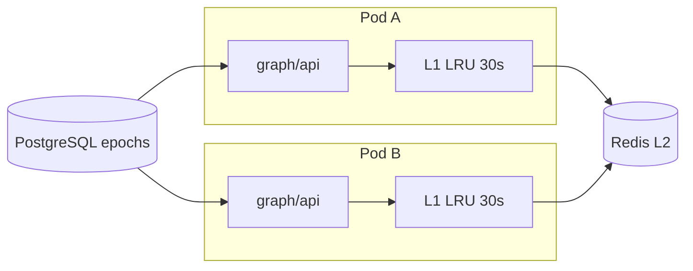
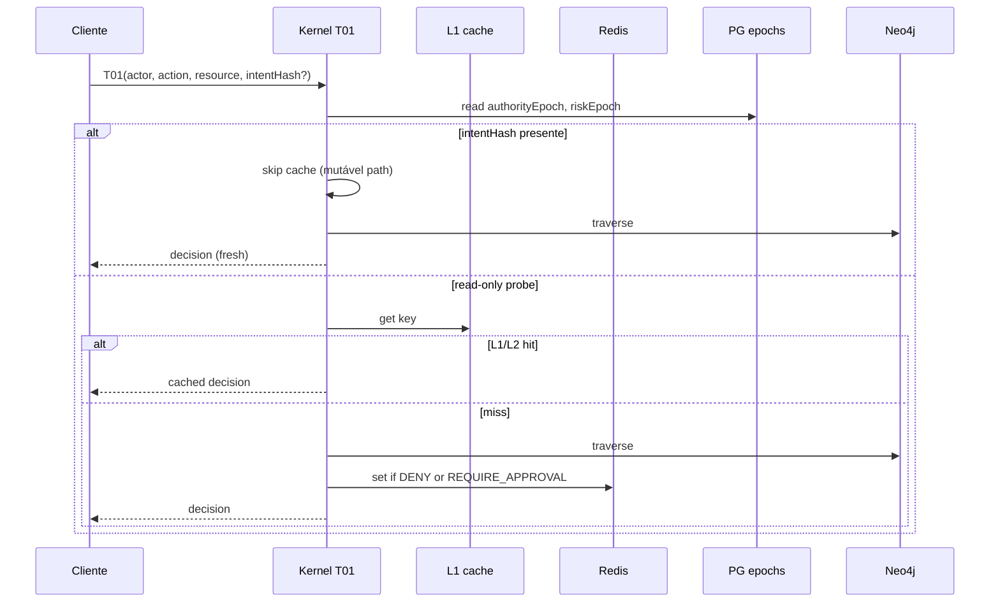

# R05 — Cache cross-pod e projeção: `modules/graph`

**Componente:** modules/graph  
**Rodada:** R5 — Cache T01/T03/T15, invalidação por epoch, markers de projeção  
**Pacote SDD:** P03  
**Data:** 2026-09-07  
**Issue debate estrutura:** ANX-41 · **Issue mapa funcional:** ANX-43  
**Sessão Slack:** [Session H — R05 cache cross-pod](./SLACK-TRANSCRIPTS.md#session-h--r05-cache-cross-pod)

## Objetivo da rodada

Fechar **RB-D02**: estratégia de cache **cross-pod** para traversals kernel **T01** (`authorization.can`), **T03** (`authorization.explain`) e **T15** (`connections.listModels` / ofertas `SYSTEM_FREE`), invalidação por **epoch** (`authorityEpoch`, `riskEpoch`, `catalogGeneration`), camadas L1/L2 (in-process + Redis), markers de projeção PG/Neo4j e ordem de rebuild. Resolver perguntas abertas de [R04-graphquery-contracts.md](./R04-graphquery-contracts.md).

## Fontes aplicadas

| Fonte | Uso em R5 |
| --- | --- |
| [R04-graphquery-contracts.md](./R04-graphquery-contracts.md) | Envelope, poll, `authorityEpoch`/`riskEpoch` em T01, `clientQueryId` cache opcional |
| [R03-schema-registry.md](./R03-schema-registry.md) | `cacheable` no catálogo Txx, `graph_traversal_catalog` |
| [R02-boundaries.md](./R02-boundaries.md) | RB-D02 aberto; T01–T03 kernel puro; CAP-D03 stale vs mutável |
| `brain/notes/anxionos-graph-traversals-v1.md` | Semântica T01/T03/T15, fixture F0 |
| Session D/G | Cache com epochs; T01 nunca ALLOW cacheável em path mutável |

## Debate R5 (síntese atribuída)

**Arquiteto:** Cache é **acelerador de leitura**, não fonte de autoridade. Mutável **sempre** revalida epoch em PG na mesma transação do efeito (CAP-D03). Cross-pod exige **Redis** como L2 compartilhado; L1 in-process LRU por pod com TTL curto (≤30s) e invalidação via pub/sub.

**Executor:** Chave canônica `graph:cache:v1:{traversalId}:{scopeHash}:{queryHash}:{epochTuple}`. `epochTuple` = `ae:{authorityEpoch}:re:{riskEpoch}:cg:{catalogGeneration}`. T15 adiciona `offerGeneration` do catálogo connections. Implementação em `graph/infrastructure/cache/` — port `GraphReadCache` injetado no executor kernel.

**Crítico:** **Proibido** cachear `decision: ALLOW` em T01 quando `intentHash` presente (path mutável). DENY e REQUIRE_APPROVAL cacheáveis com TTL 60s máx. T03 herda mesma política — explain de ALLOW mutável não entra em cache 24h.

**Security:** Redis sem payload sensível completo — só resultado já mascarado (T16 pattern). Pub/sub invalidação assinada por `ownerDomain`; graph consumer governance escuta `governance.grant.*` e incrementa epoch local + `PUBLISH graph:invalidate`. Agente não pode forçar `cacheBypass` — header ignorado em v1.

**Síntese Orquestrador:** RB-D02 fechado; handoff R06 dependencies/rebuild order detalhado.

---

## Princípios de cache

| Princípio | Decisão |
| --- | --- |
| Autoridade | PG governance/risk é fonte para mutável; Neo4j + cache são leitura derivada |
| Cross-pod | Redis L2 obrigatório em deploy multi-réplica; single-node dev pode L1-only com flag |
| Invalidação primária | Bump de `authorityEpoch` / `riskEpoch` / `catalogGeneration` na chave |
| Invalidação secundária | Pub/sub `graph:invalidate` + TTL máximo por traversal |
| T01 ALLOW mutável | **Nunca** cacheável |
| T01 DENY / REQUIRE_APPROVAL | Cacheável TTL 60s |
| T03 explain | Mesma regra epoch; árvore truncada por fieldMask antes de cache |
| T15 ofertas | Cacheável TTL 300s; invalidação em `connections.catalog.updated` |
| Rebuild / drain | Cache flush por `registryGeneration` no marker PG |

---

## Camadas L1 / L2



| Camada | Tech | TTL default | Escopo |
| --- | --- | --- | --- |
| **L1** | `lru-cache` in-process por pod | 30s | Hot path T01 deny, T15 list |
| **L2** | Redis 7+ (`graph:cache:v1:*`) | 60s T01/T03 · 300s T15 | Cross-pod consistency |
| **Negative** | Redis `graph:neg:v1:*` | 15s | NOT_FOUND após projeção estável |

**GK-R05-01:** Produção multi-réplica **exige** L2 Redis; `GRAPH_CACHE_MODE=local-only` só dev/test.

Lookup: L1 hit → return; L1 miss → L2 → executor Neo4j/PG → populate L2 → populate L1.

---

## Chaves de cache

### Componentes da chave

```typescript
// sketch — packages/contracts/src/graph/cache.ts (novo)
export type GraphCacheKeyParts = {
  traversalId: "T01" | "T03" | "T15";
  scopeHash: string; // sha256(scopeType|scopeId|principalId)
  queryHash: string; // sha256(canonical JSON params sem PII)
  authorityEpoch: number;
  riskEpoch: number;
  catalogGeneration: number; // graph_traversal_catalog.registry_generation
  offerGeneration?: number; // T15 only — connections catalog
  intentHash?: string; // T01 only — quando presente, política no-cache ALLOW
};
```

Chave Redis: `graph:cache:v1:{traversalId}:{scopeHash}:{queryHash}:{ae}:{re}:{cg}[:og:{offerGeneration}]`

**GK-R05-02:** `queryHash` usa JSON canônico ordenado; exclui `clientQueryId` (correlação apenas).

### Política por traversal

| Traversal | `cacheable` catálogo | TTL L2 | ALLOW mutável | Notas |
| --- | --- | --- | --- | --- |
| **T01** | `conditional` | 60s | ❌ se `intentHash` set | DENY/REQUIRE_APPROVAL OK |
| **T03** | `conditional` | 60s | ❌ se input implica mutável | `reasonTree` já mascarado |
| **T15** | `true` | 300s | N/A (read-only offers) | `SYSTEM_FREE` ≠ ver conta alheia |
| T05, T09, … | `false` v1 | — | — | Context/budget — sem cache |

---

## Invalidação por epoch

### Fontes de epoch (PostgreSQL)

| Epoch | Tabela / origem | Bump quando |
| --- | --- | --- |
| `authorityEpoch` | `governance_authority_epochs` (por scope) | grant revoke, mandate change, delegation |
| `riskEpoch` | `risk_policy_epochs` (por scope) | policy/limit/kill switch |
| `catalogGeneration` | `graph_traversal_catalog.registry_generation` | deploy bootstrap, admin registry change |
| `offerGeneration` | `connections_model_catalog.generation` | T15 — catalog publish |

Executor T01 lê epochs atuais **antes** de consultar cache; mismatch na chave = miss natural.

### Pub/sub secundário

Canal Redis: `graph:invalidate`

```json
{
  "v": 1,
  "scopeType": "ORGANIZATION",
  "scopeId": "550e8400-e29b-41d4-a716-446655440000",
  "reason": "governance.grant.revoked.v1",
  "authorityEpoch": 8,
  "riskEpoch": 3,
  "at": "2026-09-07T23:15:00Z"
}
```

**GK-R05-03:** Consumer graph projection worker publica invalidação **após** ack inbox — não antes do journal commit do owner.

Pods subscrevem: flush L1 entries matching `scopeHash`; `SCAN` + `DEL` L2 prefix quando epoch bump > cached epoch (bounded batch 500/s).

---

## T01 — `authorization.can`

### Fluxo com cache



**GK-R05-04:** `decision: ALLOW` **só** cacheável quando `intentHash` ausente **e** path UI read-only — orchestration mutável envia `acceptStale: false` (R04 Security).

Resposta cacheada inclui `meta.cached: true`, `meta.cacheAgeMs` — UI badge distinto de `meta.stale` (projeção Neo4j).

---

## T03 — `authorization.explain`

- Mesma chave base que T01 + sufixo `:explain`.
- `reasonTree` armazenado **após** fieldMask Security (AGENCY não vê estágios Platform).
- TTL 60s; invalidação idêntica T01.
- Human explain panel e agent tool `graph.authorization.explain` compartilham cache key (AP01).

---

## T15 — ofertas / `connections.listModels`

- Input: `scope`, `capability`, `tierFilter` opcional.
- `offerGeneration` na chave — bump quando connections publica catálogo.
- Cache 300s; **não** implica permissão de usar modelo — T01 ainda necessário antes de inferência.
- `SYSTEM_FREE` é oferta publicada no catálogo, não grant de visualizar conta de terceiros (invariante Session E).

---

## Markers de projeção (PG)

Complemento RB-D02 — alinhamento cache vs projeção Neo4j:

| Marker | Tabela PG | Uso |
| --- | --- | --- |
| `projection_generation` | `graph_projection_markers` | Monotônico por consumer; poll R04 |
| `registry_generation` | `graph_traversal_catalog` | Flush cache em deploy |
| `checkpoint` | `graph_projection_inbox` | Metadata resposta; não gate cache |
| `last_invalidated_at` | `graph_cache_stats` (opcional ops) | Observabilidade |

**GK-R05-05:** Rebuild controlado incrementa `registry_generation` → **flush total** `graph:cache:v1:*` (PLATFORM job) antes de swap alias Neo4j generation.

Ordem rebuild (resumo — detalhe R06):

1. Drain consumers + pause cache writes  
2. Rebuild Neo4j generation N+1  
3. Bump `registry_generation` + pub/sub flush  
4. Replay F0 oracles T01–T20  
5. Swap read alias  

---

## `clientQueryId` — cache idempotente leitura

R04: POST traversal com mesmo `clientQueryId` → cache 24h **opcional**.

| Regra | Decisão |
| --- | --- |
| Escopo | Somente traversals `cacheable: true` no catálogo |
| Storage | Redis `graph:clientq:v1:{clientQueryId}` → pointer para cache key |
| T01 | **Excluído** se resultado foi ALLOW |
| TTL | 24h máx; invalidação epoch ainda aplica |

---

## Layout implementação proposta

```text
graph/
├── domain/
│   └── cache/
│       ├── ports.ts          # GraphReadCache port
│       └── policies.ts       # T01/T03/T15 rules
├── infrastructure/
│   └── cache/
│       ├── redis-l2.ts
│       ├── lru-l1.ts
│       ├── key-builder.ts
│       └── invalidation-subscriber.ts
└── application/
    └── traversals/
        └── kernel/
            ├── T01-executor.ts  # cache wrap
            ├── T03-executor.ts
            └── T15-executor.ts
```

Contracts: `packages/contracts/src/graph/cache.ts` — tipos de chave e `CachePolicy` enum.

---

## Observabilidade

| Métrica | Descrição |
| --- | --- |
| `graph_cache_hit_total{layer,traversalId}` | Hits L1/L2 |
| `graph_cache_miss_stale_epoch_total` | Miss por epoch drift |
| `graph_cache_skip_mutable_total` | T01 skips por intentHash |
| `graph_invalidate_pubsub_total` | Mensagens processadas |

Alerta: hit rate L2 > 95% em T01 com `intentHash` — possível bypass bug.

---

## Decisões R05

| ID | Decisão | Status |
| --- | --- | --- |
| **GK-R05-01** | Redis L2 obrigatório multi-réplica; L1 LRU 30s por pod | ✅ Aceito |
| **GK-R05-02** | Chave com scopeHash, queryHash, authorityEpoch, riskEpoch, catalogGeneration | ✅ Aceito |
| **GK-R05-03** | Invalidação primária epoch; secundária pub/sub pós-inbox ack | ✅ Aceito |
| **GK-R05-04** | T01 ALLOW com `intentHash` nunca cacheável; DENY TTL 60s | ✅ Aceito |
| **GK-R05-05** | Rebuild bump `registry_generation` → flush cache total | ✅ Aceito |
| **GK-R05-06** | T03/T15 seguem política epoch; T15 TTL 300s + offerGeneration | ✅ Aceito |

---

## Perguntas abertas para R06

1. `nodes.batchGet` limite de batch e partial failure (herdado R04).
2. Ordem NATS ack vs projeção durante rebuild — diagrama completo.
3. Webhook/SSE substituto de poll — defer P07+.
4. OpenAPI Scalar: gerar de Zod ou hand-written paths.
5. Rate limit por `traversalId` e principal.

---

## Saída R5

✅ Cache cross-pod T01/T03/T15 debate aprovado — R06 dependencies/rebuild próximo.

**RB-D02:** ✅ Fechado (cache layers, chaves epoch, invalidação, markers PG, rebuild flush).  
**Dependências:** ANX-32 implementação; Redis em `deploy/` P03; governance/risk epoch tables P02.
