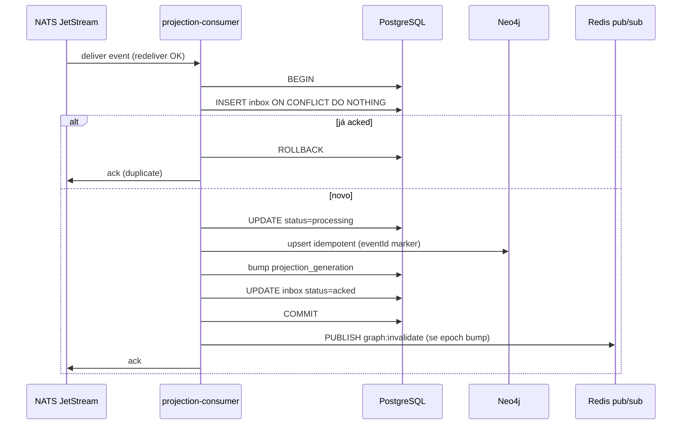
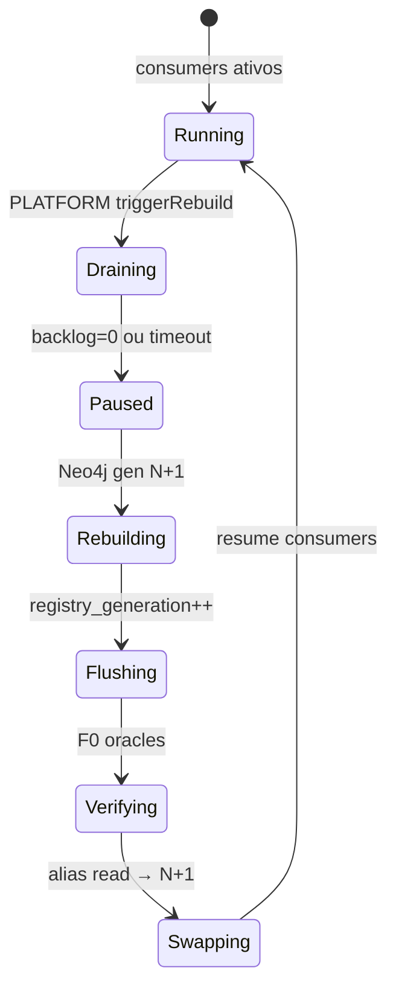
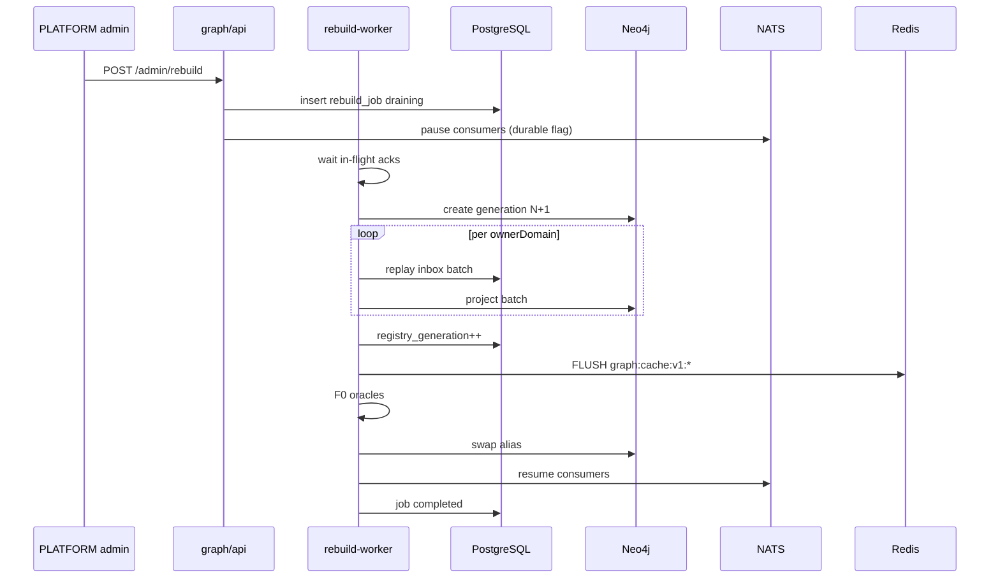

# R06 — Rebuild, inbox e ordem NATS: `modules/graph`

**Componente:** modules/graph  
**Rodada:** R6 — Dependências upstream/downstream, inbox idempotência, ordem NATS ack vs projeção, rebuild controlado  
**Pacote SDD:** P03  
**Data:** 2026-09-07  
**Issue debate estrutura:** ANX-41 · **Issue mapa funcional:** ANX-43  
**Sessão Slack:** [Session I — R06 rebuild/inbox/NATS](./SLACK-TRANSCRIPTS.md#session-i--r06-rebuild-inboxnats)

## Objetivo da rodada

Fechar **RB-D06**: mapa de dependências P03, semântica de **inbox** (`graph_projection_inbox`), ordem **NATS ack** vs commit Neo4j/PG, pipeline de **rebuild controlado** (generation alias), e limites de `nodes.batchGet`. Resolver perguntas abertas de [R05-cache-projection.md](./R05-cache-projection.md) e [R04-graphquery-contracts.md](./R04-graphquery-contracts.md).

## Fontes aplicadas

| Fonte | Uso em R6 |
| --- | --- |
| [R05-cache-projection.md](./R05-cache-projection.md) | Rebuild flush `registry_generation`, pub/sub pós-ack, markers PG |
| [R04-graphquery-contracts.md](./R04-graphquery-contracts.md) | Poll `minProjectionGeneration`, `nodes.batchGet`, admin rebuild 202 |
| [R03-schema-registry.md](./R03-schema-registry.md) | `ownerDomain` por consumer, registry generation |
| [R02-boundaries.md](./R02-boundaries.md) | `processWithInbox`, dispatcher, consumers `graph:*:v1` |
| [organizations/R06-dependencies.md](../../modules/organizations/R06-dependencies.md) | Padrão upstream/downstream, consumer `graph:organizations:v1` |
| `brain/notes/anxionos-backend-structure.md` | Regras 1–12, graph workers |
| Session H | Handoff rebuild NATS order, batchGet → R06 |

## Debate R6 (síntese atribuída)

**Arquiteto:** Graph é **downstream** de todos os domínios via eventos; **upstream** de leitura para orchestration, agents, knowledge, consoles. Inbox PG é fonte de idempotência; NATS é transporte at-least-once — ack **somente** após transação atômica inbox+marker+Neo4j.

**Executor:** `processWithInbox(eventId, consumerName)` em `graph/application/projections/inbox.ts` — upsert inbox `processing` → Neo4j → bump `projection_generation` → inbox `acked` na mesma transação PG. NATS `ack()` no finally **após** commit PG. Rebuild job em `graph/workers/rebuild.ts` orquestra drain + generation swap.

**Crítico:** Ack antes do commit = perda silenciosa em crash; ack tardio = redelivery aceitável se inbox idempotente. Durante rebuild, consumer normal **pausa** — mensagens ficam pending NATS até resume — nunca projetar em generation stale.

**Security:** Rebuild trigger só PLATFORM; inbox não expõe payload de evento em API. Replay forjado com `eventId` duplicado → no-op idempotente, não double-write Neo4j.

**Síntese Orquestrador:** RB-D06 fechado; handoff R07 riscos (lag, poison pill, partial rebuild).

---

## Mapa de dependências

### Upstream (graph consome)

| Origem | Mecanismo | Obrigatório P03 |
| --- | --- | --- |
| **identity** | Eventos `identity.*` → consumer `graph:identity:v1` | Principal→User projection |
| **organizations** | Eventos E003/E008/E009/E016 → `graph:organizations:v1` | Agency, Membership |
| **governance** | Eventos grant → `graph:governance:v1` | T01 F0, `authorityEpoch` |
| **risk** | Policy events → `graph:risk:v1` | `riskEpoch` |
| **connections** | Catalog events → `graph:connections:v1` | T15 `offerGeneration` |
| **packages/eventing** | NATS JetStream, outbox relay | Transporte |
| **packages/contracts** | GraphQuery, schema, cache types | Contratos públicos |
| **packages/database** | Pool PG, migrations | Inbox, markers, rebuild jobs |
| **Neo4j** | Adapter privado graph | Projeção operacional |
| **Redis** | Cache L2 + pub/sub invalidate | Cross-pod (R05) |

### Downstream (consome graph)

| Destino | Mecanismo | Notas |
| --- | --- | --- |
| **orchestration** | `/v1/graph` T01/T04/T09 | Mutável revalida PG |
| **agents** | SDK `graph.traversal.*` | Zero credencial Neo4j |
| **knowledge** | Graph RAG read traversals | Stale OK com badge |
| **apps/api** | Monta rotas graph | Composition root |
| **apps/workers** | Registra projection/rebuild workers | NATS consumers |
| **operations** | OP01 lag dashboard read-only | Sem trigger rebuild |
| **audit** | Manifest rebuild job | CAP-D04 |

### Imports proibidos (ratificado R02 + R6)

| Proibido | Motivo |
| --- | --- |
| Módulo → `graph/infrastructure/adapters/neo4j/**` | Isolamento adapter |
| Módulo → tabelas `graph_*` | API/eventos only |
| `graph/domain` → NATS, Neo4j, Drizzle | Regra 1 |
| graph → repository privado cross-module | Regra 4 |

---

## Inbox — idempotência e estados

### Tabela `graph_projection_inbox`

| Coluna | Tipo | Semântica |
| --- | --- | --- |
| `event_id` | UUID/text PK part | Idempotência global por evento |
| `consumer_name` | text PK part | Ex.: `graph:organizations:v1` |
| `owner_domain` | text | Roteamento rebuild |
| `status` | enum | `pending` · `processing` · `acked` · `quarantined` |
| `checkpoint` | bigint | Offset journal metadata |
| `projection_generation` | bigint | Monotônico por consumer após ack |
| `processed_at` | timestamptz | Commit ack |
| `error_code` | text nullable | Quarentena |
| `attempt_count` | int | Poison pill tracking |

**GK-R06-01:** Chave única `(event_id, consumer_name)` — replay duplicado retorna early sem Neo4j write.

### `processWithInbox` — fluxo



**GK-R06-02:** `NATS ack()` **após** `COMMIT` PG da transação inbox+generation. Nunca ack antes do commit.

**GK-R06-03:** Falha Neo4j após `processing` → `ROLLBACK` + `NATS nak` com backoff; inbox permanece `pending` ou `processing` com lease timeout → retry.

**GK-R06-04:** Evento schema desconhecido → `quarantined` + ack (não bloquear fila) + alerta ops; replay manual após fix.

---

## Ordem NATS ack vs projeção

### Modo normal (fora de rebuild)

| Ordem | Etapa | Garantia |
| ---: | --- | --- |
| 1 | Owner journal+outbox commit | Fonte autoritativa |
| 2 | NATS deliver to consumer | At-least-once |
| 3 | Inbox insert/processing | Idempotência |
| 4 | Neo4j upsert + marker `eventId` | Projeção derivada |
| 5 | PG `projection_generation++` + inbox `acked` | Poll gate R04 |
| 6 | Redis invalidate (se aplicável) | Pós-ack (GK-R05-03) |
| 7 | NATS `ack()` | Libera redelivery |

**GK-R06-05:** `graph:invalidate` pub/sub **nunca** antes do passo 5 — ratifica GK-R05-03.

### Durante rebuild controlado



| Fase | Consumers NATS | Ack policy |
| --- | --- | --- |
| **Draining** | Ativos; finish in-flight | Ack normal |
| **Paused** | `AckWait` extended; novos não startam | Não ack novos até resume |
| **Rebuilding** | **Pausados** — mensagens pending na stream | Sem ack até swap |
| **Flushing** | Pausados | Cache flush Redis (GK-R05-05) |
| **Verifying** | Pausados | Replay F0 T01–T20 |
| **Swapping** | Resume ordenado por `ownerDomain` | Catch-up desde cutoff checkpoint |

**GK-R06-06:** Durante rebuild, mensagens NATS **não** são ackadas em consumer pausado — permanecem pending até `resumeConsumers()` após swap alias.

**GK-R06-07:** Cutoff checkpoint em `graph_rebuild_jobs.cutoff_checkpoint` — eventos ≤ cutoff projetados na generation N+1 via replay batch; eventos > cutoff catch-up incremental pós-swap.

---

## Pipeline rebuild controlado (detalhe R05)

### Tabela `graph_rebuild_jobs`

| Campo | Uso |
| --- | --- |
| `job_id` | UUID público |
| `status` | `pending` · `draining` · `rebuilding` · `verifying` · `completed` · `failed` |
| `target_generation` | Neo4j alias N+1 |
| `cutoff_checkpoint` | Journal offset inclusivo |
| `owner_domain_order` | JSON array ordenado |
| `registry_generation` | Bump para flush cache |
| `audit_manifest_id` | Link audit/operations |

### Ordem por `ownerDomain` (v1)

| Ordem | ownerDomain | Consumer | Motivo |
| ---: | --- | --- | --- |
| 1 | `identity` | `graph:identity:v1` | User/Principal base |
| 2 | `organizations` | `graph:organizations:v1` | Agency, Membership |
| 3 | `governance` | `graph:governance:v1` | Grants antes de risk-dependent |
| 4 | `risk` | `graph:risk:v1` | Epoch policies |
| 5 | `connections` | `graph:connections:v1` | Catálogo modelos |
| 6+ | demais P04–P06 | `graph:{domain}:v1` | Alfabético estável |

**GK-R06-08:** Rebuild batch por domínio em checkpoint ascendente; **sem** interleaving cross-domain no mesmo batch Neo4j transaction.

### Sequência completa (10 passos)

1. **PLATFORM** `POST /v1/graph/admin/rebuild` → `202` + `jobId`
2. Audit manifest registrado (operations)
3. `drainConsumers()` — aguarda in-flight + pause flag
4. `GRAPH_CACHE_WRITE=false` — pause cache populate (R05)
5. Criar Neo4j generation **N+1** (label suffix ou database alias)
6. Replay journal → inbox reprocess com generation marker N+1
7. Bump `graph_traversal_catalog.registry_generation` → flush `graph:cache:v1:*`
8. Executar F0 oracles T01–T20 contra generation N+1
9. Swap read alias `current` → N+1; drop N-1 após retention
10. `resumeConsumers()` — catch-up NATS pending + `GRAPH_CACHE_WRITE=true`



---

## `nodes.batchGet` — limites e partial failure

Herda R04 pergunta aberta; fechado em R06:

| Regra | Decisão |
| --- | --- |
| Máx keys por request | **50** `nodeKey` |
| Máx payload response | **2 MB** — truncar com `truncated: true` |
| Invisíveis | **Omitidos** — não revelam existência (R04 Security) |
| Partial failure | HTTP **200** — array sparse; entries ausentes = invisível ou NOT_FOUND interno sem distinguir |
| `minProjectionGeneration` | Aplica por key; key abaixo → omitida (não 409 no batch) |
| Rate limit | Conta como **1** request; custo interno `keys.length` para fair-use |

```typescript
// sketch — packages/contracts/src/graph/queries.ts
export const nodesBatchGetInputSchema = z.object({
  keys: z.array(nodeKeySchema).min(1).max(50),
  minProjectionGeneration: z.number().int().positive().optional(),
  fieldMask: fieldMaskSchema.optional(),
});
```

**GK-R06-09:** Batch não retorna 409 NOT_PROJECTED por key — cliente usa `node.get` unitário quando precisa distinguir not-found vs pending.

---

## Dependências de pacote e workers

```text
graph/
├── domain/
│   └── projection/
│       ├── inbox-port.ts           # processWithInbox contract
│       └── rebuild-spec.ts
├── application/
│   └── projections/
│       ├── inbox.ts                # processWithInbox impl
│       ├── organizations/
│       ├── governance/
│       └── ...
├── infrastructure/
│   ├── persistence/
│   │   ├── inbox-repository.ts
│   │   └── rebuild-job-repository.ts
│   └── messaging/
│       └── nats-consumer.ts        # ack after PG commit
└── workers/
    ├── projection-consumer.ts
    └── rebuild.ts
```

| Worker | Stream NATS | Durable | Notas |
| --- | --- | --- | --- |
| `graph-projection-consumer` | `events.>` filtered | `graph-projector` | Um consumer name por domínio internamente |
| `graph-rebuild-worker` | admin queue | `graph-rebuild` | Sem concorrência — single leader |
| `graph-invalidation-subscriber` | Redis pub/sub | — | R05 |

---

## Observabilidade

| Métrica | Descrição |
| --- | --- |
| `graph_inbox_ack_lag_seconds` | Tempo deliver NATS → ack |
| `graph_inbox_duplicate_total` | Replay idempotente |
| `graph_inbox_quarantine_total` | Poison/schema fail |
| `graph_rebuild_phase_seconds` | Por fase drain/rebuild/verify |
| `graph_nats_pending_during_rebuild` | Alerta se > threshold |

Alerta: `ack_lag` p99 > 30s ou pending rebuild > 100k mensagens.

---

## Decisões R06

| ID | Decisão | Status |
| --- | --- | --- |
| **GK-R06-01** | Inbox idempotente `(eventId, consumerName)` | ✅ Aceito |
| **GK-R06-02** | NATS ack somente após COMMIT PG inbox+generation | ✅ Aceito |
| **GK-R06-03** | Falha Neo4j → rollback + nak com backoff | ✅ Aceito |
| **GK-R06-04** | Schema desconhecido → quarantine + ack + alerta | ✅ Aceito |
| **GK-R06-05** | Invalidate Redis pós-ack inbox (ratifica GK-R05-03) | ✅ Aceito |
| **GK-R06-06** | Consumers pausados durante rebuild; pending NATS até resume | ✅ Aceito |
| **GK-R06-07** | Cutoff checkpoint + catch-up pós-swap | ✅ Aceito |
| **GK-R06-08** | Rebuild ordenado por ownerDomain; batch sem interleaving | ✅ Aceito |
| **GK-R06-09** | `nodes.batchGet` max 50 keys; invisíveis omitidos; sem 409 batch | ✅ Aceito |

---

## Perguntas abertas para R07

1. Poison pill: max `attempt_count` antes de quarantine automática?
2. Partial rebuild single `ownerDomain` sem full generation swap?
3. Lag SLA operations OP01 — thresholds por consumer?
4. Rate limit por `traversalId` e principal (herdado R04/R05).
5. OpenAPI Scalar generation — defer implementação ANX-32.

---

## Saída R6

✅ Rebuild/inbox/NATS order debate aprovado — R07 riscos próximo.

**RB-D06:** ✅ Fechado (dependências P03, inbox idempotência, ordem NATS ack, rebuild pipeline, batchGet limits).  
**Dependências:** ANX-32 implementação; NATS JetStream em `deploy/` P03; governance grant events RB-D04 para F0 útil.
