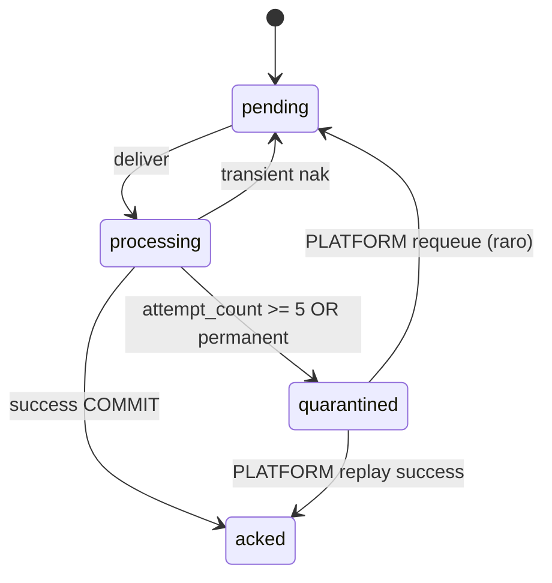
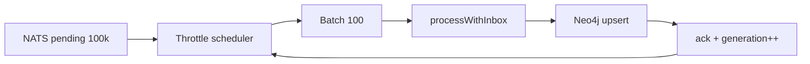

# R07 — Poison pill, quarentena e riscos de projeção: `modules/graph`

**Componente:** modules/graph  
**Rodada:** R7 — Poison pill, threshold de quarentena, DLQ, retry backoff, lag SLA, pending 100k  
**Pacote SDD:** P03  
**Data:** 2026-09-07  
**Issue debate estrutura:** ANX-41 · **Issue mapa funcional:** ANX-43  
**Sessão Slack:** [Session J — R07 poison pill/quarantine](./SLACK-TRANSCRIPTS.md#session-j--r07-poison-pillquarantine)

## Objetivo da rodada

Fechar **RB-D07**: política de **poison pill** (`attempt_count`), threshold de **quarentena** automática, **DLQ** operacional, **retry backoff** NATS, limites de **pending** (100k) pós-rebuild/resume, **lag SLA** OP01 e rate limit por `traversalId`. Resolver perguntas abertas de [R06-rebuild-inbox.md](./R06-rebuild-inbox.md).

## Fontes aplicadas

| Fonte | Uso em R7 |
| --- | --- |
| [R06-rebuild-inbox.md](./R06-rebuild-inbox.md) | Inbox estados, GK-R06-03/04, pending rebuild, métricas |
| [R05-cache-projection.md](./R05-cache-projection.md) | Invalidate pós-ack; stale ALLOW |
| [R04-graphquery-contracts.md](./R04-graphquery-contracts.md) | Poll backoff cap 15s; rate limit traversalId |
| [organizations/R07-risks.md](../../modules/organizations/R07-risks.md) | Formato registro de riscos Sev L×I |
| Session I | Handoff poison threshold, 100k pending, partial rebuild |

## Debate R7 (síntese atribuída)

**Arquiteto:** Poison pill não é só schema desconhecido — qualquer falha **determinística** repetida (Neo4j constraint, payload inválido permanente, `ownerDomain` órfão) deve sair do hot path após N tentativas. Quarentena **ack + DLQ** preserva ordem da fila; nak infinito é anti-padrão.

**Executor:** `attempt_count` incrementa em cada `nak` ou exceção classificada `retryable=false`. Threshold **5** → `status=quarantined`, publicar em `graph.quarantine.v1`, NATS **ack** (GK-R06-04 ratificado). Backoff exponencial `min(300, 2^attempt)` segundos + jitter 0–20%. DLQ PG espelha inbox com `replay_token` PLATFORM-only.

**Crítico:** Quarentena sem DLQ auditável = evento fantasma. Partial rebuild single `ownerDomain` **adiado R08** — risco de generation drift maior que lag temporário. Resume com 100k pending exige **throttle** batch Neo4j, não aumentar concorrência cegamente.

**Security:** Replay manual de quarentena só PLATFORM + manifest audit; payload em DLQ **redact** secrets. Rate limit `traversalId` por principal previne herd em T01 durante catch-up.

**Síntese Orquestrador:** RB-D07 fechado; handoff R08 decision-log (partial rebuild, OpenAPI Scalar defer).

---

## Poison pill — classificação e threshold

### Tipos de falha

| Classe | Exemplos | Ação |
| --- | --- | --- |
| **Transient** | Neo4j timeout, PG deadlock, Redis indisponível | `nak` + backoff; `attempt_count++` |
| **Permanent** | Schema version desconhecida, constraint violation determinística, `ownerDomain` sem consumer | Quarentena imediata ou após 1ª ocorrência |
| **Poison** | Mesma falha após max attempts | Quarentena + DLQ + ack |

### GK-R07-01 — Threshold `attempt_count`

| Parâmetro | Valor v1 | Notas |
| --- | --- | --- |
| `max_attempts` | **5** | Inclui redeliveries NATS |
| `lease_timeout_processing` | **120s** | `processing` órfão → retry como transient |
| Quarentena imediata | `PERMANENT_*` error codes | Sem esperar 5 tentativas |

Estados inbox após threshold:



**GK-R07-02:** Ao atingir quarentena: `UPDATE inbox SET status=quarantined, error_code=…` + insert `graph_projection_dlq` + **NATS ack** — nunca bloquear consumer por poison.

---

## Retry backoff (NATS JetStream)

### Política `nak` / redelivery

| Tentativa | Backoff base | Com jitter (0–20%) |
| ---: | ---: | ---: |
| 1 | 2s | 2–2.4s |
| 2 | 4s | 4–4.8s |
| 3 | 8s | 8–9.6s |
| 4 | 16s | 16–19.2s |
| 5 | 32s | 32–38.4s |
| ≥6 | — | → quarentena (não nak) |

**GK-R07-03:** Backoff exponencial `min(300, 2^attempt_count)` segundos; cap **300s** para transientes persistentes antes da quarentena final.

```typescript
// sketch — graph/infrastructure/messaging/nats-consumer.ts
function nakDelayMs(attemptCount: number): number {
  const base = Math.min(300_000, 2 ** attemptCount * 1000);
  const jitter = base * (0.8 + Math.random() * 0.2);
  return Math.floor(jitter);
}
```

**GK-R07-04:** `AckWait` consumer ≥ **330s** durante catch-up (acima do cap backoff + margem processamento).

---

## DLQ — Dead Letter Queue operacional

### Tabela `graph_projection_dlq`

| Coluna | Tipo | Semântica |
| --- | --- | --- |
| `dlq_id` | UUID PK | Identificador público replay |
| `event_id` | text | Correlação inbox |
| `consumer_name` | text | Ex.: `graph:governance:v1` |
| `owner_domain` | text | Roteamento |
| `quarantined_at` | timestamptz | Entrada DLQ |
| `error_code` | text | `SCHEMA_UNKNOWN`, `NEO4J_CONSTRAINT`, … |
| `attempt_count` | int | Snapshot no quarantine |
| `payload_ref` | text | URI flight recorder — **não** inline secrets |
| `replay_status` | enum | `open` · `replayed` · `discarded` |
| `audit_manifest_id` | UUID nullable | Replay PLATFORM |

### Stream NATS `graph.quarantine.v1`

| Campo | Valor |
| --- | --- |
| Retention | Limits |
| Max age | 90 dias |
| Consumers | `graph-dlq-ops` (read-only ops), `graph-dlq-replay` (PLATFORM worker) |

**GK-R07-05:** Payload sensível nunca em DLQ row — `payload_ref` aponta audit/flight recorder com redaction. Replay exige `POST /v1/graph/admin/dlq/{dlqId}/replay` + PLATFORM scope + manifest.

**GK-R07-06:** Métrica `graph_inbox_quarantine_total` por `error_code` e `consumer_name` — alerta Sev2 se taxa > 10/min em janela 5m.

---

## Pending 100k — catch-up pós-rebuild/resume

Session I (Ryn): resume após swap com **100k** mensagens pending — risco OOM Neo4j e thundering herd.

### Throttle catch-up

| Parâmetro | Valor v1 |
| --- | --- |
| `catch_up_batch_size` | **100** eventos/batch por consumer |
| `catch_up_max_inflight` | **3** batches Neo4j paralelos por `ownerDomain` |
| `catch_up_sleep_ms` | **50ms** entre batches se pending > 50k |
| Alerta warning | pending > **50k** |
| Alerta critical | pending > **100k** ou ack_lag p99 > 60s |



**GK-R07-07:** Durante catch-up com pending > 100k: **não** iniciar novo rebuild; OP01 banner `GRAPH_CATCH_UP`; consumers normais ativos mas throttled.

**GK-R07-08:** `graph_nats_pending_during_rebuild` herda threshold R06 (alerta 100k) — unificado com catch-up pós-swap.

---

## Lag SLA — operations OP01

| Métrica | Warning | Critical | Ação ops |
| --- | --- | --- | --- |
| `graph_inbox_ack_lag_seconds` p99 | > 30s | > 60s | Investigar Neo4j/PG; scale workers |
| `projection_generation` lag vs journal head | > 5 min | > 15 min | Dashboard OP01; considerar rebuild |
| Quarantine rate | > 5/min | > 10/min | Page on-call; freeze deploy |
| DLQ depth (`open`) | > 100 | > 500 | PLATFORM triage semanal |

**GK-R07-09:** OP01 read-only — sem trigger rebuild/quarantine replay; apenas visualização e export manifest.

---

## Rate limit — `traversalId` e principal

Herda R04/R05; fechado em R07:

| Escopo | Limite v1 | Janela |
| --- | --- | --- |
| Por `principalId` + `traversalId` | **60** req | 1 min |
| Por `agencyId` T01 mutável | **30** req | 1 min |
| `nodes.batchGet` | 1 req = `keys.length` unidades fair-use | 1 min |

**GK-R07-10:** Durante catch-up pending > 50k, rate limit HTTP **inalterado** — proteção é throttle consumer, não degradar leitura orchestration.

**GK-R07-11:** Excesso → `429` + `Retry-After`; métrica `graph_rate_limit_exceeded_total`.

---

## Registro de riscos (top 8)

| ID | Risco | L | I | Sev | Mitigação | Gate |
| --- | --- | ---: | ---: | ---: | --- | --- |
| **R-GR-01** | Poison pill bloqueia fila NATS (nak infinito) | 3 | 5 | **15** | Quarentena + ack após 5; DLQ auditável | G4, G5 |
| **R-GR-02** | 100k pending pós-resume OOM Neo4j | 3 | 4 | **12** | Throttle batch 100; max inflight 3; alertas | G3, G5 |
| **R-GR-03** | Replay DLQ sem audit duplica projeção | 2 | 5 | **10** | PLATFORM + manifest; inbox idempotente | G4, G5 |
| **R-GR-04** | Lag projeção → T01 stale ALLOW | 3 | 5 | **15** | Zero cache ALLOW (GK-R05-04); PG revalidate | G4, G5 |
| **R-GR-05** | Partial rebuild generation drift | 2 | 4 | **8** | Adiado R08; full swap v1 | G2 |
| **R-GR-06** | Secrets em payload DLQ | 2 | 5 | **10** | `payload_ref` redacted only | G4 |
| **R-GR-07** | Herd T01 durante catch-up | 3 | 3 | **9** | Rate limit traversalId; throttle consumer | G3 |
| **R-GR-08** | `processing` lease orphan duplica upsert | 2 | 4 | **8** | Lease 120s + inbox idempotente GK-R06-01 | G5 |

---

## Partial rebuild — decisão adiada

**Pergunta R06 #2:** rebuild single `ownerDomain` sem full generation swap.

| Opção | Prós | Contras |
| --- | --- | --- |
| A — Full swap only (v1) | F0 oracles simples; alias único | Downtime drain maior |
| B — Partial per domain | Menor blast radius | Generation drift; F0 parcial complexo |

**GK-R07-12:** v1 mantém **full generation swap** apenas — partial rebuild → **R08 decision-log** com spike de design, não implementar em ANX-32 slice 1.

---

## Observabilidade (extensão R06)

| Métrica | Descrição |
| --- | --- |
| `graph_inbox_attempt_histogram` | Distribuição antes quarentena |
| `graph_dlq_depth` | `replay_status=open` |
| `graph_catch_up_throttle_active` | 0/1 |
| `graph_rate_limit_exceeded_total` | Por traversalId |

Dashboard OP01 painéis: ack lag, pending NATS, quarantine rate, DLQ depth, catch-up throttle.

---

## Decisões R07

| ID | Decisão | Status |
| --- | --- | --- |
| **GK-R07-01** | `max_attempts=5` antes quarentena automática | ✅ Aceito |
| **GK-R07-02** | Quarentena → ack + não bloquear fila | ✅ Aceito |
| **GK-R07-03** | Backoff exponencial cap 300s + jitter | ✅ Aceito |
| **GK-R07-04** | `AckWait` ≥ 330s em catch-up | ✅ Aceito |
| **GK-R07-05** | DLQ PG + stream `graph.quarantine.v1`; payload_ref redacted | ✅ Aceito |
| **GK-R07-06** | Alerta quarantine > 10/min | ✅ Aceito |
| **GK-R07-07** | Throttle catch-up: batch 100, inflight 3, sleep 50ms >50k | ✅ Aceito |
| **GK-R07-08** | Pending > 100k → critical; bloqueia novo rebuild | ✅ Aceito |
| **GK-R07-09** | Lag SLA OP01: ack p99 30s/60s; projection lag 5m/15m | ✅ Aceito |
| **GK-R07-10** | Rate limit HTTP independente de catch-up throttle | ✅ Aceito |
| **GK-R07-11** | Rate limit 60/min traversalId+principal; 429 Retry-After | ✅ Aceito |
| **GK-R07-12** | Partial rebuild adiado R08 | ✅ Aceito |

---

## Perguntas abertas para R08

1. Partial rebuild — spike design com F0 parcial por `ownerDomain`.
2. OpenAPI Scalar generation — continua defer ANX-32.
3. Auto-replay DLQ após fix schema (batch) vs manual only.
4. SLO contratual lag para tenants premium.
5. Integração alertmanager/PagerDuty operations P07.

---

## Saída R7

✅ Poison pill / quarantine / DLQ / backoff / 100k pending debate aprovado — R08 decision-log próximo.

**RB-D07:** ✅ Fechado (poison threshold, DLQ, retry backoff, catch-up throttle, lag SLA, rate limit traversalId).  
**Dependências:** ANX-32 implementação inbox+DLQ; operations OP01 dashboard; audit flight recorder `payload_ref`.
