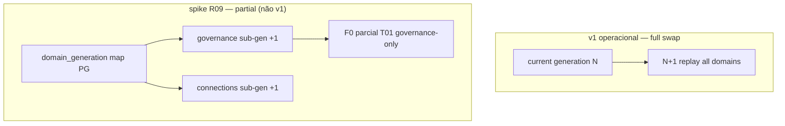

# R08 — Decision log: `modules/graph`

**Componente:** modules/graph  
**Rodada:** R8 — Síntese do debate, partial rebuild spike, deferências v1  
**Pacote SDD:** P03  
**Data:** 2026-09-07  
**Issue debate estrutura:** ANX-41 · **Issue mapa funcional:** ANX-43  
**Sessão Slack:** [Session K — R08 decision-log](./SLACK-TRANSCRIPTS.md#session-k--r08-decision-log)

## Participantes

| Papel | Agente |
| --- | --- |
| Orquestrador | CTO orchestrator |
| Arquiteto | architect |
| Executor | executor |
| Crítico | critic-reviewer |
| Code Review | code-reviewer |
| QA | QA |
| Security | security-reviewer (Kai) |
| Red Team | Red Team (Ryn) |

## Objetivo da rodada

Consolidar posições aceitas em **R01–R07** num **decision log** rastreável (`D-GR-*`), conduzir **spike de design** para partial rebuild single `ownerDomain` (GK-R07-12), fechar deferências v1 (OpenAPI Scalar, auto-replay DLQ) e definir **pré-condições G0** para R09/R10.

## Debate R8 (síntese atribuída)

**Orquestrador:** R01–R07 fecharam contexto, fronteiras, schema registry, GraphQuery v1, cache cross-pod, rebuild/inbox e poison pill/DLQ. R08 não reabre decisões salvo lacunas explícitas de R07 (partial rebuild, OpenAPI, auto-replay DLQ).

**Arquiteto:** Partial rebuild por `ownerDomain` exige **sub-generation** por domínio + oráculos F0 parciais — spike aprovado como documento de design, **não** implementação v1. Full generation swap permanece único caminho operacional até validação do spike em ANX-32 slice 2.

**Crítico:** Generation drift entre domínios durante partial rebuild é achado impeditivo se misturarmos leitura cross-domain na mesma alias — spike deve provar isolamento de leitura ou rejeitar partial para v1.

**Security:** OpenAPI Scalar com schemas Zod expõe superfície admin — defer até contracts estáveis e redaction de `payload_ref` validada em DLQ. Auto-replay DLQ batch só após manifest PLATFORM e teste G5 idempotente.

**Síntese Orquestrador:** Decision log consolidado; partial rebuild **spike design** aceito (GK-R08-01); implementação partial **deferida** (GK-R08-02); OpenAPI Scalar **defer ANX-32 slice 2** (GK-R08-03); DLQ replay **manual only v1** (GK-R08-04). R08 aprovado para **R09** dev-plan.

---

## Tabela consolidada de decisões

| ID | Decisão | Rodada | Status |
| --- | --- | --- | --- |
| **D-GR-001** | Graph Kernel é dono de catálogo T01–T20, traversals, inbox projeção, rebuild control e adapter Neo4j privado | R1, R2 | ✅ Aceito |
| **D-GR-002** | Capital, grants, tasks, journal de domínio **não** pertencem a graph — dispatcher roteia mutações ao `ownerDomain` | R1, R2 | ✅ Aceito |
| **D-GR-003** | Agentes e módulos **zero** credencial Neo4j — leitura/mutação via `/v1/graph` e SDK | R1, R2 | ✅ Aceito |
| **D-GR-004** | Registry único; T01–T03 kernel puro; T08/T16/T18/T20 híbridos; composição T04/T07/T17 no Kernel | R2 | ✅ Aceito |
| **D-GR-005** | Neo4j adapter isolado em `graph/infrastructure/adapters/neo4j/` — import cross-module proibido | R2 | ✅ Aceito |
| **D-GR-006** | Dispatcher `node.create/update` roteia por `ownerDomain`; Kernel não persiste negócio | R2 | ✅ Aceito |
| **D-GR-007** | Consumer `graph:organizations:v1` (e demais `graph:{domain}:v1`) implementado em graph P03 | R2, R6 | ✅ Aceito |
| **D-GR-008** | Registry híbrido: `packages/contracts/graph/` + PG `graph_schema_*` + runtime fail-fast | R3 | ✅ Aceito |
| **D-GR-009** | `User` projetado no Neo4j; `Principal` só PG identity; Membership E009→User | R3 | ✅ Aceito |
| **D-GR-010** | Um escritor por agregado via `ownerDomain` no evento | R3 | ✅ Aceito |
| **D-GR-011** | T01–T20 mapeados a edge allowlist; sub-planos bootstrap estático (sem hot-reload v1) | R3 | ✅ Aceito |
| **D-GR-012** | `projectionPending` async default; sync wait `X-Graph-Wait-Projection` PLATFORM-only | R3, R4 | ✅ Aceito |
| **D-GR-013** | GraphQuery v1 schemas Zod em `packages/contracts/graph/traversals/`; `queryVersion: 1` | R4 | ✅ Aceito |
| **D-GR-014** | Poll primário `minProjectionGeneration`; etag composto checkpoint+generation | R4 | ✅ Aceito |
| **D-GR-015** | `NODE_NOT_PROJECTED` 409 ≠ `NODE_NOT_FOUND` 404 | R4 | ✅ Aceito |
| **D-GR-016** | `MERGE_CONFLICT` 409 com `conflicts[]`; 1 retry server interno | R4 | ✅ Aceito |
| **D-GR-017** | `PROJECTION_TIMEOUT` 504 com `commandId` em sync wait | R4 | ✅ Aceito |
| **D-GR-018** | Redis L2 cross-pod + L1 LRU 30s; dev `GRAPH_CACHE_MODE=local-only` | R5 | ✅ Aceito |
| **D-GR-019** | Chave cache epoch-aware: scopeHash, queryHash, authorityEpoch, riskEpoch, catalogGeneration | R5 | ✅ Aceito |
| **D-GR-020** | T01 ALLOW com `intentHash` **nunca** cacheável; DENY/REQUIRE_APPROVAL TTL 60s | R5 | ✅ Aceito |
| **D-GR-021** | Invalidação epoch primária; pub/sub `graph:invalidate` pós-inbox ack | R5, R6 | ✅ Aceito |
| **D-GR-022** | Rebuild flush cache via `registry_generation++` | R5, R6 | ✅ Aceito |
| **D-GR-023** | Inbox idempotente `(eventId, consumerName)` | R6 | ✅ Aceito |
| **D-GR-024** | NATS ack somente após COMMIT PG inbox+generation | R6 | ✅ Aceito |
| **D-GR-025** | Rebuild full: drain → pause → N+1 → replay por ownerDomain → F0 → swap → resume | R6 | ✅ Aceito |
| **D-GR-026** | Ordem rebuild: identity→organizations→governance→risk→connections→demais alfabético | R6 | ✅ Aceito |
| **D-GR-027** | `nodes.batchGet` max 50 keys; invisíveis omitidos; 409 NOT_PROJECTED só em `node.get` | R6 | ✅ Aceito |
| **D-GR-028** | Poison pill `max_attempts=5` → quarantine + DLQ + NATS ack | R7 | ✅ Aceito |
| **D-GR-029** | Backoff exponencial `min(300s, 2^n)` + jitter; `AckWait` ≥ 330s catch-up | R7 | ✅ Aceito |
| **D-GR-030** | DLQ `graph_projection_dlq` + stream `graph.quarantine.v1`; `payload_ref` redacted | R7 | ✅ Aceito |
| **D-GR-031** | Catch-up throttle: batch 100, inflight 3, sleep 50ms pending > 50k | R7 | ✅ Aceito |
| **D-GR-032** | Pending > 100k critical; bloqueia novo rebuild; lag SLA OP01 ratificado | R7 | ✅ Aceito |
| **D-GR-033** | Rate limit 60/min `principalId+traversalId`; HTTP independente do throttle consumer | R7 | ✅ Aceito |
| **D-GR-034** | Admin rebuild/DLQ replay: PLATFORM scope + `audit_manifest_id` | R6, R7 | ✅ Aceito |
| **D-GR-035** | OP01 read-only — sem trigger rebuild/replay na UI | R6, R7 | ✅ Aceito |
| **D-GR-036** | Partial rebuild spike design documentado (sub-generation por domain) — **não** operação v1 | R8 | ✅ Aceito — GK-R08-01 |
| **D-GR-037** | Operação rebuild v1 = **full generation swap only** | R7, R8 | ✅ Aceito — GK-R08-02 |
| **D-GR-038** | OpenAPI Scalar generation — defer **ANX-32 slice 2** após contracts estáveis | R8 | ⏸ Deferido — GK-R08-03 |
| **D-GR-039** | Auto-replay DLQ batch após fix schema — defer R09; v1 replay **manual** PLATFORM | R8 | ⏸ Deferido — GK-R08-04 |
| **D-GR-040** | SLO contratual lag tenants premium — defer billing/P07 + operations | R7 | ⏸ Deferido R09 |
| **D-GR-041** | Integração alertmanager/PagerDuty operations — defer P07 | R7 | ⏸ Deferido R09 |
| **D-GR-042** | `graphDlqReplayInputSchema` em contracts — defer ANX-32 slice 2 | R7 | ⏸ Deferido R09 |
| **D-GR-043** | Código graph ausente — ANX-32/33/34 bloqueadas até R10 G0 + P02 foundation | R1 | ✅ Aceito |
| **D-GR-044** | F0 oracles T01–T20 obrigatórios antes de prod; QA NOT_RUN até ANX-32 | R4–R7 | ✅ Aceito |

**Total decisões registradas:** 44 (`D-GR-001` … `D-GR-044`)  
**Aceitas v1:** 38 · **Deferidas:** 6

---

## Crosswalk GK → decision log

| GK (rodada) | Consolidado em |
| --- | --- |
| GK-R02-01..05 | D-GR-004..007, D-GR-012 |
| GK-R03-01..04 | D-GR-008..011 |
| GK-R04-01..06 | D-GR-012..017 |
| GK-R05-01..06 | D-GR-018..022 |
| GK-R06-01..09 | D-GR-023..027, D-GR-021 |
| GK-R07-01..12 | D-GR-028..033, D-GR-036..037 |
| GK-R08-01..04 | D-GR-036..039 |

---

## Partial rebuild — spike de design (GK-R08-01 / GK-R08-02)

**Pergunta R06/R07:** rebuild single `ownerDomain` sem full generation swap global.

### Opções avaliadas

| Opção | Prós | Contras | Decisão R08 |
| --- | --- | --- | --- |
| **A — Full swap only (v1)** | F0 oracles simples; alias único; GK-R06-08 invariante | Downtime drain maior por domínio pequeno | ✅ **Operação v1** (D-GR-037) |
| **B — Partial per domain** | Menor blast radius; menos drain global | Generation drift cross-domain; F0 parcial complexo; T07 merge ambíguo | ⏸ Spike design only (D-GR-036) |
| **C — Partial + read fence** | Isola leitura por `domainGeneration` | Overhead HTTP; stale badges; não validado | 🔬 Spike R09 prototipar |

### Spike design (documental — não implementar em ANX-32 slice 1)

| Elemento spike | Proposta |
| --- | --- |
| `graph_domain_generation` | Tabela PG `(owner_domain, generation)` monotônica |
| Neo4j marker | Propriedade `domainGeneration` por nó — leitura T01 revalida epoch PG **e** domain gen do grant owner |
| Oráculo F0 parcial | Subconjunto T01/T03 quando só `governance` rebuild — **não** substitui F0 full pré-prod |
| Critério go/no-go | Se T07 ou T04 leem cross-domain na mesma request → partial **rejeitado** para v2 |

**GK-R08-01:** Spike design aprovado como artefato R09 — prova de isolamento ou rejeição formal.  
**GK-R08-02:** v1 operacional mantém **full generation swap only** — ratifica GK-R07-12.

---

## OpenAPI Scalar — defer (GK-R08-03)

| Aspecto | Decisão R08 |
| --- | --- |
| Geração | Defer **ANX-32 slice 2** — após `packages/contracts/graph/` estável em CI |
| Fonte | Zod schemas → OpenAPI via tooling Scalar/Elysia — não hand-written duplicado |
| Escopo v1 | Paths públicos `/v1/graph/traversal/*`, `node.get`, `nodes.batchGet` — admin rebuild/DLQ **excluídos** do doc público |
| Bloqueante R09 | Não — dev-plan documenta comando `npm run contracts:openapi` quando slice 2 abrir |

**GK-R08-03:** OpenAPI Scalar **não** bloqueia R09 dev-plan nem R10 G0 package documental.

---

## DLQ replay — manual vs auto (GK-R08-04)

| Modo | v1 | Pós-R09 |
| --- | --- | --- |
| Manual `POST /admin/dlq/{id}/replay` | ✅ PLATFORM + manifest | Mantido |
| Batch auto após deploy fix schema | ❌ Defer | Spike com rate limit + idempotência inbox |
| Discard `replay_status=discarded` | ✅ Auditado, sem delete físico | Mantido |

**GK-R08-04:** Auto-replay batch defer R09 — requer teste G5 double-replay e alerta quarantine storm (Session J Ryn).

---

## Registro de riscos consolidado (R01–R07)

| ID | Risco | Sev | Status R08 |
| --- | --- | ---: | --- |
| R-GR-01 | Poison nak infinito | 15 | ✅ Mitigado D-GR-028 |
| R-GR-02 | 100k pending OOM | 12 | ✅ Mitigado D-GR-031 |
| R-GR-03 | Replay DLQ duplica projeção | 10 | ✅ Mitigado D-GR-030, D-GR-039 |
| R-GR-04 | Stale ALLOW T01 | 15 | ✅ Mitigado D-GR-020 |
| R-GR-05 | Partial rebuild generation drift | 8 | ⏸ Spike R09; full swap v1 |
| R-GR-06 | Secrets em DLQ | 10 | ✅ Mitigado D-GR-030 |
| R-GR-07 | Herd T01 catch-up | 9 | ✅ Mitigado D-GR-033 |
| R-GR-08 | Processing lease orphan | 8 | ✅ Mitigado D-GR-028 (lease 120s) |

---

## Pré-condições G0 (R10)

| # | Pré-condição | Evidência |
| ---: | --- | --- |
| 1 | R09 dev-plan com ordem ANX-32 slices | Artefato R09 |
| 2 | P02 identity `getPrincipalById` exportado (ANX-28 G7) | Gate identity |
| 3 | Governance grant events mínimos RB-D04 para F0 T01 | Gate governance |
| 4 | Contracts CI diff catálogo PG vs Zod T01–T20 | Gate AR01 |
| 5 | Spike partial rebuild go/no-go documentado | GK-R08-01 |
| 6 | Operations OP01 dashboard spec lag/DLQ | Defer P07 — wireframe R09 |

---

## Decisões R08

| ID | Decisão | Status |
| --- | --- | --- |
| **GK-R08-01** | Partial rebuild spike design aprovado; prova isolamento em R09 | ✅ Aceito |
| **GK-R08-02** | v1 operacional full generation swap only | ✅ Aceito |
| **GK-R08-03** | OpenAPI Scalar defer ANX-32 slice 2 | ✅ Aceito |
| **GK-R08-04** | DLQ replay manual only v1; auto-batch defer R09 | ✅ Aceito |
| **GK-R08-05** | Decision log D-GR-001..044 consolida R01–R07 | ✅ Aceito |

---

## Perguntas abertas para R09

1. Ordem slices ANX-32: inbox+DLQ → rebuild worker → cache → HTTP GraphQuery.
2. Spike partial: protótipo `graph_domain_generation` ou rejeição formal após matriz T07.
3. Fixtures F0 mínimos por traversal — ownership QA vs graph.
4. Dependência exata RB-D04 governance — event list fechada.
5. Bench T01 latência p99 com Redis L2 — targets numéricos dev-plan.

---

## Saída R8

✅ Decision log consolidado — debate pronto para **R09** (plano de implementação).

**RB-D08:** ✅ Fechado (síntese R01–R07, partial rebuild spike, OpenAPI defer, DLQ manual v1).  
**Dependências:** ANX-32 slice 1 inbox+DLQ; R09 dev-plan; identity ANX-28 G7 para consumers identity.
