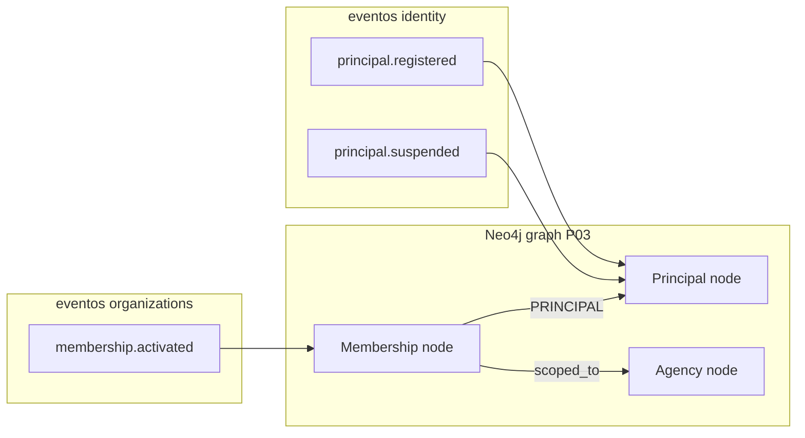

# R03 — Esboço de domínio: `modules/identity`

**Componente:** modules/identity  
**Rodada:** R3 — Domain model  
**Pacote SDD:** P02  
**Data:** 2026-09-07  
**Issue debate estrutura:** ANX-42 · implementação parcial: ANX-28 (`in_review`)

## Objetivo da rodada

Esboçar o modelo de domínio de **identity** após [R02-boundaries.md](./R02-boundaries.md): entidade `Principal`, value objects, comandos/queries, eventos, respostas às cinco perguntas abertas de R02 e projeção Neo4j. Alinhar com o port `PrincipalLookup` de [organizations/R03-domain-sketch.md](../../modules/organizations/R03-domain-sketch.md) e [organizations/R06-dependencies.md](../../modules/organizations/R06-dependencies.md).

## Fontes aplicadas

| Fonte | Uso em R3 |
| --- | --- |
| [R02-boundaries.md](./R02-boundaries.md) | Fronteiras, exports P0, perguntas abertas |
| [R01-context.md](./R01-context.md) | Propósito e armazenamento |
| [organizations/R06-dependencies.md](../../modules/organizations/R06-dependencies.md) | `PrincipalLookup` → `getPrincipalById` |
| `backend/modules/identity/src/` | Código ANX-28 parcial |
| `brain/notes/anxionos-graph-schema-v1.md` | E008–E009, tipos Identity |

## Debate R3 (diálogo atribuído)

**Arquiteto:** Um agregado núcleo v1 — `Principal` humano. `ServicePrincipal` reservado como segundo agregado (sketch, implementação P02+). Value objects mínimos: IDs tipados e `PrincipalStatus`.

**Executor:** Ports: `PrincipalRepository` (estado PG), sem port Neo4j — projeção via eventos. Queries públicas espelham repositório; `getPrincipalById` é pré-requisito organizations G1.

**Crítico (organizations):** `PrincipalLookup.exists` deve retornar `false` para principal `suspended` — não apenas inexistente.

**Security:** `authUserId` nunca trafega em eventos downstream além do necessário no boundary identity; payload de `principal.registered` já expõe `authUserId` — revisar em R4 se reduzir para só `principalId` + `email`.

**Síntese Orquestrador:** Domain sketch v1 aprovado; `getPrincipalById` marcado como entrega G1 obrigatória ANX-28.

---

## Entidade: `Principal`

Agregado raiz institucional para atores humanos. Referenciado por `principalId` em organizations, governance, grants e grafo.

```typescript
interface Principal {
  id: PrincipalId;           // UUID v4
  authUserId: AuthUserId;    // referência lógica 1:1 → Better Auth user.id
  email: EmailAddress;       // espelho institucional (único na plataforma)
  status: PrincipalStatus;
  createdAt: Date;
  suspendedAt?: Date;        // preenchido quando status = suspended (R04)
  suspensionReason?: string; // código/razão curta; sem PII (R04)
}
```

### Estados (`PrincipalStatus`)

| Estado | Significado | Transições permitidas |
| --- | --- | --- |
| `active` | Ator institucional válido; lookups “ativos” retornam o registro | → `suspended` |
| `suspended` | Revogação institucional; fail-closed em `PrincipalLookup` e sessão derivada | → `active` (reativação — **deferida R04**) |

Estado inicial na criação: sempre `active`.

### Invariantes de domínio

| ID | Regra |
| --- | --- |
| INV-IDN-01 | Todo `Principal` humano tem exatamente um `authUserId` único na plataforma |
| INV-IDN-02 | Todo `Principal` humano tem `email` único na plataforma (espelho institucional) |
| INV-IDN-03 | `RegisterPrincipal` é idempotente por `authUserId` — replay retorna o mesmo agregado |
| INV-IDN-04 | `Principal.status = suspended` implica que queries “para autorização” tratam o ator como inexistente (`null` ou erro conforme contrato) |
| INV-IDN-05 | Mutações confirmam estado + journal + outbox na mesma transação PG |
| INV-IDN-06 | `domain/*` não conhece Better Auth, HTTP nem Neo4j |
| INV-IDN-07 | `Principal` é **global** à plataforma — escopo tenant emerge em organizations via `Membership`, não em identity |

---

## Value objects e IDs

| Tipo | Formato / validação | Uso |
| --- | --- | --- |
| `PrincipalId` | `string` UUID v4 | Identificador institucional canônico |
| `AuthUserId` | `string` opaco (BA `user.id`) | Ligação credencial ↔ Principal; só no boundary HTTP + identity |
| `EmailAddress` | email normalizado lowercase, max 320 | Espelho; unicidade em PG |
| `PrincipalStatus` | `"active" \| "suspended"` | Enum de domínio |
| `ServicePrincipalId` | UUID v4 | **Reservado** — agregado `ServicePrincipal` (deferido implementação) |

Implementação v1: IDs como `string` tipado via TypeScript alias; validação Zod na borda application/contracts (R04).

---

## Ports (domain/)

| Port | Métodos (esboço) | Notas |
| --- | --- | --- |
| `PrincipalRepository` | `findById`, `findByAuthUserId`, `findByEmail`, `save` | `findById` **ausente no código** — adicionar em ANX-28 |
| `IdentityUnitOfWork` | transação estado + journal + outbox | Mesmo padrão organizations; hoje inline em `registerPrincipal` |

**Não há port Neo4j** — graph consome eventos `ownerDomain: identity`.

---

## Comandos application

### `RegisterPrincipal` (implementado — ANX-28)

Cria `Principal` após signup Better Auth. Orquestrado pelo composition root (`apps/api` hook pós-signup).

```typescript
export interface RegisterPrincipalInput {
  authUserId: string;
  email: string;
}

export interface RegisterPrincipalDeps {
  pool: Pool;
  repository: PrincipalRepository;
}

export async function registerPrincipal(
  deps: RegisterPrincipalDeps,
  input: RegisterPrincipalInput,
): Promise<Principal>;
```

| Aspecto | Decisão |
| --- | --- |
| Idempotência | Por `authUserId` — retorna existente sem reemitir evento |
| Pré-condição | `authUserId` e `email` válidos; email não usado por outro Principal |
| Efeito | Insert PG + `principal.registered` |
| Erros | `PRINCIPAL_EMAIL_TAKEN` |

### `LinkAuthUserId` (sketch — **deferido R04**)

Vincula credencial BA a Principal existente (conta federada, migração). Não necessário para v1 signup linear.

```typescript
export interface LinkAuthUserIdInput {
  principalId: string;
  authUserId: string;
}

// Pré: Principal sem authUserId OU merge controlado por operations
// Pós: atualiza authUserId; evento principal.auth_linked.v1 (R04)
```

### `SuspendPrincipal` (sketch — P1, R04 implementação)

Revogação institucional do ator.

```typescript
export interface SuspendPrincipalInput {
  principalId: string;
  reasonCode: string;   // ex.: "ops.manual", "governance.revoked"
  actorPrincipalId?: string; // quem suspendeu (auditoria)
}

export interface SuspendPrincipalDeps {
  pool: Pool;
  repository: PrincipalRepository;
}

export async function suspendPrincipal(
  deps: SuspendPrincipalDeps,
  input: SuspendPrincipalInput,
): Promise<Principal>;
```

| Aspecto | Decisão |
| --- | --- |
| Pré-condição | Principal existe e `status = active` |
| Efeito | `status → suspended`, `suspendedAt`, journal + outbox |
| Idempotência | Re-suspend do já suspenso retorna mesmo estado sem duplicar evento |
| Side effect HTTP | **Não** neste comando — ver resposta Q3 (consumer em `apps/api`) |

### `SyncPrincipalEmail` (sketch — R04)

Propaga mudança de email do BA para espelho institucional. Ver resposta Q2.

---

## Queries application

Assinaturas públicas alinhadas a organizations `PrincipalLookup` e `apps/api` auth plugin.

### `getPrincipalByAuthUserId` (implementado)

```typescript
export async function getPrincipalByAuthUserId(
  repository: PrincipalRepository,
  authUserId: string,
): Promise<Principal | null>;
```

| Consumidor | Uso |
| --- | --- |
| `apps/api` `authPlugin` | Sessão BA → `principalId` injetado em comandos HTTP |
| Testes / integração | Fixture de ligação |

Retorna `null` se inexistente **ou** se `status = suspended` (**fail-closed** — alinhar implementação ANX-28).

### `getPrincipalById` (**P0 — G1 ANX-28, ausente no `index.ts`**)

```typescript
export interface GetPrincipalByIdDeps {
  repository: PrincipalRepository;
}

export async function getPrincipalById(
  deps: GetPrincipalByIdDeps,
  principalId: string,
): Promise<Principal | null>;
```

| Consumidor | Uso |
| --- | --- |
| organizations `IdentityPrincipalLookup` | `PrincipalLookup.exists(id)` → `getPrincipalById` !== null && status active |
| `apps/api` (validação opcional) | Sanity check antes de mutação cross-module |

**Contrato para `PrincipalLookup` (organizations):**

```typescript
// organizations adapter (referência)
async exists(principalId: string): Promise<boolean> {
  const p = await getPrincipalById(deps, principalId);
  return p !== null && p.status === "active";
}
```

---

## Eventos de domínio (rascunho para R4)

Envelope: `ownerDomain: "identity"`, `schemaVersion: "0.1.0"`. Naming alinhado a organizations (`identity.principal.<action>.v1` em R4; código atual usa `principal.registered` sem sufixo — **normalizar em R04**).

| eventType (sketch) | aggregate | Payload principal | Consumidores previstos |
| --- | --- | --- | --- |
| `identity.principal.registered.v1` | Principal | `principalId`, `email` | graph projector, audit |
| `identity.principal.suspended.v1` | Principal | `principalId`, `reasonCode`, `suspendedAt` | graph, `apps/api` (invalidação sessão), governance (grants derivados) |
| `identity.principal.email_updated.v1` | Principal | `principalId`, `email` | graph (display), audit — **R04** |

### Exemplo `identity.principal.registered.v1`

```json
{
  "eventId": "550e8400-e29b-41d4-a716-446655440010",
  "schemaVersion": "0.1.0",
  "ownerDomain": "identity",
  "eventType": "identity.principal.registered.v1",
  "occurredAt": "2026-09-08T02:30:00.000Z",
  "payload": {
    "principalId": "p1b2c3d4-e5f6-7890-abcd-ef1234567890",
    "email": "owner@example.com"
  }
}
```

**Nota:** `authUserId` **omitido** do payload público em R4 (reduz superfície); permanece só em PG identity.

### Exemplo `identity.principal.suspended.v1`

```json
{
  "eventType": "identity.principal.suspended.v1",
  "payload": {
    "principalId": "p1b2c3d4-e5f6-7890-abcd-ef1234567890",
    "reasonCode": "ops.manual",
    "suspendedAt": "2026-09-08T03:00:00.000Z"
  }
}
```

---

## Respostas às perguntas abertas de R02

### 1. Service principal — modelo de credencial e patrocinador

| Aspecto | Posição v1 | Racional |
| --- | --- | --- |
| Agregado | `ServicePrincipal` separado de `Principal` humano | Credencial rotacionável e lifecycle distinto |
| Patrocínio | `sponsorPrincipalId` obrigatório — humano responsável | Auditoria e revogação em cascata via governance |
| Credencial | API key rotacionável (hash em PG); **JWT/mTLS deferidos** R04+ | Menor superfície para P02; execution-go pode começar com API key scoped |
| Relação | `ServicePrincipal` referencia `sponsorPrincipalId`, não herda sessão BA | Service nunca usa cookie humano |

**Deferido R04:** tabela `identity_service_principals`, comando `registerServicePrincipal`, rotação e eventos `service_principal.*`.

### 2. Sincronização email BA → identity

| Aspecto | Posição v1 | Racional |
| --- | --- | --- |
| Caminho primário | **Hook síncrono** no composition root após `updateUser` BA → `syncPrincipalEmail` | Consistência imediata para convites organizations que cruzam email |
| Fallback | Worker de reconciliação periódico (email BA vs PG identity) | Recuperação de falha transitória; **especificação R05/R09** |
| organizations | Continua sem usar email como chave de membership ativo | INV-IDN-02 + organizations R02 |

**Deferido:** schema exato do comando e idempotência do hook (R04).

### 3. Revogação em cascata — quem invalida sessões BA

| Aspecto | Posição v1 | Racional |
| --- | --- | --- |
| Dono do fato | **identity** emite `principal.suspended` | Domínio institucional |
| Invalidação cookie/sessão | **Consumer em `apps/api`** (ou worker TS dedicado no composition root) subscreve evento e chama API BA de revogação de sessão | identity não manipula HTTP/cookies (R02) |
| governance | Pode revogar grants derivados assincronamente | Separado de sessão HTTP |
| identity worker | **Não** em v1 | Evita segundo composition root prematuro |

**Deferido R09:** wiring NATS/inbox consumer `api:identity-sessions:v1`.

### 4. Unicidade cross-tenant — Principal global vs scoped

| Aspecto | Posição v1 | Racional |
| --- | --- | --- |
| Escopo | **`Principal` global à plataforma** | Uma pessoa = um ator institucional |
| Tenancy | Via `Membership` em organizations (`agencyId` + `role`) | ADR0002 + organizations R03 |
| Implicação | Mesmo `principalId` pode ter memberships em múltiplas Agencies | Esperado multi-tenant |
| Anti-padrão | Duplicar Principal por Agency | Viola INV-IDN-01/02 |

**Sem deferral** — decisão fechada para v1.

### 5. Projeção graph — nó `User` vs `Principal`

| Aspecto | Posição v1 | Racional |
| --- | --- | --- |
| Nó projetado | **`:Principal`** com `principalId`, `status`, `email` (classification INTERNAL) | Alinha eventos identity e `principalId` em organizations |
| Schema v1 `User` | Label legado no draft — projector P03 mapeia `User.identitySubject` → `principalId` no nó `:Principal` | Evita dois IDs para o mesmo ator |
| Nó BA/credencial | **Não projetado** em v1 | Credencial fica em PG BA; grafo é institucional |
| Aresta `AUTHENTICATES_AS` | **Deferida** | Só necessária se projetar credencial técnica ou multi-auth |
| Ligação Agency | Via eventos **organizations** — `Membership` → `PRINCIPAL` → `:Principal` (E008–E009 adaptados) | identity não conhece Agency |

---

## Projeção Neo4j (sketch)

Consumer futuro: `graph:identity:v1` (módulo **graph**, P03). identity publica eventos; não importa `neo4j-driver`.

### Nó `:Principal`

| Propriedade | Fonte | Notas |
| --- | --- | --- |
| `principalId` | `payload.principalId` | NodeKey: `(PLATFORM, platformId, Principal, principalId)` |
| `email` | `payload.email` | classification INTERNAL; redact em exports |
| `status` | `active` / `suspended` | Atualizado por `principal.suspended` |
| `schemaVersion` | `1` | Conforme graph schema v1 |
| `ownerDomain` | `"identity"` | Envelope |
| `revision` | monotônico por evento | Idempotência projector |

### Relacionamento com Agency (via organizations)

identity **não** cria arestas para Agency. Fluxo:



| Edge | Origem evento | Assinatura (adaptada E008–E009) |
| --- | --- | --- |
| `(:Agency)-[:HAS_MEMBERSHIP]->(:Membership)` | `organizations.membership.*` | graph:organizations:v1 |
| `(:Membership)-[:PRINCIPAL]->(:Principal)` | `membership.activated` + nó pré-existente | Requer `principal.registered` antes ou upsert idempotente |
| Status membership | organizations | `suspended` Principal não remove nó — memberships tratadas em governance/org |

---

## Escopo ANX-28 — entrega G1 (desbloqueio organizations)

> **Nota obrigatória:** o export público **`getPrincipalById`** e o método de repositório **`findById`** fazem parte do **entregável G1 de ANX-28**, não de um follow-up opcional. Sem eles, organizations **não** pode wirear `IdentityPrincipalLookup` nem fechar G1 (ANX-29 bloqueada).

| Item | Prioridade | Gate | Evidência esperada |
| --- | --- | --- | --- |
| `PrincipalRepository.findById` | P0 | G1 identity | Implementação Drizzle |
| `getPrincipalById` em `index.ts` | P0 | G1 identity | Espelha assinatura de `getPrincipalByAuthUserId` |
| Fail-closed `suspended` nas queries | P0 | G1 identity | Teste unitário queries |
| `suspendPrincipal` | P1 | R04 / G2+ | Sketch neste doc; não bloqueia organizations G1 |
| Eventos versionados `identity.principal.*.v1` | P1 | R04 | Normalizar `principal.registered` atual |

**Dependência downstream:** organizations R06 D-R6-01, P-R6-01, R-ORG-03/13 (R07) assumem `getPrincipalById` aceito em identity G7 antes de ANX-29 G1.

---

## Estrutura de pastas (referência — já parcialmente existente)

```text
modules/identity/
├── domain/entities/principal.ts
├── domain/ports/principal-repository.ts
├── application/commands/register-principal.ts
├── application/commands/suspend-principal.ts      # R04
├── application/queries/get-principal.ts           # + getPrincipalById
├── infrastructure/persistence/
└── index.ts
```

---

## Critérios de aceite R3

| # | Critério | Status |
| --- | --- | --- |
| AC-R3-01 | Entidade Principal com estados e invariantes | ✅ |
| AC-R3-02 | Value objects / IDs documentados | ✅ |
| AC-R3-03 | Comandos RegisterPrincipal + SuspendPrincipal (sketch) + link authUserId | ✅ |
| AC-R3-04 | Queries com assinaturas públicas documentadas | ✅ |
| AC-R3-05 | Eventos principal.registered / principal.suspended (sketch) | ✅ |
| AC-R3-06 | Cinco perguntas R02 respondidas com posição e deferrals | ✅ |
| AC-R3-07 | Projeção Neo4j sketch + relação Agency via organizations | ✅ |
| AC-R3-08 | Nota explícita ANX-28 / getPrincipalById G1 | ✅ |

## Pendências para rodadas seguintes

| ID | Assunto | Rodada |
| --- | --- | --- |
| P-R3-01 | Implementar `getPrincipalById` + `findById` (ANX-28 G1) | Imediato |
| P-R3-02 | Schemas `@anxionos/contracts/identity/*` | R4 |
| P-R3-03 | `suspendPrincipal` + consumer sessão `apps/api` | R4 / R09 |
| P-R3-04 | `ServicePrincipal` agregado e storage | R5 |
| P-R3-05 | Consumer `graph:identity:v1` | graph P03 |
| P-R3-06 | Normalizar eventType com sufixo `.v1` | R4 |

## Saída R3

✅ Domain sketch aprovado — R04 concluído em [R04-contracts-events.md](./R04-contracts-events.md).

Próximo passo crítico de implementação: fechar **ANX-28 G1** com `getPrincipalById` antes de organizations wiring.
