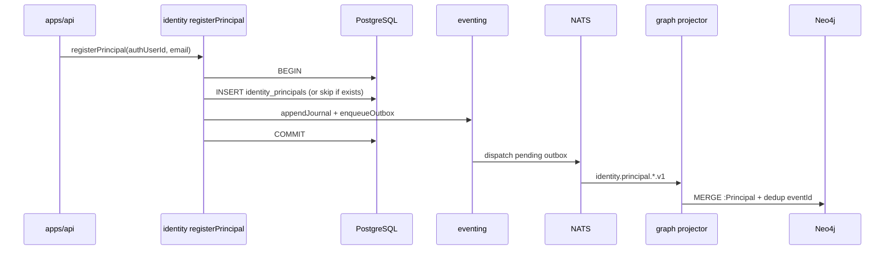

# R05 — Armazenamento: `modules/identity`

**Componente:** modules/identity  
**Rodada:** R5 — PostgreSQL, journal/outbox, projeção Neo4j  
**Pacote SDD:** P02  
**Data:** 2026-09-07  
**Issue debate estrutura:** ANX-42 · implementação parcial: ANX-28 (`in_review`)

## Participantes

| Papel | Agente |
| --- | --- |
| Orquestrador | CTO / orchestrate-work |
| Executor | code-architect |
| Crítico | critic-reviewer |
| Code Review | code-reviewer |
| QA | QA Team |
| Security | security-reviewer |
| Red Team | Red Team |
| Arquiteto | architect |

Roster obrigatório: [DEBATE-ROSTER.md](../../DEBATE-ROSTER.md).

## Objetivo da rodada

Definir o modelo de persistência autoritativo de **identity** após [R04-contracts-events.md](./R04-contracts-events.md): tabelas PostgreSQL (`identity_principals`), alinhamento journal/outbox com `packages/eventing`, exclusão de segredos em eventos, separação das tabelas Better Auth, projeção Neo4j e exclusões SQLite — espelhando padrões de [organizations/R05-storage.md](../../modules/organizations/R05-storage.md).

## Fontes aplicadas

| Fonte | Uso em R5 |
| --- | --- |
| [R04-contracts-events.md](./R04-contracts-events.md) | EventTypes `identity.principal.*.v1`, payloads sem `authUserId` |
| [R03-domain-sketch.md](./R03-domain-sketch.md) | Entidade Principal, invariantes INV-IDN-01..07 |
| [R02-boundaries.md](./R02-boundaries.md) | PG identity vs tabelas BA em `apps/api` |
| [organizations/R05-storage.md](../../modules/organizations/R05-storage.md) | Padrão journal/outbox, prefixo de tabela, sem FK cross-module |
| `brain/notes/anxionos-storage-ownership.md` | Matriz identity: PG + Neo4j projeção |
| `backend/modules/identity/` | Schema Drizzle, migration `0000`, `registerPrincipal` transacional |
| `backend/packages/eventing/` | `domain_journal`, `outbox`, `appendJournal`, `enqueueOutbox` |

## Debate R5 (diálogo atribuído)

**Arquiteto:** PostgreSQL confirma `Principal` humano em `identity_principals`. Prefixo `identity_` nas tabelas e enums. Journal/outbox compartilhados via `@anxionos/eventing` — identity **não** duplica DDL de eventos.

**Security:** `authUserId` é dado de ligação credencial — **proibido** em payload de outbox/journal consumido downstream. Email no evento é PII mínima (classification INTERNAL no grafo); hash de senha e tokens BA **nunca** entram no módulo identity.

**Crítico:** Código ANX-28 ainda emite `principal.registered` com `authUserId` no payload — gap P1 documentado em R04; P0 storage não bloqueia, mas Security deve bloquear merge P1 sem correção.

**Executor:** Transação única em `registerPrincipal`: INSERT `identity_principals` + `appendJournal` + `enqueueOutbox`. Idempotência por `authUserId` (replay retorna existente **sem** reemitir evento). `identity_command_journal` **deferido** v1 — identity não expõe HTTP com `Idempotency-Key` direto; composition root orquestra signup.

**Code Review:** Colunas `suspended_at` e `suspension_reason` entram na migration **0001** quando `suspendPrincipal` for implementado (P1) — não antecipar no P0 G1 para não inflar ANX-28.

**QA:** Testes P0: transação rollback se outbox falha; idempotência signup duplo; `getPrincipalById` com fixture suspended.

**Red Team:** Vetor: enumerar `principalId` em rotas futuras; email em evento vaza em log de NATS se subscriber não redact — exigir classification em projector audit.

**Síntese Orquestrador:** Modelo de armazenamento v1 fechado; P0 G1 não exige novas tabelas além de `identity_principals` + índices documentados.

---

## Princípios de autoridade

| Princípio | Decisão |
| --- | --- |
| Fonte de verdade transacional | PostgreSQL (`identity_*`) |
| Credencial / sessão HTTP | Tabelas Better Auth — **fora** do Drizzle schema identity; dono `apps/api` |
| Grafo institucional | Neo4j — projeção derivada de eventos `ownerDomain: identity` |
| Journal de eventos | Tabela compartilhada `domain_journal` |
| Outbox | Tabela compartilhada `outbox` — mesma transação que mutação de estado |
| Idempotência de comando HTTP | **Deferida** — `identity_command_journal` só se identity ganhar rotas HTTP próprias (não v1) |
| Idempotência de domínio | `RegisterPrincipal` por `authUserId`; `SuspendPrincipal` por `principalId` (P1) |
| SQLite | **Proibido** para estado institucional deste módulo |
| FK cross-module | **Não** — organizations referencia `principal_id` logicamente |
| Segredos em eventos | **Proibido** — sem `authUserId`, tokens, hashes, API keys |

Fluxo de escrita:



---

## PostgreSQL — enums

| Enum Drizzle | Valores | Uso |
| --- | --- | --- |
| `identity_principal_status` | `active`, `suspended` | [R03](./R03-domain-sketch.md) `PrincipalStatus` |

---

## PostgreSQL — tabela `identity_principals` (v1 — migration 0000)

Agregado raiz humano. `id` = `principalId` canônico em commands, events e grants.

| Coluna | Tipo | Nullable | Descrição |
| --- | --- | --- | --- |
| `id` | `uuid` PK | não | `gen_random_uuid()` — `principalId` |
| `auth_user_id` | `text` | não | UNIQUE — referência lógica 1:1 → Better Auth `user.id` |
| `email` | `text` | não | UNIQUE — espelho institucional lowercase |
| `status` | `identity_principal_status` | não | Default `active` |
| `created_at` | `timestamptz` | não | `defaultNow()` |

### Índices `identity_principals` (existentes + recomendados)

| Nome | Colunas | Propósito |
| --- | --- | --- |
| `identity_principals_auth_user_id_unique` | `(auth_user_id)` UNIQUE | Idempotência `RegisterPrincipal`, `getPrincipalByAuthUserId` |
| `identity_principals_email_unique` | `(email)` UNIQUE | INV-IDN-02 |
| `identity_principals_status_idx` | `(status)` | Operações batch suspend/reconcile (P1) |

### Colunas P1 — migration `0001` (com `suspendPrincipal`)

| Coluna | Tipo | Nullable | Descrição |
| --- | --- | --- | --- |
| `suspended_at` | `timestamptz` | sim | Preenchido em suspend |
| `suspension_reason` | `text` | sim | Código curto (`ops.manual`, etc.) — sem PII |

**Decisão:** não adicionar em ANX-28 P0 — apenas documentar para migration coordenada com comando P1.

---

## PostgreSQL — tabela `identity_service_principals` (**deferida**)

| Aspecto | Decisão v1 |
| --- | --- |
| Status | **Não criar** em P02 G1 — sketch R03/R04 |
| Motivo | ANX-28 escopo = Principal humano + lookup organizations |
| Quando | Follow-up identity ou execution-go wiring |

Esboço futuro (referência): `id`, `sponsor_principal_id`, `name`, `api_key_hash`, `status`, `created_at`, `rotated_at`.

---

## Tabelas Better Auth — fora do módulo identity

| Tabela BA (ex.) | Dono | Notas |
| --- | --- | --- |
| `user`, `session`, `account`, `verification` | `apps/api` + Better Auth | Mesmo `DATABASE_URL`; migrations BA separadas |
| Pool | Composition root | Pode compartilhar pool PG; identity usa factory `createIdentityDb` |

identity **não** importa schema BA nem escreve nessas tabelas.

---

## Journal e outbox — alinhamento `packages/eventing`

O módulo **não** cria tabelas `domain_journal` / `outbox`.

| Função (`@anxionos/eventing`) | Uso em identity |
| --- | --- |
| `ensureEventingSchema(pool)` | Bootstrap no composition root **antes** de `ensureIdentitySchema` |
| `appendJournal(client, envelope)` | Dentro da transação de `registerPrincipal` / `suspendPrincipal` |
| `enqueueOutbox(client, envelope)` | Mesma transação |
| `appendEventAtomic` | **Não** usar isoladamente — mutação de estado na mesma `BEGIN`/`COMMIT` |

### Pseudocódigo `registerPrincipal` (estado atual + alvo)

```typescript
async function registerPrincipal(deps, input) {
  const existing = await deps.repository.findByAuthUserId(input.authUserId);
  if (existing) return existing; // sem evento

  const client = await deps.pool.connect();
  try {
    await client.query("BEGIN");
    // INSERT identity_principals ...
    const envelope = {
      ownerDomain: "identity",
      eventType: "identity.principal.registered.v1", // P1: migrar de principal.registered
      payload: { principalId, email }, // SEM authUserId
    };
    await appendJournal(client, envelope);
    await enqueueOutbox(client, envelope);
    await client.query("COMMIT");
    return principal;
  } catch (e) {
    await client.query("ROLLBACK");
    throw e;
  } finally {
    client.release();
  }
}
```

### Mapa evento → colunas afetadas

| eventType | Tabelas / colunas |
| --- | --- |
| `identity.principal.registered.v1` | INSERT `identity_principals` |
| `identity.principal.suspended.v1` | UPDATE `status`, `suspended_at`, `suspension_reason` (P1) |
| `identity.principal.email_updated.v1` | UPDATE `email` (P1) |
| `identity.principal.reactivated.v1` | UPDATE `status`, CLEAR suspend cols (**deferido**) |

### Regras de payload (sem segredos)

| Campo | Em PG identity | Em evento outbox |
| --- | --- | --- |
| `principalId` | ✅ | ✅ |
| `email` | ✅ | ✅ (INTERNAL) |
| `authUserId` | ✅ | ❌ **proibido** |
| `reasonCode` | ✅ (suspend) | ✅ (enum fechado) |
| Senha / token / API key | ❌ | ❌ |

---

## Projeção Neo4j

Projector no módulo **graph** (P03); identity publica eventos.

### Nó `:Principal`

| Propriedade | Fonte | Notas |
| --- | --- | --- |
| `principalId` | `payload.principalId` | NodeKey institucional |
| `email` | `payload.email` | classification INTERNAL |
| `status` | `active` / `suspended` | Atualizado por eventos suspend |
| `ownerDomain` | `"identity"` | Envelope |
| `revision` | monotônico | Idempotência projector |

### Arestas

identity **não** cria arestas para Agency — organizations projeta `Membership → PRINCIPAL → Principal` (ver [R03](./R03-domain-sketch.md)).

Consumer: `graph:identity:v1` com inbox dedup por `eventId`.

---

## O que permanece FORA do SQLite

| Dado | Motivo |
| --- | --- |
| `identity_principals` | Autoridade transacional única em PG |
| Estado de revogação (`suspended`) | Fail-closed exige PG autoritativo |
| Journal / outbox | Mecanismo compartilhado PG |
| Sessões Better Auth | Runtime HTTP — tabelas BA em PG via apps/api |
| Projeção Neo4j | Engine separado |

**Permitido em SQLite (fora do módulo):** cache UI local sem autoridade (ex.: último email digitado no formulário de login).

---

## Drizzle — ownership

```text
backend/modules/identity/
├── drizzle.config.ts
├── package.json                   # db:generate, db:migrate
└── src/infrastructure/
    ├── persistence/
    │   ├── schema.ts              # identity_principals + enum
    │   └── principal-repository.ts
    ├── create-db.ts               # createIdentityDb(pool)
    ├── migrate.ts                 # ensureIdentitySchema(pool)
    └── migrations/
        ├── 0000_identity_principals.sql
        └── meta/
```

| Aspecto | Decisão |
| --- | --- |
| Prefixo | `identity_*` |
| Bootstrap | `ensureIdentitySchema(pool)` após `ensureEventingSchema` |
| Export schema | `export { principals }` em `index.ts` — testes e bootstrap |
| FK cross-module | Nenhuma |

**Ordem de bootstrap no composition root (`apps/api`):**

1. `ensureEventingSchema(pool)`
2. `ensureIdentitySchema(pool)`
3. `ensureOrganizationsSchema(pool)` (quando ANX-29)

---

## Gap código vs R05 (ANX-28)

| Item | Código atual | Alvo R5 |
| --- | --- | --- |
| Tabela `identity_principals` | ✅ migration 0000 | ✅ |
| Transação estado + journal + outbox | ✅ `registerPrincipal` | ✅ |
| `eventType` | `principal.registered` | `identity.principal.registered.v1` (P1) |
| Payload sem `authUserId` | ❌ inclui `authUserId` | Remover (P1) |
| `findById` / `getPrincipalById` | ❌ ausente | **P0 G1** |
| Fail-closed `suspended` nas queries | ❌ não filtra | **P0 G1** |
| Colunas suspend | ❌ ausente | P1 com `suspendPrincipal` |
| `identity_service_principals` | ❌ deferido | Deferido |

---

## Escopo ANX-28 — P0 G1 (prontidão implementação)

> Consolidado R03 + R04 + R05. Itens 1–3 são **bloqueantes** para organizations `PrincipalLookup` e retomada G1.

| # | Entregável | Prioridade | Evidência |
| ---: | --- | --- | --- |
| 1 | `PrincipalRepository.findById` | **P0** | Drizzle + teste unitário repositório |
| 2 | `getPrincipalById` exportado em `index.ts` | **P0** | Query application |
| 3 | Fail-closed `suspended` em `getPrincipalById` e `getPrincipalByAuthUserId` | **P0** | Testes queries — regra na application, não SQL |
| 4 | Transação register + journal + outbox | P0 | ✅ já existe — QA valida rollback |
| 5 | Normalizar `eventType` → `identity.principal.registered.v1` | P1 | Diff `register-principal.ts` |
| 6 | Remover `authUserId` do payload de evento | P1 | Security sign-off |
| 7 | Migration 0001 colunas suspend | P2 | Com `suspendPrincipal` |
| 8 | Schemas `@anxionos/contracts/identity/*` | P1 | AR01 contratos |

**Veredito R05:** storage v1 **aprovado**; ANX-28 **pronto para retomada G1** nos itens P0 1–3 — sem nova migration obrigatória.

---

## Critérios de aceite R5

| # | Critério | Status |
| --- | --- | --- |
| AC-R5-01 | Tabela `identity_principals` com colunas, tipos e índices | ✅ |
| AC-R5-02 | Journal/outbox via `packages/eventing` na mesma transação | ✅ |
| AC-R5-03 | Segredos e `authUserId` excluídos de payloads de evento (norma) | ✅ |
| AC-R5-04 | Separação BA vs identity documentada | ✅ |
| AC-R5-05 | Projeção Neo4j `:Principal` mapeada | ✅ |
| AC-R5-06 | Exclusões SQLite explícitas | ✅ |
| AC-R5-07 | `ServicePrincipal` e `identity_command_journal` deferidos com rationale | ✅ |
| AC-R5-08 | Lista P0 G1 consolidada para ANX-28 | ✅ |

## Pendências para rodadas seguintes

| ID | Assunto | Rodada |
| --- | --- | --- |
| P-R5-01 | Migration 0001 + `suspendPrincipal` | R09 / follow-up ANX-28 |
| P-R5-02 | Consumer `apps/api:identity-sessions:v1` | R09 |
| P-R5-03 | `identity_service_principals` storage | P02+ |
| P-R5-04 | Testes integração PG: rollback journal/outbox | R09 |
| P-R5-05 | Wiring projector `graph:identity:v1` | graph P03 |

## Saída R5

✅ Modelo de armazenamento aprovado — próxima rodada **R06 — dependências** (`R06-dependencies.md`).

Próximo passo crítico de implementação: fechar **ANX-28 G1** (P0 itens 1–3) antes de organizations wiring.
