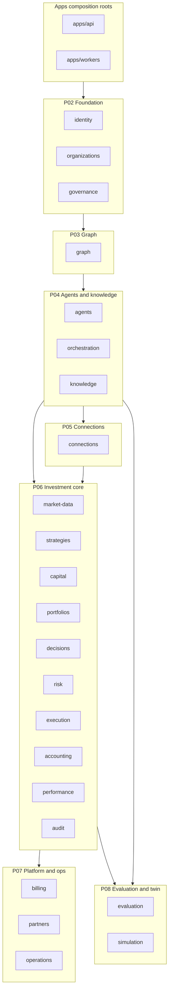

# Índice — debate da estrutura backend (25 componentes)

Debate documentado **R1–R10** para cada parte da árvore ADR0002 em `brain/notes/anxionos-backend-structure.md` (linhas 24–51): **2 apps** + **23 módulos**.

| Meta | Valor |
| --- | --- |
| **Issue taskboard** | ANX-42 — Debate estrutura backend |
| **Playbook** | [module-development-playbook.md](../module-development-playbook.md) |
| **Mapa de capacidades** | [system-capabilities/CAPABILITY-MAP.md](../system-capabilities/CAPABILITY-MAP.md) (ANX-43) |
| **Fila módulos** | [module-queue.md](../module-queue.md) |
| **Sessão atual** | Framework + R01 ✅ (25 componentes) · **23/23 debates `g0_ready`** (PC-G0 10/10 cada) — reconciliação 2026-09-08 (ANX-54) |
| **Próximo passo** | G7 aceites debates **ANX-39, ANX-41, ANX-46, ANX-77, ANX-82–115** (22 `in_review`) · impl G1 **ANX-104–116** · **ANX-32** graph G2 re-run |
| **Debate roster** | [DEBATE-ROSTER.md](../DEBATE-ROSTER.md) — 8 personas obrigatórias |

## Legenda

| Campo | Significado |
| --- | --- |
| **Fase** | Pacote SDD P01–P09 |
| **Código** | `ausente` · `parcial` · `in_review` · `in_dev` · `done` (snapshot 2026-09-07) |
| **Debate** | Rodadas concluídas / pendentes por componente (máx. 10 rodadas) |

## Diagrama por pacote SDD

Compatibilidade Mermaid: [MERMAID-STYLE.md](../MERMAID-STYLE.md).

## Índice dos 25 componentes

| # | Componente | Responsabilidade (brain) | Fase | Dependências principais | Código | Debate | R01 |
| ---: | --- | --- | --- | --- | --- | --- | --- |
| 1 | **apps/api** | API Bun + Elysia; composition root HTTP | P01–P07 | packages/*, modules registrados | `in_review` parcial | R01 ✅ | [R01](./apps-api/R01-context.md) |
| 2 | **apps/workers** | Composition root workers TypeScript | P01–P09 | eventing, modules/*/workers | `ausente` | R01 ✅ | [R01](./apps-workers/R01-context.md) |
| 3 | **identity** | Usuários, sessões, autenticação | P02 | packages P02 | `done` P0 (ANX-28) | **R01–R10 ✅** · debate `g0_ready` (ANX-77) | [R01–R05](./identity/) · [R06–R10](../modules/identity/ROUNDS.md) · [Slack](./identity/SLACK-TRANSCRIPTS.md) |
| 4 | **organizations** | Agency, Owner, onboarding, equipes | P02 | identity, packages P02 | `done` (ANX-29) | **R01–R10 ✅** · debate `g0_ready` (ANX-39) | [R01–R10](../modules/organizations/ROUNDS.md) |
| 5 | **governance** | Grants, delegação, mandatos, aprovações | P02 | identity, organizations | `ausente` | **R01–R10 ✅** · debate `g0_ready` (ANX-40) | [R01 estrutural](./governance/R01-context.md) · [debate módulo](../modules/governance/ROUNDS.md) |
| 6 | **graph** | Kernel, schema, traversals, temporalidade | P03 | P02, eventing, Neo4j | `ausente` | **R01–R10 ✅** · debate `g0_ready` | [R01](./graph/R01-context.md) · [R02](./graph/R02-boundaries.md) · [R03](./graph/R03-schema-registry.md) · [R04](./graph/R04-graphquery-contracts.md) · [R05](./graph/R05-cache-projection.md) · [R06](./graph/R06-rebuild-inbox.md) · [R07](./graph/R07-poison-pill-quarantine.md) · [R08](./graph/R08-decision-log.md) · [R09](./graph/R09-dev-plan.md) · [R10](./graph/R10-g0-handoff.md) · [Slack](./graph/SLACK-TRANSCRIPTS.md) |
| 7 | **agents** | Agent/AgentVersion, skills, fachada Brain | P04 | graph, governance | `ausente` | **R01–R05 ✅** · R06–R10 ✅ · debate `g0_ready` (ANX-82) | [R01](./agents/R01-context.md) · [R02](./agents/R02-boundaries.md) · [R03](./agents/R03-domain-sketch.md) · [R04](./agents/R04-contracts-events.md) · [R05](./agents/R05-storage-pg.md) · [R06](./agents/R06-dependencies.md) · [R07](./agents/R07-risks.md) · [R08](./agents/R08-decision-log.md) · [R09](./agents/R09-dev-plan.md) · [R10](./agents/R10-g0-handoff.md) |
| 8 | **orchestration** | Goals, Tasks, Runs, scheduler | P04 | agents, graph | `ausente` | **R01–R10 ✅** · debate `g0_ready` (ANX-46) | [R01](./orchestration/R01-context.md) · [R01 hierarchy](./orchestration/R01-hierarchy-modes.md) · [R02 Paperclip](./orchestration/R02-paperclip-checkout-heartbeat.md) · [R03 domain sketch](./orchestration/R03-domain-sketch.md) · [R04 contracts/events](./orchestration/R04-contracts-events.md) · [R05 storage/PG](./orchestration/R05-storage-pg.md) · [R06 dependencies](./orchestration/R06-dependencies.md) · [R07 risks](./orchestration/R07-risks.md) · [R08 decision log](./orchestration/R08-decision-log.md) · [R09 dev-plan](./orchestration/R09-dev-plan.md) · [R10](./orchestration/R10-g0-handoff.md) · [Slack](./orchestration/SLACK-TRANSCRIPTS.md) |
| 9 | **connections** | Providers, contas, modelos, inferência | P05 | P02, spec 005 | `ausente` | **R01–R10 ✅** · debate `g0_ready` (ANX-83) | [R01 estrutural](./connections/R01-context.md) · [R01 módulo](../modules/connections/R01-context.md) · [R02](../modules/connections/R02-boundaries.md) · [R03](../modules/connections/R03-domain-sketch.md) · [R04](../modules/connections/R04-contracts-events.md) · [R05](../modules/connections/R05-storage-pg.md) · [R06](../modules/connections/R06-dependencies.md) · [R07](../modules/connections/R07-risks.md) · [R08](../modules/connections/R08-decision-log.md) · [R09](../modules/connections/R09-dev-plan.md) · [R10](../modules/connections/R10-g0-handoff.md) · [ROUNDS](../modules/connections/ROUNDS.md) |
| 10 | **knowledge** | Documentos, memórias, evidências, Graph RAG | P04 | graph, governance | `ausente` | **R01–R10 ✅** · debate `g0_ready` (ANX-85) | [R01](./knowledge/R01-context.md) · [R02](./knowledge/R02-boundaries.md) · [R03](./knowledge/R03-domain-sketch.md) · [R04](./knowledge/R04-contracts-events.md) · [R05](./knowledge/R05-storage-pg.md) · [R06](./knowledge/R06-dependencies.md) · [R07](./knowledge/R07-risks.md) · [R08](./knowledge/R08-decision-log.md) · [R09](./knowledge/R09-dev-plan.md) · [R10](./knowledge/R10-g0-handoff.md) · [ROUNDS](./knowledge/ROUNDS.md) |
| 11 | **market-data** | Instrumentos, feeds, preços, eventos | P06 | organizations, TimescaleDB | `ausente` | **R01–R10 ✅** · debate `g0_ready` (ANX-87) | [R01](./market-data/R01-context.md) · [R02](./market-data/R02-boundaries.md) · [R03](./market-data/R03-domain-sketch.md) · [R04](./market-data/R04-contracts-events.md) · [R05](./market-data/R05-storage-pg.md) · [R06](./market-data/R06-dependencies.md) · [R07](./market-data/R07-risks.md) · [R08](./market-data/R08-decision-log.md) · [R09](./market-data/R09-dev-plan.md) · [R10](./market-data/R10-g0-handoff.md) · [ROUNDS](./market-data/ROUNDS.md) |
| 12 | **strategies** | Estratégias, backtests, deployments | P06 | market-data, agents | `ausente` | **R01–R10 ✅** · debate `g0_ready` (ANX-89) | [R01](./strategies/R01-context.md) · [R02](./strategies/R02-boundaries.md) · [R03](./strategies/R03-domain-sketch.md) · [R04](./strategies/R04-contracts-events.md) · [R05](./strategies/R05-storage-pg.md) · [R06](./strategies/R06-dependencies.md) · [R07](./strategies/R07-risks.md) · [R08](./strategies/R08-decision-log.md) · [R09](./strategies/R09-dev-plan.md) · [R10](./strategies/R10-g0-handoff.md) · [ROUNDS](./strategies/ROUNDS.md) |
| 13 | **capital** | Contas capital, alocações, reservas | P06 | organizations, governance | `ausente` | **R01–R10 ✅** · debate `g0_ready` (ANX-91) | [R01](./capital/R01-context.md) · [R02](./capital/R02-boundaries.md) · [R03](./capital/R03-domain-sketch.md) · [R04](./capital/R04-contracts-events.md) · [R05](./capital/R05-storage-pg.md) · [R06](./capital/R06-dependencies.md) · [R07](./capital/R07-risks.md) · [R08](./capital/R08-decision-log.md) · [R09](./capital/R09-dev-plan.md) · [R10](./capital/R10-g0-handoff.md) · [ROUNDS](./capital/ROUNDS.md) |
| 14 | **portfolios** | Portfolios, posições, exposição, valuation | P06 | capital, execution | `ausente` | **R01–R10 ✅** · debate `g0_ready` (ANX-95) | [R01](./portfolios/R01-context.md) · [R02](./portfolios/R02-boundaries.md) · [R03](./portfolios/R03-domain-sketch.md) · [R04](./portfolios/R04-contracts-events.md) · [R05](./portfolios/R05-storage-pg.md) · [R06](./portfolios/R06-dependencies.md) · [R07](./portfolios/R07-risks.md) · [R08](./portfolios/R08-decision-log.md) · [R09](./portfolios/R09-dev-plan.md) · [R10](./portfolios/R10-g0-handoff.md) · [ROUNDS](./portfolios/ROUNDS.md) |
| 15 | **decisions** | Decisões e intenções de investimento | P06 | knowledge, portfolios | `ausente` | **R01–R10 ✅** · debate `g0_ready` (ANX-97) | [R01](./decisions/R01-context.md) · [R02](./decisions/R02-boundaries.md) · [R03](./decisions/R03-domain-sketch.md) · [R04](./decisions/R04-contracts-events.md) · [R05](./decisions/R05-storage-pg.md) · [R06](./decisions/R06-dependencies.md) · [R07](./decisions/R07-risks.md) · [R08](./decisions/R08-decision-log.md) · [R09](./decisions/R09-dev-plan.md) · [R10](./decisions/R10-g0-handoff.md) · [ROUNDS](./decisions/ROUNDS.md) |
| 16 | **risk** | Políticas/limites, checks, kill switch | P06 | governance, portfolios | `ausente` | **R01–R10 ✅** · debate `g0_ready` (ANX-99) | [R01](./risk/R01-context.md) · [R02](./risk/R02-boundaries.md) · [R03](./risk/R03-domain-sketch.md) · [R04](./risk/R04-contracts-events.md) · [R05](./risk/R05-storage-pg.md) · [R06](./risk/R06-dependencies.md) · [R07](./risk/R07-risks.md) · [R08](./risk/R08-decision-log.md) · [R09](./risk/R09-dev-plan.md) · [R10](./risk/R10-g0-handoff.md) · [ROUNDS](./risk/ROUNDS.md) |
| 17 | **execution** | Ordens, fills, reconciliação venue | P06 | decisions, risk, execution-go | `ausente` | **R01–R10 ✅** · debate `g0_ready` (ANX-101) | [R01](./execution/R01-context.md) · [R02](./execution/R02-boundaries.md) · [R03](./execution/R03-domain-sketch.md) · [R04](./execution/R04-contracts-events.md) · [R05](./execution/R05-storage-pg.md) · [R06](./execution/R06-dependencies.md) · [R07](./execution/R07-risks.md) · [R08](./execution/R08-decision-log.md) · [R09](./execution/R09-dev-plan.md) · [R10](./execution/R10-g0-handoff.md) · [ROUNDS](./execution/ROUNDS.md) |
| 18 | **accounting** | Ledger, taxas, reconciliação financeira | P06 | execution, capital | `ausente` | **R01–R10 ✅** · debate `g0_ready` (ANX-93) | [R01](./accounting/R01-context.md) · [R02](./accounting/R02-boundaries.md) · [R03](./accounting/R03-domain-sketch.md) · [R04](./accounting/R04-contracts-events.md) · [R05](./accounting/R05-storage-pg.md) · [R06](./accounting/R06-dependencies.md) · [R07](./accounting/R07-risks.md) · [R08](./accounting/R08-decision-log.md) · [R09](./accounting/R09-dev-plan.md) · [R10](./accounting/R10-g0-handoff.md) · [ROUNDS](./accounting/ROUNDS.md) |
| 19 | **performance** | P&L, métricas, atribuição | P06 | accounting, portfolios | `ausente` | **R01–R10 ✅** · debate `g0_ready` (ANX-105) | [R01](./performance/R01-context.md) · [R10](./performance/R10-g0-handoff.md) · [ROUNDS](./performance/ROUNDS.md) |
| 20 | **evaluation** | Avaliação, certificação, reputação | P08 | strategies, simulation | `ausente` | **R01–R10 ✅** · debate `g0_ready` (ANX-109) | [R01](./evaluation/R01-context.md) · [R10](./evaluation/R10-g0-handoff.md) · [ROUNDS](./evaluation/ROUNDS.md) |
| 21 | **simulation** | Digital Twin, cenários isolados | P08 | strategies, graph | `ausente` | **R01–R10 ✅** · debate `g0_ready` (ANX-115) | [R01](./simulation/R01-context.md) · [R10](./simulation/R10-g0-handoff.md) · [ROUNDS](./simulation/ROUNDS.md) |
| 22 | **audit** | Flight Recorder, linhagem, replay | P06 | eventing, todos módulos | `ausente` | **R01–R10 ✅** · debate `g0_ready` (ANX-107) | [R01](./audit/R01-context.md) · [R10](./audit/R10-g0-handoff.md) · [ROUNDS](./audit/ROUNDS.md) |
| 23 | **billing** | Assinatura/cobrança plataforma | P07 | organizations, connections | `ausente` | **R01–R10 ✅** · debate `g0_ready` (ANX-103) | [R01](./billing/R01-context.md) · [R10](./billing/R10-g0-handoff.md) · [ROUNDS](./billing/ROUNDS.md) |
| 24 | **partners** | Indicações, comissões, payouts | P07 | billing, organizations | `ausente` | **R01–R10 ✅** · debate `g0_ready` (ANX-113) | [R01](./partners/R01-context.md) · [R10](./partners/R10-g0-handoff.md) · [ROUNDS](./partners/ROUNDS.md) |
| 25 | **operations** | Incidentes, retenção, export, recovery | P07 | audit, observability | `ausente` | **R01–R10 ✅** · debate `g0_ready` (ANX-111) | [R01](./operations/R01-context.md) · [R10](./operations/R10-g0-handoff.md) · [ROUNDS](./operations/ROUNDS.md) |

### organizations — debate existente (não duplicado)

O módulo **organizations** mantém o debate canônico em `docs/orchestration/modules/organizations/`:

| Rodada | Artefato | Status |
| --- | --- | --- |
| R1 | [R01-context.md](../modules/organizations/R01-context.md) | ✅ |
| R2 | [R02-boundaries.md](../modules/organizations/R02-boundaries.md) | ✅ |
| R3 | [R03-domain-sketch.md](../modules/organizations/R03-domain-sketch.md) | ✅ |
| R4 | [R04-contracts.md](../modules/organizations/R04-contracts.md) | ✅ |
| R5 | [R05-storage.md](../modules/organizations/R05-storage.md) | ✅ |
| R6 | [R06-dependencies.md](../modules/organizations/R06-dependencies.md) | ✅ |
| R7 | [R07-risks.md](../modules/organizations/R07-risks.md) | ✅ |
| R8 | [R08-decision-log.md](../modules/organizations/R08-decision-log.md) | ✅ |
| R9 | [R09-dev-plan.md](../modules/organizations/R09-dev-plan.md) | ✅ |
| R10 | [R10-g0-handoff.md](../modules/organizations/R10-g0-handoff.md) | ✅ |

Issues: **ANX-39** (debate G7 `in_review`) · **ANX-29** (implementação `done`, G7 2026-09-07).

## Contagens desta sessão

| Artefato | Quantidade |
| --- | ---: |
| R01 criados em `structure-debate/` | **24** |
| R01 linkados (organizations) | **1** |
| **Total R01 cobertos** | **25** |

## Ordem recomendada para R02

Seguir a fila P02→P09 e debates já iniciados:

1. **[organizations → R06](../modules/organizations/R06-dependencies.md)** (dependências) — debate mais avançado; fechar R6–R10 antes de G0
2. **identity → R06** — dependências (R05 ✅ [storage](./identity/R05-storage.md); fronteira R02/R06 em [boundaries](./identity/R02-boundaries.md)); retomar ANX-28 G1 P0 (`getPrincipalById`, `findById`, fail-closed)
3. **[apps/api → R02](./apps-api/R01-context.md)** — onde termina composition root vs `modules/*/api` (R02 pendente; R01 cobre composition root)
4. **[governance → R02](./governance/R01-context.md)** — grants vs risk PolicyVersion; depende identity+organizations (R02 pendente)
5. **[apps/workers → R02](./apps-workers/R01-context.md)** — perfis de deploy antes de graph projection workers (P03) (R02 pendente)

Demais componentes: R02 em ordem de pacote após consenso P02 foundation.

## Workflow de debate (referência)

| Rodada | Artefato | Objetivo |
| --- | --- | --- |
| **R1** | `R01-context.md` | Inventário — ✅ esta sessão |
| R2 | [`R02-boundaries.md`](../DEBATE-FORMAT.md) | Fronteiras possui/não possui |
| R3 | [`R03-domain-sketch.md`](../DEBATE-FORMAT.md) | Entidades, invariantes, ports |
| R4 | [`R04-contracts.md`](../DEBATE-FORMAT.md) | API, eventos, contratos |
| R5 | [`R05-storage.md`](../DEBATE-FORMAT.md) | PG / Neo4j / SQLite |
| R6 | `R06-dependencies.md` | Upstream / downstream |
| R7 | `R07-risks.md` | Riscos e lacunas |
| R8 | `R08-decision-log.md` | Síntese e decisões |
| R9 | `R09-dev-plan.md` | Plano implementação |
| R10 | `R10-g0-package.md` | Pacote G0 |

Artefatos por componente: `docs/orchestration/structure-debate/<component>/` (organizations permanece em `docs/orchestration/modules/organizations/`).

## Lacunas documentais conhecidas

Fonte local: `brain/notes/anxionos-storage-ownership.md` — status **draft** (ANX-8); matriz usada como proposta, não schema instalado.
Fora dos 25 componentes deste índice: `services/execution-go` e `services/research-python`; referenciados onde relevante.
Upstream P02 ainda `not_started`: `packages/secrets` e `packages/sdk`.

## Referências

Fonte local: `brain/notes/anxionos-backend-structure.md`.
Fonte local: `brain/notes/anxionos-storage-ownership.md`.
Fonte local: `brain/project-docs/decisions/0002-adopt-modular-backend-layout.md`.
Fonte local: `brain/project-docs/specs/001-institutional-contract/spec.md`.
