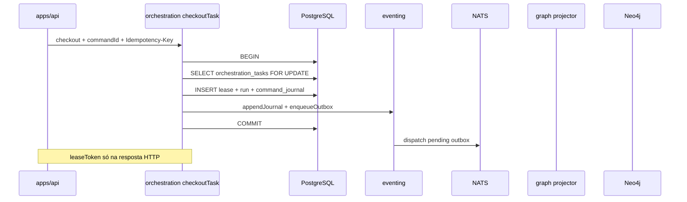

# R05 — Armazenamento: `modules/orchestration`

**Componente:** modules/orchestration  
**Rodada:** R5 — PostgreSQL, journal/outbox, projeção Neo4j  
**Pacote SDD:** P04  
**Data:** 2026-09-08  
**Issues:** ANX-46 · ANX-42 (debate estrutura) · ANX-44 (roster 8 personas)  
**Sessão Slack:** [Session E — R05 storage/PG](./SLACK-TRANSCRIPTS.md#session-e--r05-storage-pg)  
**Pré-requisito:** [R04-contracts-events.md](./R04-contracts-events.md) · [R03-domain-sketch.md](./R03-domain-sketch.md) · `brain/project-docs/specs/010-agent-hierarchy-orchestration/spec.md`

## Participantes

| Papel | Agente |
| --- | --- |
| Orquestrador | Orquestrador (CTO) |
| Executor | code-architect |
| Crítico | critic-reviewer |
| Code Review | code-reviewer |
| QA | QA |
| Security | security-reviewer |
| Red Team | Red Team (Ryn) |
| Arquiteto | architect |

Roster obrigatório: [DEBATE-ROSTER.md](../../DEBATE-ROSTER.md).

## Objetivo da rodada

Definir o modelo de persistência autoritativo de **orchestration** após [R04-contracts-events.md](./R04-contracts-events.md): tabelas PostgreSQL (`orchestration_goals`, `orchestration_tasks`, `orchestration_runs`, `orchestration_task_leases`, `orchestration_run_heartbeats`, `orchestration_gate_bindings`), alinhamento journal/outbox com `packages/eventing`, `orchestration_command_journal` para idempotência HTTP, exclusão de `leaseToken` em eventos/logs, projeção Neo4j (ReviewEdge CIRCULAR) e exclusões SQLite — espelhando padrões de [organizations/R05-storage.md](../../modules/organizations/R05-storage.md) e [identity/R05-storage.md](../identity/R05-storage.md).

## Fontes aplicadas

| Fonte | Uso em R5 |
| --- | --- |
| [R04-contracts-events.md](./R04-contracts-events.md) | EventTypes `orchestration.*.v1`, idempotência HTTP, `leaseToken` boundary |
| [R03-domain-sketch.md](./R03-domain-sketch.md) | Agregados, invariantes INV-ORC-01..12 |
| [R02-paperclip-checkout-heartbeat.md](./R02-paperclip-checkout-heartbeat.md) | Checkout atômico, heartbeat coalescing |
| [organizations/R05-storage.md](../../modules/organizations/R05-storage.md) | `command_journal`, prefixo tabela, `ensureOrganizationsSchema` |
| [graph/R05-cache-projection.md](../graph/R05-cache-projection.md) | Inbox dedup, projeção pós-ack |
| `backend/modules/organizations/` | Migration S1 `0000` + `0001` índices parciais |
| `backend/packages/eventing/` | `domain_journal`, `outbox`, `appendJournal`, `enqueueOutbox` |

## Debate R5 (diálogo atribuído)

**Arquiteto:** PostgreSQL confirma seis tabelas núcleo v1 com prefixo `orchestration_`. `TaskLease` como tabela filha 1:1 com `orchestration_tasks` — não embarcar colunas de lease na row Task para evitar lock amplo em heartbeat. `RunHeartbeat` fila durável separada. `PlanRevision` **deferida** migration 0002.

**Security:** `lease_token` coluna em `orchestration_task_leases` — **proibido** em payload outbox, `domain_journal` consumido downstream e logs estruturados. Retorno HTTP único (ORCH-R04-07). `artifactDigest` em `gate_bindings` — imutável após INSERT; invalidação via `invalidated_at`, não UPDATE do digest.

**Crítico:** Idempotência HTTP exige `orchestration_command_journal` — discordância resolvida: espelhar organizations, não reutilizar só chaves naturais. Checkout natural key `(agent_id, task_id)` complementa, não substitui `command_id`.

**Executor:** Transação única checkout: `SELECT FOR UPDATE` em `orchestration_tasks` + INSERT lease + INSERT run + command_journal + journal + outbox. `ensureOrchestrationSchema(pool)` após `ensureEventingSchema` no composition root — mesma ordem que organizations S1.

**Code Review:** Migration `0000` tabelas + enums; `0001` índices parciais lease vigente e heartbeat `pending`. Anti-pattern: Redis como lock autoritativo de lease — PG only (ORCH-R02-01).

**QA:** Testes P0 documentais: rollback se outbox falha; idempotência `command_id` replay; lease expirado libera task; heartbeat coalesce por `coalesce_key`. QA NOT_RUN até módulo existir.

**Red Team:** Vetor: enumerar `lease_token` via timing em renew — mitigação `timingSafeEqual` + rate limit. Spoof webhook `done` não toca PG orchestration sem mirror dedupe — já R04.

**Síntese Orquestrador:** Modelo de armazenamento v1 fechado; zero código até greenlight; R06 cobre dependências upstream/downstream.

---

## Princípios de autoridade

| Princípio | Decisão |
| --- | --- |
| Fonte de verdade transacional | PostgreSQL (`orchestration_*`) |
| Grafo institucional | Neo4j — projeção derivada de `orchestration.gate.disposition.recorded.v1` (CIRCULAR ReviewEdge) |
| Journal de eventos | Tabela compartilhada `domain_journal` (`ownerDomain: "orchestration"`) |
| Outbox | Tabela compartilhada `outbox` — mesma transação que mutação de estado |
| Idempotência HTTP | Tabela dedicada `orchestration_command_journal` |
| Idempotência domínio checkout | `(agent_id, task_id)` com lease não expirado — retorna Run existente |
| SQLite | **Proibido** para estado institucional deste módulo |
| FK cross-module | **Não** — `organization_id`, `agent_id` são referências lógicas |
| Segredos em eventos | **Proibido** — sem `leaseToken`, thread ids completos, prompts |

Fluxo de escrita (checkout):



---

## PostgreSQL — enums

Prefixo: `orchestration_*` (espelha `organizations_*`).

| Enum Drizzle | Valores | Uso |
| --- | --- | --- |
| `orchestration_goal_status` | `draft`, `active`, `completed`, `archived` | [R03](./R03-domain-sketch.md) `GoalStatus` |
| `orchestration_checkout_status` | `UNCLAIMED`, `LEASED`, `COMPLETED`, `BLOCKED` | [R04](./R04-contracts-events.md) `checkoutStatusSchema` |
| `orchestration_run_status` | `SCHEDULED`, `WAKING`, `ACTIVE`, `PAUSED`, `COMPLETED`, `ORPHANED`, `BUDGET_STOPPED`, `TERMINATED` | [R04](./R04-contracts-events.md) `runStatusSchema` |
| `orchestration_gate_id` | `G0`..`G7` | GateBinding |
| `orchestration_gate_disposition` | `PASS`, `CHANGES_REQUIRED`, `BLOCKED`, `NOT_APPLICABLE` | GateBinding |
| `orchestration_hierarchy_mode` | `HIERARCHY_TREE`, `HIERARCHY_CIRCULAR` | Snapshot no binding |
| `orchestration_heartbeat_status` | `pending`, `processing`, `done`, `cancelled` | RunHeartbeat fila |

---

## PostgreSQL — tabela `orchestration_goals`

| Coluna | Tipo | Nullable | Descrição |
| --- | --- | --- | --- |
| `id` | `uuid` PK | não | `goalId` |
| `organization_id` | `text` | não | Escopo tenancy |
| `parent_goal_id` | `uuid` | sim | DAG — sem FK física cross-goal obrigatória |
| `title` | `text` | não | |
| `priority` | `integer` | não | Default `0` |
| `status` | `orchestration_goal_status` | não | Default `draft` |
| `revision` | `integer` | não | Default `1` |
| `created_at` | `timestamptz` | não | |
| `updated_at` | `timestamptz` | não | |

### Índices `orchestration_goals`

| Nome | Colunas | Propósito |
| --- | --- | --- |
| `orchestration_goals_organization_id_idx` | `(organization_id)` | Listagem por org |
| `orchestration_goals_parent_goal_id_idx` | `(parent_goal_id)` WHERE NOT NULL | Traversal ancestry |

---

## PostgreSQL — tabela `orchestration_tasks`

Unidade de trabalho; espelha issue ANX-*.

| Coluna | Tipo | Nullable | Descrição |
| --- | --- | --- | --- |
| `id` | `uuid` PK | não | `taskId` |
| `organization_id` | `text` | não | |
| `goal_id` | `uuid` | não | Referência lógica → goals |
| `goal_ancestry` | `jsonb` | não | `uuid[]` serializado — denormalizado INV-ORC-01 |
| `parent_task_id` | `uuid` | sim | Subtasks |
| `issue_identifier` | `text` | não | Pattern `^ANX-[0-9]+$` |
| `title` | `text` | não | |
| `checkout_status` | `orchestration_checkout_status` | não | Default `UNCLAIMED` |
| `revision` | `integer` | não | Default `1` |
| `created_at` | `timestamptz` | não | |
| `updated_at` | `timestamptz` | não | |

### Índices `orchestration_tasks`

| Nome | Definição | Propósito |
| --- | --- | --- |
| `orchestration_tasks_organization_id_idx` | `(organization_id)` | Tenancy |
| `orchestration_tasks_issue_identifier_uidx` | UNIQUE `(issue_identifier)` | 1:1 Task ↔ issue ANX-* |
| `orchestration_tasks_goal_id_idx` | `(goal_id)` | Queries por Goal |
| `orchestration_tasks_checkout_status_idx` | `(checkout_status)` WHERE `checkout_status = 'LEASED'` | Worker polling lease ativo |

---

## PostgreSQL — tabela `orchestration_task_leases`

Lease transacional 1:1 com Task vigente (INV-ORC-02).

| Coluna | Tipo | Nullable | Descrição |
| --- | --- | --- | --- |
| `id` | `uuid` PK | não | |
| `task_id` | `uuid` | não | UNIQUE — no máximo um lease por task |
| `run_id` | `uuid` | não | Run associado |
| `agent_id` | `text` | não | |
| `lease_token` | `uuid` | não | **Nunca** em evento — ORCH-R04-07 |
| `leased_at` | `timestamptz` | não | |
| `expires_at` | `timestamptz` | não | Default TTL 4h; cap renew 8h |
| `heartbeat_due_at` | `timestamptz` | sim | Próximo wakeup esperado |
| `released_at` | `timestamptz` | sim | Liberação explícita ou TTL |
| `created_at` | `timestamptz` | não | |

### Índices `orchestration_task_leases`

| Nome | Definição | Propósito |
| --- | --- | --- |
| `orchestration_task_leases_task_id_uidx` | UNIQUE `(task_id)` WHERE `released_at IS NULL` | INV-ORC-02 |
| `orchestration_task_leases_expires_at_idx` | `(expires_at)` WHERE `released_at IS NULL` | Sweeper TTL / orphan |
| `orchestration_task_leases_agent_task_active_uidx` | UNIQUE `(agent_id, task_id)` WHERE `released_at IS NULL` | Idempotência checkout INV-ORC-03 |

**Decisão ORCH-R05-01:** Lease em tabela filha, não colunas em `orchestration_tasks` — reduz contenção em renew heartbeat.

---

## PostgreSQL — tabela `orchestration_runs`

| Coluna | Tipo | Nullable | Descrição |
| --- | --- | --- | --- |
| `id` | `uuid` PK | não | `runId` — correlaciona eventos |
| `task_id` | `uuid` | não | |
| `agent_id` | `text` | não | |
| `organization_id` | `text` | não | |
| `goal_ancestry` | `jsonb` | não | Snapshot no início do Run |
| `issue_identifier` | `text` | não | Denormalizado |
| `parent_run_id` | `uuid` | sim | Retomada / fork |
| `status` | `orchestration_run_status` | não | Default `SCHEDULED` |
| `coalesce_key` | `text` | não | `{taskId}:{agentId}` — heartbeat dedupe |
| `revision` | `integer` | não | Default `1` |
| `started_at` | `timestamptz` | sim | |
| `completed_at` | `timestamptz` | sim | |
| `created_at` | `timestamptz` | não | |
| `updated_at` | `timestamptz` | não | |

### Índices `orchestration_runs`

| Nome | Colunas | Propósito |
| --- | --- | --- |
| `orchestration_runs_task_id_idx` | `(task_id)` | Runs por Task |
| `orchestration_runs_agent_id_idx` | `(agent_id)` | Runs por agente |
| `orchestration_runs_issue_identifier_idx` | `(issue_identifier)` | Mirror taskboard |
| `orchestration_runs_status_active_idx` | `(status)` WHERE `status IN ('ACTIVE','WAKING')` | Scheduler |

**Nota:** `lease_token` **não** duplicado em `orchestration_runs` — join via `orchestration_task_leases.run_id`.

---

## PostgreSQL — tabela `orchestration_run_heartbeats`

Fila durável — não agregado raiz (R03).

| Coluna | Tipo | Nullable | Descrição |
| --- | --- | --- | --- |
| `id` | `uuid` PK | não | |
| `run_id` | `uuid` | não | |
| `task_id` | `uuid` | não | |
| `agent_id` | `text` | não | |
| `coalesce_key` | `text` | não | Dedupe janela 30s (ORCH-R03-01) |
| `next_wake_at` | `timestamptz` | não | |
| `status` | `orchestration_heartbeat_status` | não | Default `pending` |
| `attempt` | `integer` | não | Default `0` |
| `created_at` | `timestamptz` | não | |
| `processed_at` | `timestamptz` | sim | |

### Índices `orchestration_run_heartbeats`

| Nome | Definição | Propósito |
| --- | --- | --- |
| `orchestration_run_heartbeats_pending_wake_idx` | `(next_wake_at)` WHERE `status = 'pending'` | Worker dequeue |
| `orchestration_run_heartbeats_coalesce_pending_uidx` | UNIQUE `(coalesce_key)` WHERE `status = 'pending'` | Coalescing ORCH-R02-02 |

**Decisão ORCH-R05-02:** Heartbeat em PG, não Redis — consistência com lease autoritativo; Redis só cache L2 graph (fora escopo).

---

## PostgreSQL — tabela `orchestration_gate_bindings`

Registro imutável de parecer G0–G7.

| Coluna | Tipo | Nullable | Descrição |
| --- | --- | --- | --- |
| `id` | `uuid` PK | não | `bindingId` |
| `organization_id` | `text` | não | |
| `gate_id` | `orchestration_gate_id` | não | |
| `issue_identifier` | `text` | não | |
| `run_id` | `uuid` | sim | |
| `disposition` | `orchestration_gate_disposition` | não | |
| `reviewer_id` | `text` | não | `agentId` — G7 validado application |
| `artifact_digest` | `text` | sim | SHA-256 hex 64; null só N/A |
| `artifact_revision` | `integer` | sim | |
| `not_applicable_reason` | `text` | sim | Obrigatório se N/A (ORCH-R04-06) |
| `hierarchy_mode_at_record` | `orchestration_hierarchy_mode` | não | |
| `schema_version` | `text` | não | Default `1.0.0` |
| `recorded_at` | `timestamptz` | não | |
| `invalidated_at` | `timestamptz` | sim | Invalidação PASS anterior (ORCH-R03-06) |

### Índices `orchestration_gate_bindings`

| Nome | Definição | Propósito |
| --- | --- | --- |
| `orchestration_gate_bindings_issue_gate_idx` | `(issue_identifier, gate_id, recorded_at DESC)` | `listGateBindingsByIssue` |
| `orchestration_gate_bindings_active_pass_uidx` | UNIQUE `(issue_identifier, gate_id)` WHERE `disposition = 'PASS' AND invalidated_at IS NULL` | Um PASS vigente por gate/issue |
| `orchestration_gate_bindings_digest_idx` | `(artifact_digest)` WHERE `artifact_digest IS NOT NULL` | Auditoria |

**Decisão ORCH-R05-03:** Binding append-only — invalidação marca `invalidated_at`; nunca UPDATE de `artifact_digest`.

---

## PostgreSQL — tabela `orchestration_command_journal`

Idempotência de comandos HTTP (espelha `organizations_command_journal`).

| Coluna | Tipo | Descrição |
| --- | --- | --- |
| `command_id` | `uuid` PK | `Idempotency-Key` do HTTP |
| `command_name` | `text` | Ex.: `CheckoutTask`, `RecordGateDisposition` |
| `aggregate_id` | `uuid` | ID do agregado afetado |
| `aggregate_type` | `text` | `task` \| `run` \| `gate_binding` |
| `revision` | `integer` | `revision` retornado |
| `response_snapshot` | `jsonb` | Replay — **sem** `leaseToken` em logs persistidos de snapshot |
| `created_at` | `timestamptz` | |

**Comportamento:** `INSERT ... ON CONFLICT (command_id) DO NOTHING` + leitura prévia; replay retorna `idempotentReplay: true` ([R04](./R04-contracts-events.md)).

**Decisão ORCH-R05-04:** `orchestration_command_journal` obrigatório v1 — organizations S1 já provou o padrão.

---

## PostgreSQL — tabela `orchestration_taskboard_mirror` (auxiliar)

Dedupe webhook/polling (ORCH-R04-04) — não substitui Dashi.

| Coluna | Tipo | Descrição |
| --- | --- | --- |
| `issue_identifier` | `text` | Parte da PK composta |
| `board_version` | `integer` | Versão do board |
| `status` | `text` | `todo` \| `in_progress` \| … |
| `thread_id` | `text` | Opcional — truncar em logs |
| `occurred_at` | `timestamptz` | |
| `ingested_at` | `timestamptz` | |

PK: `(issue_identifier, board_version, status)`.

---

## Journal e outbox — alinhamento `packages/eventing`

O módulo **não** cria tabelas `domain_journal` / `outbox`.

| Função (`@anxionos/eventing`) | Uso em orchestration |
| --- | --- |
| `ensureEventingSchema(pool)` | Bootstrap no composition root **antes** de `ensureOrchestrationSchema` |
| `appendJournal(client, envelope)` | Dentro da transação UoW |
| `enqueueOutbox(client, envelope)` | Mesma transação |

### Mapa evento → tabelas

| eventType | Tabelas / colunas |
| --- | --- |
| `orchestration.task.checked_out.v1` | INSERT lease, run; UPDATE task `checkout_status` |
| `orchestration.task.lease_released.v1` | UPDATE lease `released_at`; task `UNCLAIMED` ou `COMPLETED` |
| `orchestration.task.lease_renewed.v1` | UPDATE lease `expires_at`, `heartbeat_due_at` |
| `orchestration.run.orphaned.v1` | UPDATE run `ORPHANED`; release lease |
| `orchestration.gate.disposition.recorded.v1` | INSERT gate_binding; UPDATE prior PASS `invalidated_at` |
| `orchestration.plan.revision.proposed.v1` | **Deferido** — tabela `orchestration_plan_revisions` migration 0002 |

### Regras de payload (sem segredos)

| Campo | Em PG | Em evento outbox |
| --- | --- | --- |
| `taskId`, `runId`, `agentId` | ✅ | ✅ |
| `leaseToken` | ✅ (leases) | ❌ **proibido** |
| `goalAncestry` | ✅ jsonb | ✅ |
| `gateBinding` completo | ✅ row | ✅ (sem lease) |
| Thread id completo | ✅ mirror | ❌ truncar |

---

## Projeção Neo4j

Projector no módulo **graph** (P03); orchestration publica eventos.

### CIRCULAR — `ReviewEdge` (ORCH-R03-07, ORCH-R04-08)

| Aspecto | Decisão |
| --- | --- |
| Gatilho | `orchestration.gate.disposition.recorded.v1` |
| Aresta | `ReviewEdge` G2–G5 quando `hierarchyMode = HIERARCHY_CIRCULAR` |
| Propriedades | `gateId`, `disposition`, `artifactDigest`, `reviewerId`, `bindingId` |
| TREE | Binding + audit only — sem ReviewEdge (OH09) |

Consumer: `graph:orchestration:gate:v1` com inbox dedup por `eventId` (padrão graph S1).

### Deferido

| Elemento | Motivo |
| --- | --- |
| Nó `:Task` / `:Run` no grafo | P04+ — audit via eventos suficiente v1 |
| `Goal` hierarchy edges | agents/knowledge P04 |

---

## O que permanece FORA do SQLite

| Dado | Motivo |
| --- | --- |
| Tasks, Runs, Leases, GateBindings | Autoridade transacional PG |
| `orchestration_command_journal` | Idempotência institucional |
| `lease_token` | Segredo de sessão de execução |
| Heartbeat queue | Scheduler requer PG durável |
| Outbox / journal | Mecanismo compartilhado PG |

**Permitido em SQLite (fora do módulo):** cache UI local de última issue visualizada — sem autoridade.

---

## Drizzle — ownership (espelha organizations S1)

```text
backend/modules/orchestration/
├── drizzle.config.ts
├── package.json                   # db:generate, db:migrate
└── src/infrastructure/
    ├── persistence/
    │   ├── schema.ts              # orchestration_* tables + enums
    │   ├── task-repository.ts
    │   ├── run-repository.ts
    │   ├── lease-repository.ts
    │   ├── gate-binding-repository.ts
    │   ├── heartbeat-repository.ts
    │   └── command-journal.ts
    ├── create-db.ts               # createOrchestrationDb(pool)
    ├── migrate.ts                 # ensureOrchestrationSchema(pool)
    └── migrations/
        ├── 0000_orchestration_core.sql
        ├── 0001_orchestration_lease_heartbeat_indexes.sql
        └── meta/
```

| Aspecto | Decisão |
| --- | --- |
| Prefixo | `orchestration_*` |
| Bootstrap | `ensureOrchestrationSchema(pool)` após `ensureEventingSchema` |
| Export | `ensureOrchestrationSchema` em `index.ts` — testes e bootstrap |
| FK cross-module | Nenhuma |

**Ordem de bootstrap no composition root (`apps/api`):**

1. `ensureEventingSchema(pool)`
2. `ensureIdentitySchema(pool)`
3. `ensureOrganizationsSchema(pool)`
4. `ensureOrchestrationSchema(pool)` (quando implementação derivada)

---

## Migration sketch — `0000_orchestration_core.sql`

```sql
-- Enums (excerpt)
CREATE TYPE "public"."orchestration_checkout_status" AS ENUM(
  'UNCLAIMED', 'LEASED', 'COMPLETED', 'BLOCKED'
);
CREATE TYPE "public"."orchestration_run_status" AS ENUM(
  'SCHEDULED', 'WAKING', 'ACTIVE', 'PAUSED', 'COMPLETED',
  'ORPHANED', 'BUDGET_STOPPED', 'TERMINATED'
);
-- ... goal_status, gate_id, gate_disposition, hierarchy_mode, heartbeat_status

CREATE TABLE "orchestration_goals" (
  "id" uuid PRIMARY KEY DEFAULT gen_random_uuid() NOT NULL,
  "organization_id" text NOT NULL,
  "parent_goal_id" uuid,
  "title" text NOT NULL,
  "priority" integer DEFAULT 0 NOT NULL,
  "status" "orchestration_goal_status" DEFAULT 'draft' NOT NULL,
  "revision" integer DEFAULT 1 NOT NULL,
  "created_at" timestamptz DEFAULT now() NOT NULL,
  "updated_at" timestamptz DEFAULT now() NOT NULL
);

CREATE TABLE "orchestration_tasks" (
  "id" uuid PRIMARY KEY DEFAULT gen_random_uuid() NOT NULL,
  "organization_id" text NOT NULL,
  "goal_id" uuid NOT NULL,
  "goal_ancestry" jsonb NOT NULL,
  "parent_task_id" uuid,
  "issue_identifier" text NOT NULL,
  "title" text NOT NULL,
  "checkout_status" "orchestration_checkout_status" DEFAULT 'UNCLAIMED' NOT NULL,
  "revision" integer DEFAULT 1 NOT NULL,
  "created_at" timestamptz DEFAULT now() NOT NULL,
  "updated_at" timestamptz DEFAULT now() NOT NULL
);

CREATE TABLE "orchestration_runs" ( /* ... conforme tabela acima ... */ );
CREATE TABLE "orchestration_task_leases" ( /* ... */ );
CREATE TABLE "orchestration_run_heartbeats" ( /* ... */ );
CREATE TABLE "orchestration_gate_bindings" ( /* ... */ );
CREATE TABLE "orchestration_command_journal" (
  "command_id" uuid PRIMARY KEY NOT NULL,
  "command_name" text NOT NULL,
  "aggregate_id" uuid NOT NULL,
  "aggregate_type" text NOT NULL,
  "revision" integer NOT NULL,
  "response_snapshot" jsonb,
  "created_at" timestamptz DEFAULT now() NOT NULL
);
CREATE TABLE "orchestration_taskboard_mirror" ( /* ... */ );

CREATE UNIQUE INDEX "orchestration_tasks_issue_identifier_uidx"
  ON "orchestration_tasks" ("issue_identifier");
```

## Migration sketch — `0001_orchestration_lease_heartbeat_indexes.sql`

```sql
CREATE UNIQUE INDEX "orchestration_task_leases_task_id_active_uidx"
  ON "orchestration_task_leases" ("task_id")
  WHERE "released_at" IS NULL;

CREATE UNIQUE INDEX "orchestration_task_leases_agent_task_active_uidx"
  ON "orchestration_task_leases" ("agent_id", "task_id")
  WHERE "released_at" IS NULL;

CREATE INDEX "orchestration_task_leases_expires_at_idx"
  ON "orchestration_task_leases" ("expires_at")
  WHERE "released_at" IS NULL;

CREATE UNIQUE INDEX "orchestration_run_heartbeats_coalesce_pending_uidx"
  ON "orchestration_run_heartbeats" ("coalesce_key")
  WHERE "status" = 'pending';

CREATE INDEX "orchestration_run_heartbeats_pending_wake_idx"
  ON "orchestration_run_heartbeats" ("next_wake_at")
  WHERE "status" = 'pending';

CREATE UNIQUE INDEX "orchestration_gate_bindings_active_pass_uidx"
  ON "orchestration_gate_bindings" ("issue_identifier", "gate_id")
  WHERE "disposition" = 'PASS' AND "invalidated_at" IS NULL;
```

**Decisão ORCH-R05-05:** S1 split `0000` core + `0001` índices parciais — espelha `organizations` (`0000_organizations_core` + `0001_organizations_membership_indexes`) e `graph` (`0000` registry + `0001` inbox).

---

## Tabela de decisões ORCH-R05

| ID | Decisão | Relação |
| --- | --- | --- |
| **ORCH-R05-01** | `TaskLease` tabela filha 1:1 — não colunas em `tasks` | ORCH-R02-01, INV-ORC-02 |
| **ORCH-R05-02** | Heartbeat fila PG com coalesce index — não Redis lock | ORCH-R02-02 |
| **ORCH-R05-03** | `gate_bindings` append-only; invalidação via `invalidated_at` | ORCH-R03-06, ORCH-R04-06 |
| **ORCH-R05-04** | `orchestration_command_journal` para idempotência HTTP | ORCH-R04-04, organizations S1 |
| **ORCH-R05-05** | Migrations `0000` core + `0001` índices parciais | organizations/graph S1 |
| **ORCH-R05-06** | `lease_token` nunca em evento/journal consumido | ORCH-R04-07 |
| **ORCH-R05-07** | `taskboard_mirror` dedupe `(issue, version, status)` | ORCH-R04-04, ORCH-R03-05 |
| **ORCH-R05-08** | `plan_revisions` deferida migration 0002 | R04 P1 |

---

## Critérios de aceite R5

| # | Critério | Status |
| --- | --- | --- |
| AC-R5-01 | Seis tabelas núcleo + command_journal + mirror documentadas | ✅ |
| AC-R5-02 | Enums alinhados a R04 Zod schemas | ✅ |
| AC-R5-03 | Índices lease/heartbeat/gate PASS vigente | ✅ |
| AC-R5-04 | Journal/outbox via `packages/eventing` na mesma transação | ✅ |
| AC-R5-05 | `leaseToken` excluído de eventos (norma) | ✅ |
| AC-R5-06 | Migration sketch 0000 + 0001 (padrão S1) | ✅ |
| AC-R5-07 | Projeção Neo4j ReviewEdge CIRCULAR mapeada | ✅ |
| AC-R5-08 | Decisões ORCH-R05-01..08 registradas | ✅ |

## Pendências para rodadas seguintes

| ID | Assunto | Rodada |
| --- | --- | --- |
| P-R5-01 | Criar `backend/modules/orchestration/` + Drizzle schema | Implementação G1 |
| P-R5-02 | Migration `0002` `orchestration_plan_revisions` | R09 / P1 |
| P-R5-03 | Worker lease sweeper + heartbeat dequeue | R06 / R09 |
| P-R5-04 | Consumer `graph:orchestration:gate:v1` | graph P03 |
| P-R5-05 | Testes integração UoW checkout rollback | R09 |
| P-R5-06 | `ensureOrchestrationSchema` no bootstrap `apps/api` | R09 |

## Próxima rodada

→ **R06 — Dependências** ([R06-dependencies.md](./R06-dependencies.md)) — ✅ Concluído (ORCH-R06-01..10). Próximo: **R07 — Riscos**.

**Veredito R05:** storage v1 **aprovado** documentalmente; implementação bloqueada até greenlight + issue derivada — sem código `modules/orchestration` nesta rodada.
