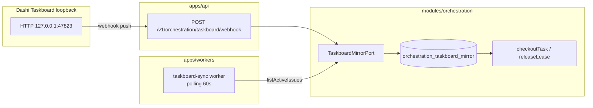
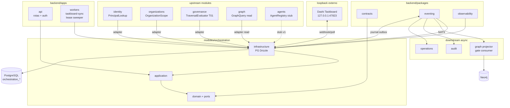

# R06 — Dependências: `modules/orchestration`

**Componente:** modules/orchestration  
**Rodada:** R6 — Upstream, packages, downstream e contratos cross-module  
**Pacote SDD:** P04  
**Data:** 2026-09-08  
**Issues:** ANX-46 · ANX-42 (debate estrutura) · ANX-44 (roster 8 personas)  
**Sessão Slack:** [Session F — R06 dependencies](./SLACK-TRANSCRIPTS.md#session-f--r06-dependencies)  
**Pré-requisito:** [R05-storage-pg.md](./R05-storage-pg.md) · [R04-contracts-events.md](./R04-contracts-events.md) · `brain/project-docs/specs/006-agent-hierarchy-orchestration/spec.md`

## Participantes

| Papel | Agente |
| --- | --- |
| Orquestrador | Orquestrador (CTO) |
| Arquiteto | architect |
| Executor | code-architect |
| Crítico | critic-reviewer |
| Code Review | code-reviewer |
| QA | QA |
| Security | security-reviewer |
| Red Team | Red Team (Ryn) |

Roster obrigatório: [DEBATE-ROSTER.md](../../DEBATE-ROSTER.md).

## Objetivo da rodada

Fechar o mapa de dependências de **orchestration** após [R05-storage-pg.md](./R05-storage-pg.md): ports upstream (**identity**, **organizations**, **governance**, **graph**), mecanismo **eventing**, espelho **taskboard** (Dashi loopback), packages compartilhados, exports públicos, imports proibidos e resolução das pendências P-R5-03..06.

## Fontes aplicadas

| Fonte | Uso em R6 |
| --- | --- |
| [R05-storage-pg.md](./R05-storage-pg.md) | PG, UoW, mirror, bootstrap order, P-R5-03..06 |
| [R04-contracts-events.md](./R04-contracts-events.md) | HTTP, eventos, `TaskboardMirrorPort`, T01 |
| [R03-domain-sketch.md](./R03-domain-sketch.md) | Ports domain, invariantes INV-ORC-01..12 |
| [organizations/R06-dependencies.md](../../modules/organizations/R06-dependencies.md) | Padrão upstream/downstream |
| [graph/R06-rebuild-inbox.md](../graph/R06-rebuild-inbox.md) | Consumer inbox, ordem NATS |
| `backend/packages/eventing/` | `appendJournal`, `enqueueOutbox`, `ensureEventingSchema` |
| `backend/modules/identity/src/index.ts` | Superfície pública identity |

## Debate R6 (diálogo atribuído)

**Arquiteto:** orchestration depende de **identity** via `PrincipalLookup` (validar `reviewerId` em G7) e de **organizations** via `OrganizationScopePort` (tenancy `organizationId`). **Governance** entra só como port `TraversalEvaluator` (T01) — fail-closed antes de checkout/renew com efeito externo. **Graph** é leitura assíncrona (`GraphQueryPort` para `ExplainEscalationPath` CIRCULAR) e downstream projector de `gate.disposition.recorded.v1`. Nunca importar Neo4j nem repositório privado cross-module.

**Executor:** Adapters em `infrastructure/adapters/`: `IdentityPrincipalLookup`, `OrganizationsScopeAdapter`, `GovernanceTraversalAdapter`, `GraphQueryAdapter`, `DashiTaskboardMirror`. `TaskboardMirrorPort` pós-commit — fora da transação UoW. Worker `taskboard-sync` em `apps/workers` consome polling 60s.

**Security:** Taskboard loopback (`127.0.0.1:47823`) não eleva privilégio — webhook HMAC quando `TASKBOARD_WEBHOOK_SECRET` configurado. `leaseToken` nunca cruza ports. T01 DENY bloqueia checkout mesmo com board `in_progress`. Mirror `done` sem G7 → `ORC_MIRROR_REJECTED` sem side effect.

**Crítico:** Duas fontes de claim (Dashi vs lease) exigem reconciliação explícita — mirror dedupe `(issueIdentifier, boardVersion, status)` em PG ([R05](./R05-storage-pg.md) ORCH-R05-07). Discordância agents: `agentId` é referência lógica v1 — port `AgentRegistryPort` stub até agents P04; checkout não bloqueia por agents ausente se T01+board OK.

**Síntese Orquestrador:** Mapa v1 fechado; P-R5-03 e P-R5-06 resolvidos em contrato; P-R5-04 permanece ownership graph; P-R5-05 → R09.

---

## Decisões-chave de dependência

| ID | Decisão | Direção | Evidência / nota |
| --- | --- | --- | --- |
| **ORCH-R06-01** | `PrincipalLookup` valida `reviewerId` em `RecordGateDisposition` (G7 = Owner) | upstream identity | Port domain; adapter → `getPrincipalById` (ANX-28) |
| **ORCH-R06-02** | `OrganizationScopePort` valida `organizationId` ativo e membership do caller | upstream organizations | Sem FK; fail-closed `ORC_SCOPE_DENIED` |
| **ORCH-R06-03** | `TraversalEvaluator` (T01) obrigatório antes de checkout/renew com efeito externo | upstream governance | Async-ready; timeout 2s → `503` |
| **ORCH-R06-04** | `GraphQueryPort` somente leitura — `ExplainEscalationPath` CIRCULAR (OH10) | upstream graph | HTTP interno ou SDK graph module |
| **ORCH-R06-05** | Journal/outbox via `@anxionos/eventing` na mesma transação PG | package | Bootstrap: eventing → identity → organizations → orchestration |
| **ORCH-R06-06** | `TaskboardMirrorPort` + tabela `orchestration_taskboard_mirror` — Dashi não é autoridade de lease | boundary taskboard | Webhook primário + polling 60s fallback |
| **ORCH-R06-07** | Projector Neo4j no **graph** — consumer `graph:orchestration:gate:v1` | downstream graph | P-R5-04 ownership graph P03 |
| **ORCH-R06-08** | orchestration **publica** 6 eventos v1; **não** subscreve outros módulos v1 | downstream async | audit, operations, agents (futuro) |
| **ORCH-R06-09** | `agentId` referência lógica; `AgentRegistryPort` opcional v1 (stub permissivo) | upstream agents | Pré-requisito agents P04 para validação forte |
| **ORCH-R06-10** | Workers lease sweeper + heartbeat dequeue em `apps/workers` | composition | P-R5-03 resolvido (contrato) |

---

## Upstream — `modules/identity`

### O que orchestration **chama**

| Necessidade | Mecanismo | Camada |
| --- | --- | --- |
| Validar `reviewerId` em G7 PASS | `PrincipalLookup.exists(reviewerId)` | application → infrastructure |
| Resolver Owner para G7 | `PrincipalLookup.isOwnerPrincipal(reviewerId, organizationId)` | application |
| Bootstrap schema | `ensureIdentitySchema(pool)` no composition root | apps/api |

### Port `PrincipalLookup` (domain)

```typescript
/** orchestration/domain/ports/principal-lookup.ts */
export interface PrincipalLookup {
  exists(principalId: string): Promise<boolean>;
  isOwnerPrincipal(principalId: string, organizationId: string): Promise<boolean>;
}
```

### Degradação

| Cenário | Comportamento |
| --- | --- |
| `RecordGateDisposition` G7 | identity indisponível → `503` `ORC_IDENTITY_UNAVAILABLE` |
| `checkoutTask` | Não consulta identity — usa `agentId` + T01 |
| Leituras `getTask` / `listGateBindings` | PG local; sem lookup |

### Proibido

| Import | Motivo |
| --- | --- |
| `identity/infrastructure/**` | Repositório privado |
| `better-auth` | Composition root only |
| Tabelas `identity_*` via SQL | Escrita lateral |

---

## Upstream — `modules/organizations`

### O que orchestration **chama**

| Necessidade | Mecanismo |
| --- | --- |
| Validar `organizationId` existe e ativo | `OrganizationScopePort.assertActive(organizationId)` |
| Validar caller pertence à org | `OrganizationScopePort.assertMembership(principalId, organizationId, minRole?)` |
| Resolver `hierarchyMode` da org | `OrganizationScopePort.getHierarchyMode(organizationId)` → TREE \| CIRCULAR |

### Port `OrganizationScopePort`

```typescript
export interface OrganizationScopePort {
  assertActive(organizationId: string): Promise<void>;
  assertMembership(
    principalId: string,
    organizationId: string,
    minRole?: "member" | "admin" | "owner",
  ): Promise<void>;
  getHierarchyMode(organizationId: string): Promise<"HIERARCHY_TREE" | "HIERARCHY_CIRCULAR">;
}
```

**Adapter:** `OrganizationsScopeAdapter` delega a queries públicas de organizations (ANX-29) — até G1, composition root pode injetar fixture documentado; domain **nunca** importa persistence organizations.

### Proibido

| Import | Motivo |
| --- | --- |
| `organizations/infrastructure/persistence/**` | Viola ADR0002 regra 4 |
| Criar Agency/Membership | Dono organizations |

---

## Upstream — `modules/governance`

### O que orchestration **chama**

| Necessidade | Mecanismo |
| --- | --- |
| Autorizar checkout / renew / wakeup externo | `TraversalEvaluator.evaluateT01(input)` |
| Validar G7 Owner (complementar) | `PrincipalLookup` + regra application G7 |

### Port `TraversalEvaluator`

```typescript
export interface TraversalEvaluator {
  evaluateT01(input: {
    principalId: string;
    organizationId: string;
    agentId: string;
    intentHash?: string;
    actingScope: string;
  }): Promise<{ decision: "ALLOW" | "DENY" | "REQUIRE_APPROVAL" }>;
}
```

| Aspecto | Decisão |
| --- | --- |
| Implementação v1 | Adapter HTTP interno para graph T01 ou governance facade quando existir |
| Fail-closed | Timeout/erro → checkout negado `ORC_CHECKOUT_DENIED` |
| Cache | **Proibido** cache ALLOW mutável com `intentHash` (alinha GK-R05-04 graph) |
| Grants | orchestration **não** persiste grants — só consulta |

### Proibido

| Import | Motivo |
| --- | --- |
| `governance/infrastructure/**` | Repositório privado |
| Emitir `ALLOW`/`DENY` como evento orchestration | Dono governance |

---

## Upstream — `modules/graph`

### Leitura (síncrona permitida)

| Necessidade | Mecanismo |
| --- | --- |
| Escalation path CIRCULAR G4/G5 | `GraphQueryPort.explainEscalationPath(agentId, organizationId)` |
| Poll pós-mutação graph (defer) | Não em orchestration v1 |

### Port `GraphQueryPort`

```typescript
export interface GraphQueryPort {
  explainEscalationPath(
    agentId: string,
    organizationId: string,
  ): Promise<{ path: string[]; complete: boolean }>;
}
```

### Downstream (projeção — P-R5-04)

| Aspecto | Decisão |
| --- | --- |
| Owner projector | Módulo **graph** |
| Consumer | `graph:orchestration:gate:v1` |
| Evento | `orchestration.gate.disposition.recorded.v1` |
| Efeito CIRCULAR | `ReviewEdge` G2–G5 |
| Efeito TREE | Audit only — sem ReviewEdge |
| Idempotência | `processWithInbox(eventId, consumerName)` |

```typescript
export const ORCHESTRATION_GRAPH_CONSUMER = "graph:orchestration:gate:v1" as const;

export const ORCHESTRATION_GRAPH_EVENT_TYPES = [
  "orchestration.gate.disposition.recorded.v1",
] as const;
```

Implementação projector: **fora do escopo** orchestration G1; graph pode atrasar sem bloquear PG.

### Proibido

| Import | Motivo |
| --- | --- |
| `neo4j-driver` | Dono graph |
| `graph/infrastructure/**` | Adapter via port público apenas |

---

## Boundary — taskboard mirror (Dashi)

Dashi/Codex Taskboard é **fonte de claim** ANX-*; orchestration mantém espelho deduplicado.



| Aspecto | Decisão |
| --- | --- |
| Autoridade claim | Taskboard (humano/agente move `in_progress`) |
| Autoridade execução | orchestration lease PG |
| Dedupe | PK `(issue_identifier, board_version, status)` — ORCH-R05-07 |
| Webhook | `ingestTaskboardWebhook`; HMAC `X-Taskboard-Signature` opcional |
| Polling | Worker 60s — issues com lease ativo apenas |
| Efeitos | Mirror → comandos internos (`releaseTaskLease`); não outbox próprio |
| Rejeição | `done` sem G7 PASS → `ORC_MIRROR_REJECTED` |

**Decisão ORCH-R06-06:** orchestration **nunca** auto-move board para `done` — unidirecional board→orch para status (ORCH-R03-08).

---

## Packages — `@anxionos/eventing`

| Função | Uso em orchestration |
| --- | --- |
| `ensureEventingSchema` | Primeiro no bootstrap |
| `appendJournal` + `enqueueOutbox` | Dentro de `OrchestrationUnitOfWork` |
| `fetchPendingOutbox` | Worker dispatch global P02 |
| `processWithInbox` | **Não** — reservado ao consumer graph |

### Ordem de bootstrap (`apps/api`)

1. `ensureEventingSchema(pool)`
2. `ensureIdentitySchema(pool)`
3. `ensureOrganizationsSchema(pool)`
4. `ensureOrchestrationSchema(pool)` — **ORCH-R06-05**

---

## Downstream — consumidores

| Módulo | Direção | Detalhe |
| --- | --- | --- |
| **graph** | eventos → projector | `graph:orchestration:gate:v1` |
| **audit** | eventos | Todos `orchestration.*.v1` — flight recorder |
| **operations** | leitura + eventos | Lag dashboard, orphan runs |
| **agents** | eventos (futuro P04) | `task.checked_out.v1` → wakeup context |
| **apps/api** | composition | Rotas `/v1/orchestration/*`, auth, workers mount |
| **apps/workers** | composition | `taskboard-sync`, lease sweeper, heartbeat dequeue |

### Subscrições orchestration v1

| Subscreve | Publica |
| --- | --- |
| **Nenhuma** | `orchestration.task.checked_out.v1`, `lease_released.v1`, `lease_renewed.v1`, `run.orphaned.v1`, `gate.disposition.recorded.v1`, `plan.revision.proposed.v1` (defer) |

---

## Contratos cross-module

### Exports públicos — `modules/orchestration/index.ts`

| Exportar | Não exportar |
| --- | --- |
| Commands + `*Deps` tipos | Drizzle schema / repositories |
| Queries | Adapters concretos |
| `ensureOrchestrationSchema`, `createOrchestrationDb` | `OrchestrationUnitOfWork` interno |
| Port **types** | Workers (`taskboard-sync`, sweeper) |
| Constants TTL / poll interval | Schemas Zod |

### Imports proibidos (checklist)

| Origem proibida | Alternativa |
| --- | --- |
| `modules/identity/infrastructure/**` | `PrincipalLookup` |
| `modules/organizations/infrastructure/**` | `OrganizationScopePort` |
| `modules/governance/infrastructure/**` | `TraversalEvaluator` |
| `modules/graph/infrastructure/**` | `GraphQueryPort` + eventos |
| `neo4j-driver` | graph module |
| HTTP direto Dashi em `domain/` | `TaskboardMirrorPort` |
| Escrita `domain_journal` sem eventing | `appendJournal` |

### Matriz compile-time

| De → Para | contracts | eventing | identity port | org port | gov port | graph port |
| --- | ---: | ---: | ---: | ---: | ---: | ---: |
| `domain` | tipos | — | — | — | — | — |
| `application` | schemas | — | port | port | port | port |
| `infrastructure` | sim | sim | adapter | adapter | adapter | adapter |
| `apps/api` | sim | sim | sim | sim | sim | sim |

---

## Diagrama de dependências



---

## Resolução pendências R05

| ID | Assunto | Status R6 | Decisão / destino |
| --- | --- | --- | --- |
| **P-R5-03** | Worker lease sweeper + heartbeat dequeue | ✅ **Resolvido** (contrato) | `apps/workers` — ORCH-R06-10 |
| **P-R5-04** | Consumer `graph:orchestration:gate:v1` | ✅ **Resolvido** (contrato) | Ownership graph P03 — ORCH-R06-07 |
| **P-R5-05** | Testes integração UoW checkout rollback | ⏳ **R09** | Inalterado |
| **P-R5-06** | `ensureOrchestrationSchema` bootstrap | ✅ **Resolvido** | Ordem ORCH-R06-05 documentada |
| P-R5-01 | Criar módulo Drizzle | ⏳ Implementação G1 | Greenlight |
| P-R5-02 | Migration `0002` plan_revisions | ⏳ R09 / P1 | Inalterado |

---

## Relação taskboard e gates

| Issue | Relação | Notas |
| --- | --- | --- |
| ANX-46 | Debate R06 entregue | Este artefato |
| ANX-42 | Debate estrutura pai | INDEX R01–R06 |
| ANX-28 | Upstream identity | `getPrincipalById` pré-G1 |
| ANX-29 | Upstream organizations | `OrganizationScopePort` |
| ANX-32 | Downstream graph | Consumer projector |

---

## Critérios de aceite R6

| # | Critério | Status |
| --- | --- | --- |
| AC-R6-01 | Upstream identity, organizations, governance, graph documentados | ✅ |
| AC-R6-02 | Boundary taskboard mirror (webhook + polling + dedupe) | ✅ |
| AC-R6-03 | Package eventing e ordem bootstrap | ✅ |
| AC-R6-04 | Downstream graph/audit/operations/workers | ✅ |
| AC-R6-05 | Ports domain + adapters + imports proibidos | ✅ |
| AC-R6-06 | P-R5-03, P-R5-04, P-R5-06 resolvidos; P-R5-05 → R09 | ✅ |
| AC-R6-07 | Diagrama mermaid dependências | ✅ |
| AC-R6-08 | Decisões ORCH-R06-01..10 registradas | ✅ |

## Pendências para rodadas seguintes

| ID | Assunto | Rodada |
| --- | --- | --- |
| P-R6-01 | Implementar adapters quando identity/organizations G1 | Pré-implementação |
| P-R6-02 | `AgentRegistryPort` forte quando agents P04 | R07 / agents |
| P-R6-03 | Worker `taskboard-sync` + HMAC webhook em apps/api | R09 |
| P-R6-04 | Teste AR01 dependency boundary orchestration | R09 |
| P-R6-05 | Saga agents wakeup pós `checked_out.v1` | R07 |

## Próxima rodada

→ **R07 — Riscos** (`R07-risks.md`) — reconciliação board/lease, degradação T01, orphan storms, mirror spoofing.

**Veredito R06:** mapa de dependências v1 **aprovado** documentalmente; implementação bloqueada até greenlight — sem código `modules/orchestration` nesta rodada.
