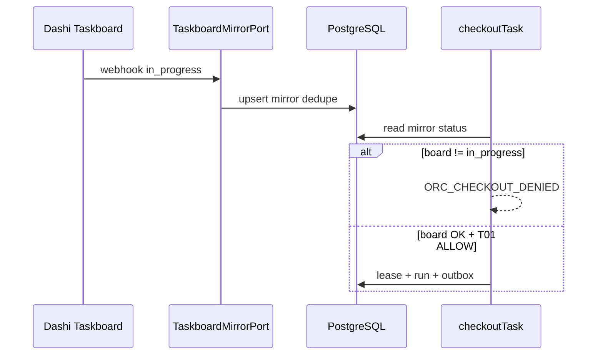
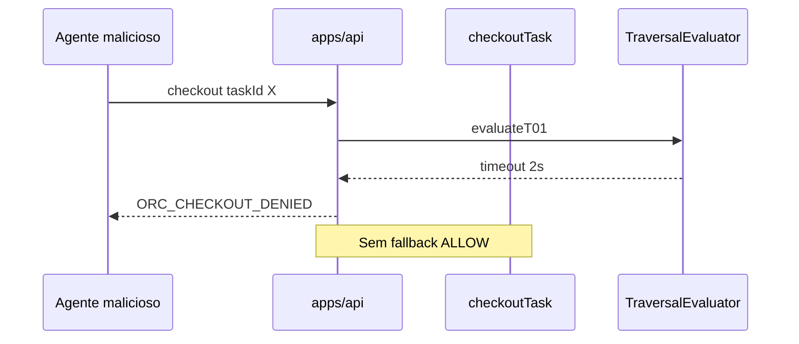

# R07 — Riscos: `modules/orchestration`

**Componente:** modules/orchestration  
**Rodada:** R7 — Registro de riscos, cenários adversariais e preparação G5  
**Pacote SDD:** P04  
**Data:** 2026-09-08  
**Issues:** ANX-46 · ANX-42 (debate estrutura) · ANX-44 (roster 8 personas)  
**Sessão Slack:** [Session G — R07 risks](./SLACK-TRANSCRIPTS.md#session-g--r07-risks)  
**Pré-requisito:** [R06-dependencies.md](./R06-dependencies.md) · [R05-storage-pg.md](./R05-storage-pg.md) · `brain/project-docs/specs/010-agent-hierarchy-orchestration/spec.md`

## Participantes

| Papel | Agente |
| --- | --- |
| Orquestrador | Orquestrador (CTO) |
| Arquiteto | architect |
| Executor | code-architect |
| Crítico | critic-reviewer |
| Code Review | code-reviewer |
| QA | QA |
| Security | security-reviewer |
| Red Team | Red Team (Ryn) |

Roster obrigatório: [DEBATE-ROSTER.md](../../DEBATE-ROSTER.md).

## Objetivo da rodada

Fechar o registro de riscos de **orchestration** após [R06-dependencies.md](./R06-dependencies.md): reconciliação board/lease (Dashi vs PG), degradação **T01**, spoofing de mirror taskboard, orphan storms, forja de **GateBinding** (G7), dependências upstream (identity, organizations, graph projector), saga agents wakeup e checklist **Red Team (G5)** antes da síntese R08.

## Fontes aplicadas

| Fonte | Uso em R7 |
| --- | --- |
| [R06-dependencies.md](./R06-dependencies.md) | Ports upstream, mirror, P-R6-02/05, ORCH-R06-01..10 |
| [R05-storage-pg.md](./R05-storage-pg.md) | UoW, command_journal, dedupe mirror, lease_token |
| [R04-contracts-events.md](./R04-contracts-events.md) | Códigos `ORC_*`, HMAC webhook, idempotência |
| [R03-domain-sketch.md](./R03-domain-sketch.md) | INV-ORC-01..12, TTL lease, GateBinding |
| [organizations/R07-risks.md](../../modules/organizations/R07-risks.md) | Formato registro Sev L×I, checklist G5 |
| [graph/R07-poison-pill-quarantine.md](../graph/R07-poison-pill-quarantine.md) | Lag projector, poison pill downstream |

## Debate R7 (diálogo atribuído)

**Security:** O maior risco v1 não é Neo4j desatualizado — é **divergência board/lease**: agente com `in_progress` no Dashi sem lease PG (ou lease órfão sem issue). OH06 exige reconciliação explícita; mirror dedupe sozinho não impede checkout sem claim válido.

**Crítico:** T01 tratado como deny em timeout (ORCH-R06-03) é correto, mas **degradação parcial** — governance lento mas não down — pode causar fila de checkout sem visibilidade. Exijo métrica `t01_eval_duration_ms` e alerta p99 antes de G1.

**Red Team:** Vetores prioritários: (1) webhook spoof `done` sem G7; (2) `RecordGateDisposition(G7, PASS)` com `reviewerId` não-Owner; (3) heartbeat flood sem coalescing; (4) renew com `lease_token` de outro agente; (5) polling recupera status falso se loopback comprometido localmente.

**Arquiteto:** orchestration não resolve grants — risco de **escalation path stale** em CIRCULAR quando graph projector atrasa. Mitigação: `ExplainEscalationPath` síncrono na leitura G4/G5; ReviewEdge assíncrono não bloqueia binding, mas audit deve registrar `graphProjectionLagMs`.

**Executor:** Controles implementáveis v1: `timingSafeEqual` em renew; cap heartbeat queue; sweeper lease com batch limit; `AgentRegistryPort` stub permissivo documentado como risco residual até agents P04.

**Síntese Orquestrador:** Registro R-ORC-* fechado; decisões ORCH-R07-01..08; P-R6-02 e P-R6-05 parcialmente resolvidos; handoff R08 decision-log.

---

## Registro de riscos

Severidade = likelihood × impact (escala 1–5). **Top 5** destacados na seção de retorno.

| ID | Risco | L | I | Sev | Mitigação (resumo) | Gate |
| --- | --- | ---: | ---: | ---: | --- | --- |
| **R-ORC-01** | Divergência board/lease — claim Dashi sem lease PG ou lease sem issue ativo | 4 | 5 | **20** | Checkout exige board `in_progress` + G0; mirror reconcilia release; dedupe ORCH-R05-07; worker 60s só issues com lease | G3, G5 |
| **R-ORC-02** | T01 indisponível ou timeout → checkout negado em massa (fail-closed) | 3 | 4 | **12** | Timeout 2s → `ORC_CHECKOUT_DENIED`; health agregado governance; sem fallback permissivo | G4 |
| **R-ORC-03** | T01 lento (degradação) — fila checkout sem SLO | 3 | 3 | **9** | Métrica p99; circuit breaker opcional R09; não cache ALLOW com `intentHash` | G3, G4 |
| **R-ORC-04** | Spoof webhook mirror `done` sem G7 PASS | 3 | 5 | **15** | `ORC_MIRROR_REJECTED`; checagem gate_bindings; HMAC opcional; rate limit | G4, G5 |
| **R-ORC-05** | Forja `GateBinding(G7, PASS)` com `reviewerId` ≠ Owner | 2 | 5 | **10** | `PrincipalLookup.isOwnerPrincipal`; `ORC_GATE_REVIEWER_MISMATCH` | G4, G5 |
| **R-ORC-06** | Identity indisponível durante `RecordGateDisposition` G7 | 3 | 4 | **12** | `503 ORC_IDENTITY_UNAVAILABLE`; sem cache autoritativo | G4 |
| **R-ORC-07** | Cross-tenant: `organizationId` manipulado em checkout/gates | 3 | 5 | **15** | `OrganizationScopePort.assertMembership`; `ORC_SCOPE_DENIED` | G4, G5 |
| **R-ORC-08** | `agentId` forjado sem validação T01/agents | 3 | 4 | **12** | T01 obrigatório pré-checkout; `AgentRegistryPort` stub v1 (risco residual) | G4, G5 |
| **R-ORC-09** | Orphan storm — leases expiram em massa, `run.orphaned.v1` flood | 3 | 3 | **9** | Sweeper batch + jitter; coalesce heartbeats; cap requeue | G3, G5 |
| **R-ORC-10** | Heartbeat flood / DoS scheduler | 3 | 3 | **9** | `coalesce_key` unique pending; rate limit por `taskId`; cap fila | G4, G5 |
| **R-ORC-11** | `lease_token` timing leak ou reuse cross-agent | 2 | 4 | **8** | `timingSafeEqual`; token UUID; zerar em release; nunca em eventos | G4, G5 |
| **R-ORC-12** | Replay `Idempotency-Key` com body diferente | 2 | 4 | **8** | command_journal hash mismatch → rejeição | G4 |
| **R-ORC-13** | Graph projector atrasa — ReviewEdge CIRCULAR stale | 3 | 3 | **9** | Inbox graph; `ExplainEscalationPath` síncrono G4/G5; lag métrica | G3 |
| **R-ORC-14** | Checkout sem G0 `GateBinding` ou board status inválido | 3 | 4 | **12** | `ORC_CHECKOUT_DENIED`; espelho `in_progress` obrigatório | G3, G5 |
| **R-ORC-15** | Polling 60s aceita status malicioso de loopback local | 2 | 4 | **8** | HMAC webhook preferencial; polling só lease ativo; audit divergência | G5 |
| **R-ORC-16** | UoW rollback parcial — PG commit sem outbox | 2 | 5 | **10** | Transação única; teste AR01 P-R5-05 R09 | G3 |
| **R-ORC-17** | `NOT_APPLICABLE` sem justificativa em gate crítico | 2 | 4 | **8** | Zod `notApplicableReason` obrigatório ORCH-R04-06 | G4 |
| **R-ORC-18** | Saga agents wakeup pós `checked_out.v1` duplicada | 2 | 3 | **6** | Consumer inbox agents; idempotência `eventId` | G3 |
| **R-ORC-19** | `leaseToken` em logs ou audit downstream | 2 | 4 | **8** | ORCH-R05-06; redact observability | G4 |
| **R-ORC-20** | Force-release Owner sem audit trail | 2 | 4 | **8** | Comando governance + evento audit; idempotente | G4, G5 |

**Legenda:** L = likelihood, I = impact, Sev = L×I.

### Top 5 riscos (prioridade G5)

| Rank | ID | Sev | Tema |
| ---: | --- | ---: | --- |
| 1 | **R-ORC-01** | 20 | Reconciliação board/lease |
| 2 | **R-ORC-04** | 15 | Mirror spoof `done` |
| 3 | **R-ORC-07** | 15 | Cross-tenant organization |
| 4 | **R-ORC-02** | 12 | T01 fail-closed mass deny |
| 5 | **R-ORC-06** | 12 | Identity down em G7 |

---

## Decisões-chave de risco

| ID | Decisão | Direção | Evidência / nota |
| --- | --- | --- | --- |
| **ORCH-R07-01** | Checkout **bloqueado** se board ≠ `in_progress` para `issueIdentifier` — mesmo com lease livre | fail-closed claim | Complementa ORCH-R06-06; resolve R-ORC-01 parcial |
| **ORCH-R07-02** | T01 timeout/erro = **DENY** checkout — sem modo degradado “allow local” | fail-closed governance | ORCH-R06-03 ratificado; métricas obrigatórias G1 |
| **ORCH-R07-03** | Mirror `done`/`canceled` exige G7 PASS vigente em `gate_bindings` — senão `ORC_MIRROR_REJECTED` | fail-closed mirror | R-ORC-04; audit tentativa |
| **ORCH-R07-04** | G7 PASS: `reviewerId` deve passar `isOwnerPrincipal` — comentário board ignorado | fail-closed G7 | R-ORC-05; OH07 |
| **ORCH-R07-05** | Sweeper orphan: batch máx **100** leases/expiração + jitter 0–30s entre batches | anti-storm | R-ORC-09 |
| **ORCH-R07-06** | Heartbeat enqueue: coalesce 30s + fila máx **10k** pending por org — acima rejeita com `ORC_HEARTBEAT_BACKPRESSURE` | anti-DoS | R-ORC-10 |
| **ORCH-R07-07** | `AgentRegistryPort` v1 stub **permissivo** documentado — validação forte agents P04 | risco aceito v1 | P-R6-02 → R08 |
| **ORCH-R07-08** | Checklist G5 abaixo é **gate obrigatório** pré-G1 implementação orchestration | G5 prep | Sandbox local apenas |

---

## Deep dive — itens de R06

### 1. Reconciliação board/lease (R-ORC-01)

**Risco:** Duas fontes de verdade — Dashi move `in_progress` / `done` / `in_review`; orchestration mantém lease PG e Run ACTIVE. Estados divergentes violam OH06 e permitem trabalho sem autoridade ou lease fantasma.

**Controles propostos:**

| Camada | Controle |
| --- | --- |
| Checkout | Pré-condição: mirror ou webhook confirma board `in_progress` para `issueIdentifier` |
| Execução | Lease PG é autoridade de **execução**; board é autoridade de **claim** |
| Release | Mirror `done`/`canceled`/`in_review` → `releaseTaskLease` interno |
| Dedupe | PK `(issue_identifier, board_version, status)` — ORCH-R05-07 |
| Rejeição | `done` sem G7 → `ORC_MIRROR_REJECTED` sem side effect |
| Polling | Worker 60s apenas issues com lease ativo — não varrer board inteiro |
| Observabilidade | Métrica `orch_board_lease_divergence_count` quando checkout negado por status board |

---

### 2. Degradação T01 (R-ORC-02, R-ORC-03)

**Risco:** Governance/graph T01 indisponível bloqueia checkout (correto) ou, pior, implementação futura trata timeout como ALLOW.

| Cenário | Comportamento v1 |
| --- | --- |
| T01 timeout (>2s) | `ORC_CHECKOUT_DENIED` — fail-closed |
| T01 503 | `ORC_CHECKOUT_DENIED` |
| T01 DENY | `ORC_CHECKOUT_DENIED` |
| T01 ALLOW | Prossegue se demais pré-condições OK |
| T01 lento p99 | Alerta operations; não relaxar timeout em prod |

**Anti-padrão proibido:** cache ALLOW mutável com `intentHash` (alinha GK-R05-04 graph).

**Decisão ORCH-R07-02:** sem modo degradado v1.

---

### 3. Mirror spoofing e loopback (R-ORC-04, R-ORC-15)

**Risco:** Atacante local envia webhook falso `done` para encerrar lease e marcar issue concluída sem G7; ou polling lê resposta HTTP adulterada em ambiente dev comprometido.

| Controle | Detalhe |
| --- | --- |
| G7 gate | `ORC_MIRROR_REJECTED` se não houver binding G7 PASS não invalidado |
| HMAC | `X-Taskboard-Signature` quando `TASKBOARD_WEBHOOK_SECRET` configurado |
| Rate limit | 60 req/min/IP na rota webhook |
| Audit | Log `mirror_rejected` com `issueIdentifier`, `attemptedStatus` |
| Prod | Webhook assinado obrigatório (R09 composition) |

---

### 4. Orphan storm e heartbeat DoS (R-ORC-09, R-ORC-10)

**Risco:** Expiração massiva de leases (redeploy, clock skew, TTL batch) publica milhares de `run.orphaned.v1`; ou agente malicioso/envenenado envia heartbeats sem coalescing.

| Controle | Detalhe |
| --- | --- |
| Sweeper | Batch 100; pausa jitter entre batches — ORCH-R07-05 |
| Heartbeat | `coalesceWindowMs` 30s; unique `coalesce_key` pending |
| Backpressure | Fila >10k/org → `ORC_HEARTBEAT_BACKPRESSURE` |
| Renew cap | TTL máx 8h ORCH-R03-01 |
| Worker | Dequeue heartbeat com `LIMIT` por tick |

---

### 5. GateBinding e G7 (R-ORC-05, R-ORC-17)

**Risco:** Agente registra PASS em G2–G7 sem autoridade; digest curto ou colisão; `NOT_APPLICABLE` em gate obrigatório sem razão.

| Controle | Detalhe |
| --- | --- |
| G7 | `PrincipalLookup.isOwnerPrincipal` — ORCH-R07-04 |
| G2–G5 CIRCULAR | `ReviewEdge` + binding; TREE: binding + audit (OH09) |
| Schema | `artifactDigest` pattern `^[a-f0-9]{64}$`; N/A exige `notApplicableReason` |
| Invalidação | Novo PASS invalida anterior via `invalidated_at` |
| Board | Comentário Slack ≠ binding estruturado |

---

### 6. Dependências upstream (R-ORC-06, R-ORC-07, R-ORC-08)

| Upstream | Risco | Controle |
| --- | --- | --- |
| identity | G7 sem `getPrincipalById` | Fail-closed 503; ANX-28 pré-G1 |
| organizations | `organizationId` cross-tenant | `OrganizationScopePort`; ANX-29 |
| governance | T01 bypass | Port adapter; sem import infra |
| agents | `agentId` fantasma | T01 + stub registry ORCH-R07-07 |
| graph | Escalation path errado | `GraphQueryPort` síncrono; projector async |

---

### 7. Saga agents wakeup (P-R6-05)

**Risco:** `orchestration.task.checked_out.v1` dispara wakeup duplicado ou com contexto de lease anterior.

| Controle | Detalhe |
| --- | --- |
| Idempotência | Consumer agents `eventId` + inbox |
| Payload | Sem `leaseToken`; `goalAncestry[]` sanitizado |
| Defer | Implementação agents P04 — orchestration só publica |
| Risco residual | Wakeup sem agents module — aceito v1 documental |

**Decisão:** P-R6-05 **parcialmente resolvido** — contrato evento + idempotência; wiring agents → R09/P04.

---

## Cenários de ameaça

### A. Divergência board/lease

| Passo | Ação adversária | Resultado esperado |
| --- | --- | --- |
| 1 | Agente chama checkout sem board `in_progress` | `ORC_CHECKOUT_DENIED` |
| 2 | Board `done` via spoof; lease ainda ativo | Mirror rejeita ou release sem marcar G7 |
| 3 | Lease expirado; board ainda `in_progress` | Sweeper libera; checkout pode re-adquirir com T01 |

### B. T01 e checkout

### C. G7 forgery

| Passo | Ação | Resultado |
| --- | --- | --- |
| 1 | `RecordGateDisposition(G7, PASS, reviewerId=agent)` | `ORC_GATE_REVIEWER_MISMATCH` |
| 2 | Owner válido + digest inválido | Zod rejeita |
| 3 | Mirror `done` após PASS forjado em board só | `ORC_MIRROR_REJECTED` se binding PG ausente |

### D. Heartbeat / orphan flood

| Vetor | Controle |
| --- | --- |
| 10k heartbeats/s mesmo task | Coalesce → 1 pending |
| Sweeper mata 5k leases de uma vez | Batch 100 + jitter |
| Replay `lease_renewed.v1` | Outbox `eventId` dedupe |

---

## Checklist Red Team (G5)

Executar em sandbox com PG + API + Dashi loopback locais; **sem** produção nem capital real.

### Board/lease (OH06)

- [ ] Checkout com board `todo` → `ORC_CHECKOUT_DENIED`
- [ ] Checkout com board `in_progress` + lease válido outro agente → negado
- [ ] Webhook spoof `done` sem G7 PASS → `ORC_MIRROR_REJECTED`
- [ ] Polling após board offline 90s recupera `in_progress` apenas para leases ativos

### T01 / governance

- [ ] T01 timeout mock → checkout negado (não 503 genérico sem código)
- [ ] T01 DENY com board OK → `ORC_CHECKOUT_DENIED`
- [ ] Verificar ausência de cache ALLOW entre requests com `intentHash` distinto

### Gates e G7

- [ ] G7 PASS com `reviewerId` não-Owner → `ORC_GATE_REVIEWER_MISMATCH`
- [ ] G2 CIRCULAR sem ReviewEdge prévio → rejeição OH-T02
- [ ] `NOT_APPLICABLE` em G1 sem `notApplicableReason` → schema fail
- [ ] Digest 32 chars hex → rejeição Zod

### Tenancy

- [ ] `organizationId` de outra org em checkout → `ORC_SCOPE_DENIED`
- [ ] List/get tasks filtrados por org do caller

### Lease e heartbeat

- [ ] Renew com token errado → falha `timingSafeEqual`
- [ ] 100 renew paralelos mesmo token → idempotente
- [ ] Heartbeat flood → backpressure ou coalesce
- [ ] Lease expirado → run ORPHANED + evento; token zerado

### Idempotência e UoW

- [ ] Mesmo `Idempotency-Key`, body diferente → rejeição
- [ ] Rollback simulado outbox falha → task UNCLAIMED (P-R5-05 R09)
- [ ] Replay `checked_out.v1` mesmo `eventId` → sem segundo run

### Segredos e logs

- [ ] Resposta/evento sem `leaseToken` completo em logs amostrados
- [ ] Webhook sem HMAC em prod config → startup warn ou fail (R09)

### Downstream

- [ ] `gate.disposition.recorded.v1` republicado → graph inbox dedupe (quando graph disponível)

---

## Resolução pendências R06

| ID | Assunto | Status R7 |
| --- | --- | --- |
| **P-R6-02** | `AgentRegistryPort` forte | ⏳ **Risco aceito v1** — ORCH-R07-07; validação agents P04 |
| **P-R6-03** | Worker taskboard-sync + HMAC | ⏳ R09 implementação |
| **P-R6-04** | Teste AR01 dependency boundary | ⏳ R09 |
| **P-R6-05** | Saga agents wakeup | ✅ **Parcial** — contrato + idempotência; wiring P04 |
| P-R5-05 | Teste UoW checkout rollback | ⏳ R09 (inalterado) |

---

## Critérios de aceite R7

| # | Critério | Status |
| --- | --- | --- |
| AC-R7-01 | Registro R-ORC-* com L/I/mitigação/gate | ✅ |
| AC-R7-02 | Deep dive R06: board/lease, T01, mirror, orphan, G7 | ✅ |
| AC-R7-03 | Decisões ORCH-R07-01..08 | ✅ |
| AC-R7-04 | Cenários de ameaça documentados | ✅ |
| AC-R7-05 | Checklist G5 Red Team | ✅ |
| AC-R7-06 | Top 5 riscos priorizados | ✅ |

## Pendências para rodadas seguintes

| ID | Assunto | Rodada |
| --- | --- | --- |
| P-R7-01 | SLO T01 p99 e circuit breaker | R08 / R09 |
| P-R7-02 | HMAC webhook obrigatório em prod — flag composition | R09 |
| P-R7-03 | Política exata board `in_review` vs lease | R08 |
| P-R7-04 | Testes G5 automatizados em CI sandbox | R09 |
| P-R7-05 | `AgentRegistryPort` forte — critérios aceite | R08 + agents P04 |

## Próxima rodada

→ **R08 — Decision log** (`R08-decision-log.md`) — síntese ORCH-R01..R07, resolução P-R7-*.

**Veredito R07:** registro de riscos v1 **aprovado** documentalmente; checklist G5 pronto para execução em sandbox pré-G1 — sem código `modules/orchestration` nesta rodada.
