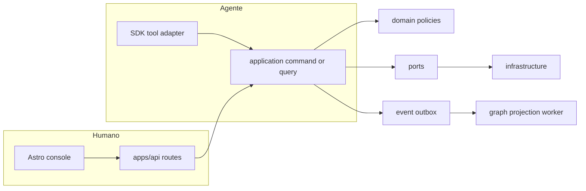

# Checklist de conformidade estrutural — módulos ADR0002

**Issue:** ANX-43  
**Data:** 2026-09-07  
**Baseline:** `brain/project-docs/decisions/0002-adopt-modular-backend-layout.md` · `brain/notes/anxionos-backend-structure.md` (linhas 76–104)

## Árvore obrigatória por módulo

```text
modules/<module>/
├── domain/
│   ├── entities/
│   ├── value-objects/
│   ├── policies/
│   ├── events/
│   └── ports/
├── application/
│   ├── commands/
│   ├── queries/
│   └── workflows/
├── infrastructure/
│   ├── persistence/
│   │   ├── schema/
│   │   ├── repositories/
│   │   └── migrations/
│   └── adapters/
├── graph/
│   ├── projections/
│   └── traversals/
├── api/
│   ├── routes/
│   ├── schemas/
│   └── presenters/
├── workers/
├── tests/
└── index.ts                    # Superfície pública explícita
```

**Regra:** criar subpastas somente quando houver responsabilidade concreta — sem placeholders vazios.

---

## O que vai em cada camada

| Camada | Responsabilidade | Humano | Agente | Proibido |
| --- | --- | --- | --- | --- |
| **domain/** | Entidades, invariantes, policies, ports, eventos de domínio (tipos) | — | — | Import Elysia, Drizzle, Neo4j, NATS, providers |
| **application/commands/** | Casos de uso mutáveis; validação de invariantes | Invocado por api e tool adapter | Mesmo handler via CapabilityManifest | Lógica HTTP, SQL direto |
| **application/queries/** | Leituras autorizadas | Dashboard, Graph Explorer | tools/SDK read-only | Bypass de governance scope |
| **application/workflows/** | Sagas multi-passo dentro do módulo | Onboarding steps | Run retomável | Escrita em tabela de outro módulo |
| **infrastructure/persistence/** | Schema Drizzle, repos implementando ports | — | — | Regra de negócio |
| **infrastructure/adapters/** | Ports externos (identity lookup, NATS, Neo4j writer interno ao graph) | — | — | Expor adapter fora do módulo |
| **graph/projections/** | Handlers evento → nó/aresta (checkpoint, eventId) | Visualização | context.buildForAgent input | Agent chamar Neo4j |
| **graph/traversals/** | Query plans registrados no Kernel | Txx no Explorer | traversal tools | Cypher arbitrário |
| **api/routes/** | Elysia routes: Zod, auth, chama application | REST consoles | — (agentes usam SDK/tools) | Regra de negócio na rota |
| **api/schemas/** | Request/response Zod na borda HTTP | OpenAPI | — | Duplicar domain types sem mapping |
| **api/presenters/** | DTO de leitura para UI | Owner/Operator views | — | Filtrar campos sensíveis aqui só |
| **workers/** | Consumers outbox, reconcilers, health | — | Heartbeat, projection-consumer | Composition root (fica em apps/workers) |
| **index.ts** | Export público: commands, queries, ports types | apps/api registra | packages/sdk re-exporta | Repository privado |

---

## Caminhos humano vs agente (paridade AP01)



| Requisito | Verificação |
| --- | --- |
| Mesmo application handler | UI route e tool adapter chamam o mesmo `commands/*` ou `queries/*` |
| CapabilityManifest | Cada comando exposto em `packages/contracts` com inputSchema, requiredGrants, idempotencyPolicy |
| Actor identity | `actorPrincipalId` da sessão — nunca do body (organizations D-ORG-014) |
| Auditoria distinta | Log registra canal (ui vs tool) mas mesmo aggregateRevision |
| WAITING_HUMAN_INPUT | orchestration/connections retomam Run com checkpoint — não estado só na UI |

---

## Checklist por módulo (G0)

| # | Item | Evidência |
| ---: | --- | --- |
| 1 | Pastas domain/application/infrastructure presentes | `ls modules/<name>/` |
| 2 | `index.ts` exporta só superfície pública | AR01 dependency test |
| 3 | `api/` ausente ou thin — rotas em apps/api registram handlers do módulo | Playbook R4 |
| 4 | `graph/projections/` se módulo emite eventos com nó no schema v1 | R05 storage map |
| 5 | `workers/` se há consumer ou reconciler | ADR0002 regra 9 |
| 6 | Migrações em `infrastructure/persistence/migrations/` | AR03 ownership |
| 7 | Testes em `tests/` ou `backend/tests/integration/<module>` | G3 |
| 8 | CapabilityManifest entries em contracts | AR07 inventário UI→contrato→tool |
| 9 | Sem import de repository privado cross-module | AR01 |
| 10 | Secrets só em infrastructure/adapters | ADR0002 regra 11 |

---

## Estado atual P02 (snapshot)

| Módulo | domain | application | infrastructure | graph | api | workers | index.ts | Conforme ADR0002 |
| --- | --- | --- | --- | --- | --- | --- | --- | --- |
| identity | ✅ parcial | ✅ parcial | ✅ parcial | ❌ ausente | ❌ (apps/api) | ❌ | ✅ | **Parcial** — falta graph/, workers/, api/ no módulo |
| organizations | ❌ | ❌ | ❌ | ❌ | ❌ | ❌ | ❌ | **Não iniciado** |
| governance | ❌ | ❌ | ❌ | ❌ | ❌ | ❌ | ❌ | **Não iniciado** |

---

## Referências

- [CAPABILITY-MAP.md](./CAPABILITY-MAP.md)
- [module-development-playbook.md](../module-development-playbook.md)
- [structure-debate/INDEX.md](../structure-debate/index.md)
