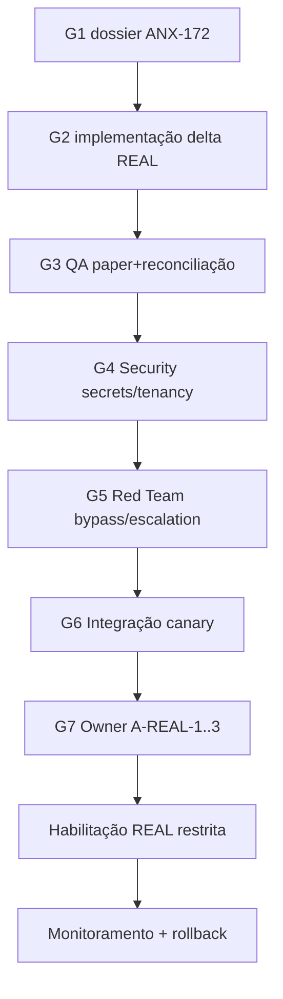

# REAL readiness dossier v1

**Issue:** ANX-172 · **Capability:** `real-readiness` · **Owner módulo:** `execution`

## 1. Objetivo e não-objetivos

Este dossiê especifica o que deve existir antes de qualquer habilitação **restrita** de `executionMode: REAL`. Ele consolida requisitos de segregação, venues, paper/reconciliação/recovery, limites canary e aprovações humanas separadas.

**Não-objetivos (invariantes desta issue):**

- Não opera capital real nem envia ordens a broker/exchange.
- Não altera flags de runtime, `ENGINE_MODE`, grants ou matriz de autonomia.
- Não substitui ADR, spec canônica em `brain/` nem pareceres G2–G7.
- Criar ou atualizar este documento **não** autoriza REAL/live.

Fail-closed permanece: ausência de evidência, homologação ou aprovação explícita mantém `EX_MODE_FORBIDDEN` e rejeição de `REAL` nos boundaries.

## 2. Fontes e baseline

| Fonte | Seção | Status | Uso neste dossiê |
| --- | --- | --- | --- |
| [module-contract-matrix-23.md §6.25](../module-contract-matrix-23.md#625-rastreio-por-capacidade--execution-r09r10) | execution R09/R10 | draft (matriz) | Gaps D-EX-001..012, REAL não verificado |
| [execution-modes-and-asset-classes.md](./execution-modes-and-asset-classes.md) | modos SIMULATED/PAPER/REAL | draft | Pipeline comum e isolamento de modo |
| [execution-environment-boundaries-v1.md](./execution-environment-boundaries-v1.md) | guards de ambiente | draft | `ENV_*` codes, secret scopes |
| [p06-financial-lifecycle-contract.md](./p06-financial-lifecycle-contract.md) | ciclo financeiro | draft | REAL como vocabulário apenas; PAPER≠REAL |
| [p08-operations-slos-recovery-contract.md](./p08-operations-slos-recovery-contract.md) | SLO/recovery | draft | RPO/RTO, UNKNOWN, restore |
| [p05-p06-external-adapter-gateway-spec.md](./p05-p06-external-adapter-gateway-spec.md) | adapters | accepted (ADR0006) | Conformance sandbox SIMULATED |
| `brain/project-docs/specs/003-investment-lifecycle/spec.md` | TradeIntent/permit | accepted (brain local) | Intent imutável, reconciliação |
| `brain/notes/anxionos-backend-conformance-2026-09-08.md` | ANX-118 | draft | Gaps históricos — revalidar no código atual |

**Dependências de programa satisfeitas (board):** ANX-163 (paper integrado), ANX-169 (backup/restore), ANX-170 (SLOs/operação 24/7). Isso autoriza **planejamento** G1, não habilitação REAL.

## 3. Estado atual verificado (2026-09-11)

| Área | Evidência | Classificação | Limite |
| --- | --- | --- | --- |
| Modo REAL em submit | `submit-order.ts` → `EX_MODE_FORBIDDEN` | Aderente (fail-closed) | Apenas SIMULATED no slice atual |
| Matriz de modos | `executionModeSchema`, `assertNoSilentModeEscalation` | Contrato presente | Homologação REAL não executada |
| Adapters engines | MT5/Cryptofeed: `ENGINE_MODE=REAL` parcial, STALE sem runtime | Wiring parcial | ANX-161 conformance SIMULATED only |
| Paper flow | ANX-163 `done` | Integração documentada | Não prova venue live |
| Backup/restore | ANX-169 `done` | Procedimento P09 | Restore em isolado; não cutover prod REAL |
| SLOs 24/7 | ANX-170 `done` | Contrato P08 | Métricas sem compromisso REAL |
| ReconciliationCase | Ports/commands planejados (§6.25) | Parcial | UNKNOWN/crash recovery não homologados em venue |
| EffectGate | [effect-gate-v1.md](./effect-gate-v1.md) | Documental | Não executado para REAL |
| Secrets REAL | `REAL_VENUE` scope; nunca em SIMULATED/PAPER | Policy definida | Sem credenciais prod provisionadas |

## 4. Arquitetura de segregação

### 4.1 Contas e books

```text
Agency
└── Investment Program
    ├── Stocks Book → Broker Account(s) → venue-specific adapter
    ├── Crypto Book → Exchange/Wallet Account(s) → venue-specific adapter
    └── Consolidated Portfolio View (read-only aggregation)
```

Regras obrigatórias para REAL futuro:

1. **Sem saldo operacional misto** — reservas, permits e reconciliação por book/conta/venue.
2. **TradeIntent por asset class** — decisão multi-asset gera intents separados; falha em uma venue não contamina a outra.
3. **Conta REAL dedicada** — nunca reutilizar conta PAPER/SIMULATED; IDs e namespaces distintos em PG e secrets.
4. **Kill switch por escopo** — agency, book, conta ou venue; bump de `riskEpoch` sem apagar histórico (D-RK-007).

### 4.2 Segredos e ambiente

| Camada | SIMULATED/PAPER | REAL (futuro) |
| --- | --- | --- |
| Secret scope | `NONE`, `PAPER_SIM_ONLY` | + `REAL_VENUE` (isolado) |
| Runtime deploy | Sandbox Docker, sem credencial prod | Perfil/issue própria; rede segregada |
| Config | `ENGINE_MODE` default `SIMULATED` | Exige `homologatedForReal: true` + manifest conformance |
| Connections | Inference sem permissão de trade implícita (D-CX-061 → ANX-172) | Capability explícita por venue |

`REAL_VENUE` **nunca** resolve em ambiente SIMULATED/PAPER (`execution-environment-boundaries-v1`).

### 4.3 Aprovação humana separada para live

Habilitar REAL exige **três autorizações independentes** (nenhuma substitui as outras):

| Gate | Responsável | Evidência mínima |
| --- | --- | --- |
| **A-REAL-1** Produto/Owner | Aceite G7 explícito por venue + asset class | Issue `ANX-*` com escopo fechado |
| **A-REAL-2** Operações | Restore/RPO/RTO comprovados no perfil REAL | Runbook + drill ANX-169 equivalente |
| **A-REAL-3** Risk/Governance | Limites, kill switch, permits e L3 (quando aplicável) | Matriz de limites assinada; L3 via ANX-173 futuro |

Promoção PAPER→REAL por configuração, retry, fallback de provider ou agente permanece **proibida** (p06 §9).

## 5. Dossiê paper / reconciliação / recovery

### 5.1 Paper (pré-requisito obrigatório)

Antes de REAL restrito, o paper integrado (ANX-163) deve demonstrar, por venue candidata:

- [ ] TradeIntent → RiskPermit → ExecutionPermit → ordem virtual com `executionMode: PAPER`
- [ ] Idempotência `clientOrderId` (D-EX-012)
- [ ] Partial fills e cancel race documentados
- [ ] Accounting/portfolios atualizados via eventos async (D-EX-004)
- [ ] UX distingue saldo simulado de capital disponível

### 5.2 Reconciliação (venue owner: execution)

| Estado | Comportamento | Owner |
| --- | --- | --- |
| `SUBMITTED` | Dispatch registrado; fill pendente | execution |
| `UNKNOWN` | Timeout/ambíguo; **sem retry cego** | execution → ReconciliationCase |
| `RECONCILING` | Consulta venue por correlação | execution adapter |
| Divergência financeira | Caso com severidade/evidência | accounting (financeiro) vs execution (venue) |

Oráculos delegados (G3 futuro): G3-EX-S2-04..06, S4 ReconciliationCase — ver §6.25 matriz.

### 5.3 Recovery

| Cenário | Resposta exigida | Evidência ANX-169/170 |
| --- | --- | --- |
| Crash antes do commit | Estado/journal/outbox sem avanço parcial | Oráculo P08 §5 |
| Crash após commit, antes de publish | Relay republica do outbox | Checkpoint workers |
| Dispatch externo incerto | UNKNOWN + reconciliação | Não presumir sucesso |
| Restore de PG | Ambiente isolado; validar schema + replay | RPO/RTO por classe |
| Kill switch mid-flight | Revoga permits; preserva ordens/fills | risk + governance |

## 6. Gaps por venue (explícitos)

| Venue / engine | Asset class | Modo alvo | Gap principal | Issue / disposição |
| --- | --- | --- | --- | --- |
| Simulated inline (TS) | Ambos | SIMULATED/PAPER | Fill síncrono na TX; não extrapolar para dispatch remoto | ANX-151 — baseline apenas |
| NautilusTrader | Multi | SIMULATED→PAPER→REAL | Conformance REAL não homologado; EffectGate | ANX-161/174 |
| GoCryptoTrader | Cripto | idem | Sandbox SIMULATED; REAL wiring ausente | ANX-175 |
| Hummingbot | Cripto CEX/DEX | idem | Transfer on-chain fora do 1º REAL | ANX-176 |
| Freqtrade | Cripto | idem | dry-run ≠ modo institucional | ANX-177 |
| Cryptofeed | Cripto data | data-plane | Order placement capability separada | ANX-179 |
| MetaTrader 5 | Broker-dependent | idem | Terminal/licença Windows; `MT5_REAL_WIRING_BLOCKERS` | ANX-180 |
| XChange | Cripto | connector | Encapsulação runtime Java; sem decisão | ANX-178 |
| Stocks broker genérico | Stocks | REAL | Adapter homologado inexistente | Filho futuro pós-ANX-161 |
| Generic CEX | Cripto | REAL | Credencial rotation + insolvency playbook | Filho futuro |

**Primeira onda REAL recomendada (quando autorizada):** cripto spot, sem alavancagem, sem transferências on-chain automáticas, uma exchange homologada, limites canary estritos (§7).

## 7. Limites canary (habilitação restrita futura)

Quando A-REAL-1..3 forem satisfeitos, a **primeira** habilitação REAL deve usar envelope canary:

| Parâmetro | Valor inicial proposto | Revisão |
| --- | --- | --- |
| Capital máximo por conta | Definido pelo Owner (teto explícito em policy) | Trimestral |
| Ordens / dia | Limite baixo fixo | Após 30d sem incidente |
| Instrumentos | Whitelist por venue | Por conformance suite |
| Horário | Janela operacional declarada | Por mercado |
| Autonomia máxima | L2 (paper) até L3 certificado (ANX-173) | Separado |
| Rollback | Kill switch + demote automático em SLO breach | operations |

Canary falhou → pausar novos submits REAL, manter reconciliação, abrir incidente; não expandir limites silenciosamente.

## 8. Checklist legal e compliance (aplicável)

Itens para validação humana antes de A-REAL-1 — **não verificado** neste slice:

- [ ] Elegibilidade regulatória do operador e da venue por jurisdição
- [ ] Contratos de dados de mercado (licença feed ≠ permissão de trade)
- [ ] KYC/AML da conta de execução quando aplicável
- [ ] Retenção e classificação de logs com PII/financeiro
- [ ] Plano de comunicação a incidentes com materialidade financeira
- [ ] Seguro / capital de garantia (se exigido pela venue)

Ausência de checklist completo **bloqueia** A-REAL-1, independentemente do estado técnico.

## 9. Matriz de dependências por módulo (execution-centric)

| Módulo | Papel no REAL futuro | Pré-requisito |
| --- | --- | --- |
| **execution** | Order/Fill/Session/ReconciliationCase | D-EX-001..012 homologados |
| **risk** | RiskPermit, kill switch, pre-trade | G3 risk suite |
| **governance** | ExecutionPermit, grants, epoch | ANX-136/137 |
| **capital** | Reserva/consumo no fill | ANX-148 |
| **accounting** | Ledger pós-fill async | ANX-152 |
| **adapter-gateway** | Registry + conformance | ANX-161 |
| **connections** | Sem trade implícito | D-CX-061 defer |
| **operations** | SLO, incident, restore | ANX-169/170 |
| **audit** | Trilha imutável de habilitação | Manifest integrity |

## 10. Caminho de autorização futuro



Nenhuma etapa após este documento está autorizada. Implementação REAL requer issues filhas com escopo por venue e evidência executada.

## 11. Riscos residuais

| Risco | Severidade | Mitigação |
| --- | --- | --- |
| Silent mode escalation | Crítica | Guards `ENV_*` + testes negativos G5 |
| PAPER sucesso simula REAL | Alta | Conformance separado; sem shared credentials |
| UNKNOWN retry duplica ordem | Crítica | ReconciliationCase obrigatório |
| Adapter como autoridade | Alta | anxionOS mantém intent/permit/ledger |
| Matriz draft vs ADR0002 | Média | Baseline `brain/` prevalece em conflito |

## 12. Oráculos e testes (delegados — não executados neste G1)

| ID | Descrição | Gate |
| --- | --- | --- |
| RR-01 | `executionMode: REAL` rejeitado sem homologação | G3 |
| RR-02 | PAPER com feed corrente não eleva modo | G3 |
| RR-03 | UNKNOWN não dispara retry sem reconciliação | G3/G5 |
| RR-04 | Secret `REAL_VENUE` inacessível em SIMULATED | G4 |
| RR-05 | Kill switch revoga permit mid-submit | G5 |
| RR-06 | Restore isolado + replay sem perda autorizada | G3 ops |

---

**Entrega G1 ANX-172:** dossiê aprovável para planejamento; **não** habilita REAL. Próximo passo formal: G2 em issues filhas por venue após aceite deste design.
