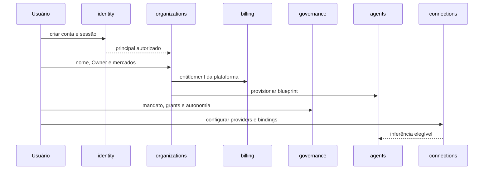
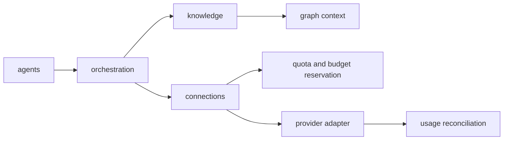
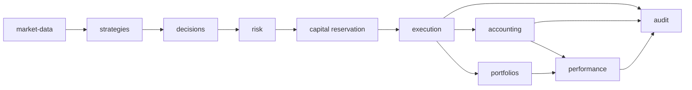

# Backend end-to-end dos 23 módulos

## 1. Contexto e problema

O anxionOS já possui uma árvore backend com os 23 módulos previstos e código distribuído em módulos, packages, apps, services e testes. A presença de diretórios, superfícies públicas ou testes unitários não prova que um módulo está completo: a matriz contratual exige ownership, estado, journal/outbox, migrations, contratos públicos, eventos, projeções, oráculos negativos, segurança e evidência de integração.

Este design transforma o baseline aceito em uma execução backend-first. O frontend não participa do primeiro aceite, mas os contratos de API, SDK/tools e workers necessários para os consumidores continuam dentro do escopo.

Fontes de autoridade:

- `brain/notes/anxionos-backend-structure.md`;
- `brain/project-docs/specs/001-institutional-contract/spec.md`;
- [matriz contratual dos 23 módulos](../../orchestration/module-contract-matrix-23.md);
- `brain/notes/anxionos-storage-ownership.md`.

A estrutura modular e o SDD são aceitos. A matriz contratual continua sendo um instrumento de backlog e rastreabilidade; não concede readiness automaticamente.

## 2. Objetivos

1. Completar e integrar os 23 módulos físicos sem duplicar ownership.
2. Entregar um backend executável em SIMULATED e PAPER.
3. Tornar bancos novos reproduzíveis por migrations versionadas.
4. Preservar autorização temporal, tenancy, idempotência, UNKNOWN e auditoria.
5. Provar projeções reconstruíveis e integração por eventos.
6. Permitir consumo equivalente por API, SDK/tools e workers.
7. Fechar P08 e P09 com avaliação, simulação, recovery e evidência operacional.

## 3. Fora do escopo

REAL/live trading, capital real e certificação de autonomia L3/L4 permanecem fora da autorização deste programa. Nenhum fallback local pode autorizar uma operação financeira ou conservar uma permissão antiga.

A pasta ou pacote `adapter-gateway` não é um vigésimo quarto módulo. O placement aceito distribui registry técnico para `operations`, conexões e bindings para `connections`, execução de ordens para `execution` e dados/feeds para `market-data`.

Frontend, consoles visuais e E2E de navegador não são gates do primeiro aceite, embora seus contratos não possam ser quebrados.

## 4. Módulos e ownership

| Fase | Módulos |
| --- | --- |
| P02 | `identity`, `organizations`, `governance` |
| P03 | `graph` |
| P04 | `agents`, `orchestration`, `knowledge` |
| P05 | `connections` |
| P06 | `market-data`, `strategies`, `capital`, `portfolios`, `decisions`, `risk`, `execution`, `accounting`, `performance`, `audit` |
| P07 | `billing`, `partners`, `operations` |
| P08 | `simulation`, `evaluation` |

P01 e P09 são fases transversais, não módulos adicionais. Cada módulo permanece escritor único do seu agregado:

- `identity` possui principal e sessão; `organizations` possui agency, Owner e membership.
- `governance` possui grants, mandatos, delegações, approvals e epochs; `risk` possui políticas, checks, limites e kill switch.
- `agents` possui Agent e AgentVersion; `orchestration` possui Goal, Task e Run.
- `capital` possui conta, alocação e reserva; `portfolios` possui posição e valuation; `accounting` possui ledger.
- `decisions` possui Decision e TradeIntent; `execution` possui Order, Fill e reconciliação de venue.
- `strategies` possui versões e deployments; `evaluation` possui certificação e promoção; `simulation` possui cenários isolados.
- `eventing` é mecanismo compartilhado; `audit` registra evidência e replay, mas não cria um segundo ledger.
- `graph` projeta relações e contexto; não assume ownership de grants, capital, tasks ou modelos.

## 5. Fluxos de integração

### 5.1 Onboarding institucional

A retomada de qualquer etapa deve ser idempotente e não duplicar agência, Owner, agentes, assinatura ou organograma.

### 5.2 Inferência governada

A inferência não concede autoridade. O request deve carregar beneficiário, grant, perfil efetivo, conta financiadora, orçamento e evidências redigidas; secrets só são resolvidos na infraestrutura autorizada.

### 5.3 Ciclo de investimento

O fluxo deve distinguir aprovação institucional, autorização de risco e revalidação/consumo do permit de execução. Um estado UNKNOWN exige investigação e reconciliação antes de novo envio.

## 6. Ondas de implementação

### P01 — baseline verificável

Fechar dependency boundaries, contratos públicos, versões, licenças, configuração, CI e oráculos de banco limpo. O resultado é um conjunto de verificações que falha quando um módulo acessa infraestrutura indevida, duplica ownership ou publica schema sem versão.

### P02 — fundação institucional

Completar packages de contracts, eventing, database, secrets e observability. Depois fechar identity, organizations e governance com migrations, UoW/ports, journal/outbox atômicos, tenancy, revogação, grants, epochs e approvals.

A prioridade inicial é remover regressões sistêmicas de migrations ausentes, replay divergente de Idempotency-Key, boundary de erros e lookup de principal sem decisão explícita de escopo.

### P03 — Graph Kernel

Implementar schema versionado, autorização de contexto, traversals registrados, projections event-driven, checkpoints, stale denial, rebuild e consistency check. Cada projeção deve manter `eventId`, `checkpoint`, `ownerDomain` e geração.

### P04 — agentes, orquestração e conhecimento

Fechar Agent/AgentVersion, capabilities, skills, Goal/Task/Run, leases, scheduler, retomada, Document/Memory/Evidence, retrieval autorizado e ContextManifest. O módulo agents oferece a fachada do Brain; knowledge continua dono da memória e evidência.

### P05 — Connections

Completar catálogo de providers, contas, ofertas, bindings, routing, quotas, reservas, cooldowns, health e uso. Provider adapters recebem secrets apenas pela infraestrutura; nenhum segredo entra em eventos, DTOs, prompts ou grafo.

### P06 — investimento e evidência

Implementar e integrar os módulos financeiros no fluxo market-data → strategies → decisions → risk → capital → execution → accounting/portfolios → performance → audit. O primeiro caminho demonstrável deve ser SIMULATED/PAPER, com stocks, cripto e carteira combinada tratados por contratos explícitos.

### P07 — comercial e operação

Completar billing, partners e operations, incluindo invoices, refunds, comissões, payouts, incidentes, procedimentos, retenção, export jobs e ações operacionais auditadas. Os endpoints devem ser consumíveis sem depender de uma tela.

### P08 — evolução

Implementar simulation com Digital Twin, seed, snapshot, clock isolado e replay; depois evaluation com datasets, certificação, reputação, regressão e critérios de promoção. Promoção é uma mudança governada e aplicada pelo dono do domínio correspondente.

### P09 — launch

Executar restore cronometrado, reconstrução de projeções, perda controlada de dependências, rotação de secret, backpressure, concorrência de comandos, benchmarks e SLOs. Não publicar readiness sem dataset, ambiente, percentis, falhas e limites registrados.

## 7. Contrato de completude por módulo

Um módulo só pode avançar para revisão quando seu pacote demonstrar:

1. domínio e invariantes independentes de framework;
2. application usando ports e UoW;
3. infrastructure com schema, migration e repositórios do próprio domínio;
4. estado, journal e outbox atômicos;
5. contratos input/output/state/error com `schemaVersion`;
6. API, SDK/tools e workers necessários;
7. idempotência que rejeita payload divergente e preserva replay legítimo;
8. isolamento de tenant, ambiente e escopo AGENCY/PLATFORM;
9. eventos, inbox, projeção e rebuild quando aplicável;
10. happy path, negativos, concorrência, timeout, UNKNOWN, recovery e redaction;
11. observabilidade com correlation/trace e sem secrets;
12. rollback, riscos residuais, documentação e evidência dos gates G1–G7.

## 8. Estratégia de paralelismo

O caminho crítico é serial até P02/P03. Após os contratos e a autoridade estarem estáveis:

- Graph pode avançar junto do fechamento final de organizations/governance.
- Agents, orchestration e knowledge devem compartilhar contratos, mas manter owners separados.
- Connections pode evoluir em paralelo com P03/P04 e integrar depois dos bindings de agents.
- Capital e portfolios podem desenvolver persistência em paralelo com decisions/risk, mas a integração só fecha com revalidação de risco.
- Billing/partners podem evoluir em paralelo com P06; operations observa todos os módulos.
- Simulation e evaluation formam uma frente P08 independente do frontend.

Cada unidade paralela terá uma issue própria, um crítico, dependências explícitas e seu próprio ciclo G0–G7. Nenhum slice herda PASS de outro candidato.

## 9. Melhorias incorporadas

- Ledger de readiness requisito → fonte → símbolo → teste → comando → resultado.
- Oracle de banco limpo sem allowlist permanente para migrations ausentes.
- Helper único de idempotência com intenção obrigatória, mantendo erro institucional do módulo.
- Contract registry gerado para API/SDK/tools, com teste de paridade e headers.
- Testes determinísticos de corrida com barreira e lock observável, sem sleep/retry cego.
- Rebuild de grafo como operação de primeira classe, não como script manual não auditado.
- Vertical slices de onboarding e investimento SIMULATED antes do fechamento de todos os detalhes avançados.
- Separação explícita entre capacidade backend-only e telas futuras, sem fabricar UI para capacidades sem decisão de produto.

## 10. Gate de aceite

O programa só pode solicitar G7 quando:

- os 23 módulos tiverem evidência individual e integrada;
- P01–P09 estiverem reconciliados com o candidato exato;
- migrations de banco novo não dependerem de allowlist;
- testes de tenancy, idempotência, concorrência, UNKNOWN, replay e recovery passarem;
- o fluxo SIMULATED/PAPER for reproduzível;
- REAL, capital real e L3/L4 permanecerem bloqueados;
- riscos residuais e limitações de ambientes reais estiverem declarados.

Este documento descreve o design; não declara que os módulos já satisfazem esses critérios.
