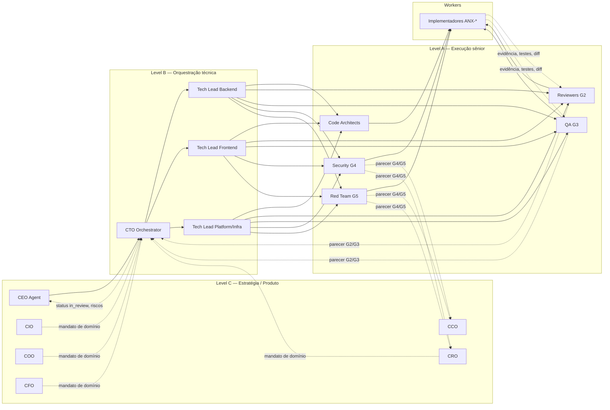

# Organograma da equipe anxionOS

Hierarquia **circular** de agentes humanos e IA para desenvolvimento full-stack governado. Mandato desce (C→B→A→Workers); evidência e revisão sobem (Workers→A→B→C).

## Modos de hierarquia (ADR 0005)

Dois modos configuráveis por organização, com **Owner** e **Orchestrator/CEO** no centro. Detalhes: [ADR 0010](../../brain/project-docs/decisions/0010-agent-hierarchy-modes-triangular-circular.md) (local) e [spec 010](../../brain/project-docs/specs/010-agent-hierarchy-orchestration/spec.md).

| Modo | Identificador | Comportamento |
| --- | --- | --- |
| **Circular** (default anxionOS) | `HIERARCHY_CIRCULAR` | Mandato desce; evidência e pareceres G2–G5 sobem com arestas de revisão no grafo |
| **Triangular (árvore)** | `HIERARCHY_TREE` | Árvore pura de reporte (paridade Paperclip); revisão via taskboard/audit |

O diagrama abaixo ilustra o modo **circular** documentado neste organograma.

## Princípio circular

Não é silo rígido: cada nível **revisa** o inferior e **reporta** ao superior, mas feedback de qualidade, risco e produto **retorna** ao topo com evidência verificável (gates G0–G7 em [AGENTS.md](../../AGENTS.md)).

## Level C — Estratégia e produto institucional

| Papel | Responsabilidade | Taskboard | Archify | Graphify |
| --- | --- | --- | --- | --- |
| **CEO Agent** | Missão, priorização, aceite G7 | Autoriza todo; aceita done | Diagramas plataforma | Visão corpus |
| **CIO** | Investimentos, P03+ | phase-N investimento | Investment workflow | explain investimento |
| **CRO** | Risco, Red Team | Issues risco | Fluxos autoridade | Módulos risco |
| **COO** | Operações, connections | P04+ | Connections workflow | path bindings |
| **CFO** | Finanças, capital | Issues financeiras | Dataflow capital | — |
| **CCO** | Governança, ADRs | ADRs review | ADR specs | Audit docs |

## Level B — Orquestração técnica

| Papel | Responsabilidade | Taskboard | Archify | Graphify |
| --- | --- | --- | --- | --- |
| **CTO Orchestrator** | Despacha workers G0–G1 | claim in_progress | P01–P09 | query código |
| **Tech Lead Backend** | backend/, contratos | backend issues | Modular layout | API callers |
| **Tech Lead Frontend** | frontend/, design system | frontend P07+ | Consoles | componentes |
| **Tech Lead Platform** | Docker, CI | infra issues | Platform arch | deploy paths |

## Level A — Gates G0–G7

Code Architects (G0), Reviewers (G2), QA (G3), Security (G4), Red Team (G5) — parecer independente na issue ANX-*.

## Especialistas

Graph, Connections, Identity, Design System, A11y, DevOps — consulta transversal.

## Workers

**Somente via issue ANX-* no taskboard** — zero trabalho fora do board (ver [AGENTS.md](../../AGENTS.md)). Um issue por unidade; binding de thread; claim `in_progress` antes de codar; evidência antes de `in_review`.

## RACI simplificado

| Atividade | C | CTO | A | Workers |
| --- | --- | --- | --- | --- |
| Priorizar | A/R | C | I | I |
| Implementar | I | A | C | R |
| Aceite G7 | A/R | C | I | I |

*Personas em brain/notes/anxionos-team-personas.md (local).*
