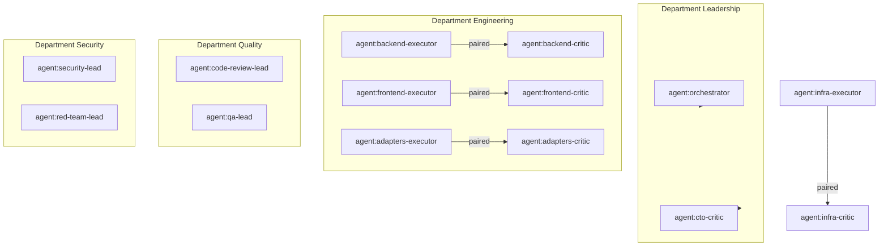

# Agent Graph Registry — personas → Agent nodes

## Escopo

Registro P0 do **Agent Graph** para ANX-268. Fontes: `.cursor/orchestration/PERSONAS.md`, `AGENT-ROSTER.md`, `PRODUCT-COMPANY-MODEL.md`, spec `006-product-agent-graph`.

**Regra:** personas permanentes = `coverageStatus: covered`. Papéis da taxonomia Owner sem persona = `partial` ou `proposed` conforme PRODUCT-COMPANY-MODEL.

## Personas permanentes (100% classificadas)

| slug | Agent node id | nome | level | department | coverageStatus | productCompanyStages |
| --- | --- | --- | --- | --- | --- | --- |
| orchestrator | agent:orchestrator | Renata Oliveira | center | Leadership | covered | 1,6,7,10,G6-G7 |
| cto-critic | agent:cto-critic | Cláudia Nunes | center | Leadership | covered | governance-all |
| architect | agent:architect | Marcus Chen | A | Architecture | covered | 2,3,5 |
| backend-executor | agent:backend-executor | Lucas Mendes | C | Engineering | covered | 7 |
| frontend-executor | agent:frontend-executor | Camila Santos | C | Engineering | covered | 4,7 |
| infra-executor | agent:infra-executor | Rafael Costa | C | Platform | covered | 7,10 |
| adapters-executor | agent:adapters-executor | Diego Almeida | C | Engineering | covered | 7 |
| backend-critic | agent:backend-critic | Marina Ferreira | C | Engineering | covered | 7,G1 |
| frontend-critic | agent:frontend-critic | Paulo Ribeiro | C | Engineering | covered | 4,7,G1 |
| infra-critic | agent:infra-critic | Ana Beatriz Lima | C | Platform | covered | 7,G1 |
| adapters-critic | agent:adapters-critic | Gustavo Henrique | C | Engineering | covered | 7,G1 |
| code-review-lead | agent:code-review-lead | Fernanda Aoki | B | Quality | covered | 9,G2 |
| qa-lead | agent:qa-lead | Eduardo Nakamura | B | Quality | covered | 8,G3 |
| security-lead | agent:security-lead | Isabella Morales | B | Security | covered | 5,8,9,G4 |
| red-team-lead | agent:red-team-lead | Thiago Martins | B | Security | covered | 8-9,G5 |
| github-lead | agent:github-lead | Juliana Pereira | B | Platform | covered | 10 |
| docs-lead | agent:docs-lead | André Kuznetsov | B | Product | covered | 3,4,12 |
| researcher | agent:researcher | Helena Duarte | on-demand | Research | covered | 1,2,12 |

**@Owner** → `agent:owner` (humano), `coverageStatus: covered`, etapa 1 CEO Agent.

**Total personas permanentes:** 18/18 = **100%** com `coverageStatus` definido.

## Relações Agent Graph (permanentes)



## Taxonomia Product Company — papéis sem persona dedicada

Resumo por status (detalhe em PRODUCT-COMPANY-MODEL.md):

| coverageStatus | Contagem aprox. | Exemplos |
| --- | --- | --- |
| covered | 4 | CEO (@Owner), CTO (Renata), Software Architect (Marcus), — |
| partial | ~25 | Risk (Cláudia+Isa), Requirements (`write-a-spec`), UI Designer (Camila), Graph Architect (Marcus+graph) |
| proposed | ~60+ | Chief Product, Product Discovery, UX Research, AI Architect, Data Architect, … |

### Top 5 proposed (prioridade P1 hire)

| roleName | coverageStatus | hire provável |
| --- | --- | --- |
| Product Discovery Agent | proposed | explore + OKF |
| Product Manager Agent | proposed | planner + write-a-spec |
| Requirements Agent | partial→proposed | write-a-spec + OKF |
| UX Research Agent | proposed | docs-researcher |
| Product Designer Agent | proposed | frontend-design hire |

## Bridge Product Graph ↔ Agent Graph

| Ligação | Exemplo |
| --- | --- |
| WorkItem → OWNED_BY_AGENT | ANX-265 → agent:backend-executor |
| Feature → DECIDED_BY | feat:decision-engine → DecisionRecord |
| Agent → PRODUCED | agent:backend-executor → code:decision-record-ts |
| Agent → HAS_CAPABILITY | agent:code-review-lead → G2 verdict |

Ver exemplos em `brain/notes/product-graph-examples/anx-265-decision-engine-contract.md`.

## Critérios de aceite ANX-268

- [x] 18/18 personas permanentes com `coverageStatus`
- [x] Departamentos e pares executor-crítico mapeados
- [x] Taxonomia Owner classificada covered/partial/proposed
- [x] Bridge para Product Graph documentada
- [ ] CLI `orchestration:agent-graph` (P1 proposed — ANX-269)

## Queries P0

```text
search "agent-graph-registry orchestrator" → este documento
search "agent:backend-executor" → registry + product-graph-examples
orchestration:who --persona backend-executor → roster vivo
```