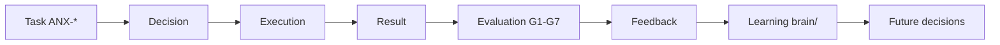

# Agent Learning Loop

**Framework:** `.cursor/orchestration/AI-PRODUCT-COMPANY-ENGINE.md` §20

## Loop



## Cursor P0 (operacional hoje)

```bash
npm run orchestration:brain -- reflect --issue ANX-N --outcome pass|fail --lesson "..."
```

Após CHANGES_REQUIRED ou erro — promover lição em `brain/` (framework: `.cursor/orchestration/OPENKNOWLEDGE-BRAIN.md`).

## Product Graph edges

- `LEARNED_FROM` (Agent → KnowledgeRef)
- `INFORMED_BY` (Decision → KnowledgeRef)
- `FEEDS_BACK` (Evaluation → Requirement | Problem)

## Agent Graph

- `KNOWS` (Agent → KnowledgeRef)
- PerformanceSnapshot atualizado após cada slice G7

## Guardrails

1. Learning **não** altera ADRs aceitos sem novo ADR
2. Lições em `brain/` passam por OKF MCP
3. Supermemory complementa — não substitui `brain/`

## Critérios P1 doc

- [x] Loop + CLI brain reflect
- [x] Edges grafo
- [ ] Automated reflect trigger (P2)
