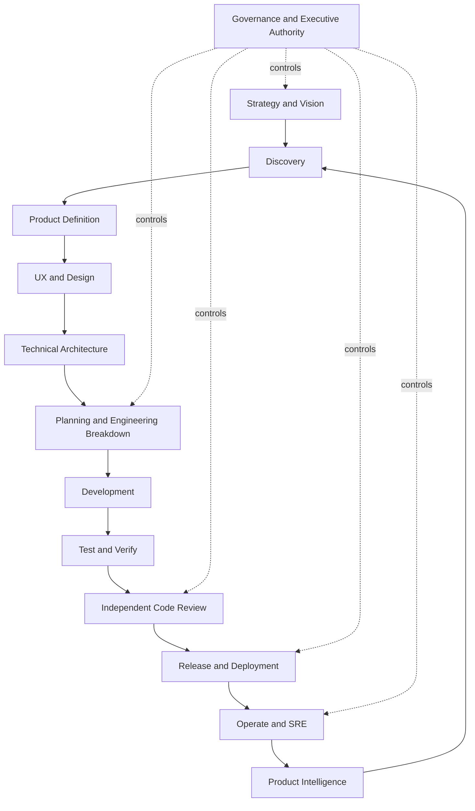

# AI Product Company Engine — ciclo operacional

## Visão

O anxionOS/ArcheonOS é tratado como uma empresa de produto virtual: agentes especializados colaboram sobre uma memória organizacional e grafos compartilhados, sob governança explícita. O modelo de produto não substitui o runtime institucional nem concede autoridade implícita a agentes.

## Ciclo completo

## Fases e outputs

| Fase | Pergunta | Outputs mínimos | Lifecycle/gates |
| --- | --- | --- | --- |
| Strategy | O que vale construir e por quê? | Vision, Business Opportunity, Strategic Objective, Product Opportunity | P0/G-B |
| Discovery | Qual problema resolver? | Problem Definition, Personas, JTBD, Pain Points, Opportunity Map | P1/G-D |
| Product Definition | O que exatamente construir? | Product Vision, PRD, Requirements, Stories, Acceptance Criteria, KPIs | P1→P2 |
| UX/Design | Como a experiência funciona? | User Flows, IA, protótipo, UI, Design System, a11y | G-UX |
| Architecture | Como o sistema satisfaz o produto? | ADR, System/Component/API/Data/Event/Security/Graph Architecture | P2/G-A |
| Planning | Como dividir em trabalho verificável? | Epics, Features, Tasks, Subtasks, Implementation Units | P3/G-P |
| Development | Como produzir mudança completa? | Código, migrations, eventos, testes unitários e contratos | P4/G0-G1 |
| Test/Verify | A mudança funciona e é segura? | Unit, integration, E2E, performance, security, regression evidence | G3 |
| Code Review | O candidato atende contratos e qualidade? | Review independente, achados, decisão | G2 |
| Release | Pode chegar a staging/produção? | Staging, canary, health checks, rollback e observabilidade | P5/P6 |
| Operations | O produto permanece confiável? | sinais, incidentes, diagnóstico, mitigação e postmortem | P7/G-Prod |
| Intelligence | O que aprendemos? | Telemetria, analytics, experimentos, oportunidades e mudanças | retorna a P0/P1 |

## Product Graph e Agent Graph

O Product Graph liga `Company → Product → Problem → User → Requirement → Feature → Capability → Service → Code → Test → Deployment → Signal`. O Agent Graph liga `Agent → Department → Team → Capability → Knowledge → Decision → Authority → Artifact`, além de dependências, comunicação, disponibilidade, desempenho e responsabilidade.

O grafo é um estado cognitivo explicável, não um segundo ledger. Cada fato tem um owner de domínio; projeções são reconstruíveis por eventos com `eventId`, `checkpoint` e `ownerDomain`. Uma busca de impacto percorre serviços, APIs, features, testes, deploys, sinais e usuários. Uma busca de responsabilidade percorre capability, agentes, equipe, departamento e autoridade.

## Governance acima do ciclo

A governança impõe:

- níveis de autoridade L0–L6;
- decisão versionada com propositor, evidência, alternativas, risco, custo, confiança, impacto, autoridade e aprovações;
- separação entre `governance` (grants/mandates/approvals), `decisions` (decisions/intents), `audit` (linhagem/replay) e `graph` (projeções);
- pipeline G0–G7 sem autoaprovação;
- escalonamento de risco alto, conflito com ADR aceito, impacto multi-tenant ou efeitos externos para autoridade superior/Owner;
- nenhum self-healing ou self-development que eleve autoridade, contorne gates ou produza efeito não autorizado.

## Alinhamento de implementação

P0–P3 são documentação, discovery, arquitetura e planejamento. P4 contém desenvolvimento e G0–G7. P5/P6 cobrem staging e lançamento. P7 cobre produção. Product Intelligence retorna para Discovery e não altera fatos históricos silenciosamente.

A taxonomia de 30 módulos é um mapa de capacidades. O baseline físico de 23 módulos continua canônico; conceitos como Products, Marketplace, Capabilities, Engineering, Testing, Security e Analytics permanecem compostos ou gaps até spec, ownership, armazenamento, eventos e issue próprios.

## Critérios de evolução

Uma nova capacidade somente avança quando possui problema e objetivo rastreáveis, owner de domínio, contrato versionado, política de autoridade, evidências, testes e rollback. Self-healing é inicialmente determinístico, limitado a procedimentos preautorizados e reversíveis; self-development requer proposta, simulação, revisão independente, aprovação e pipeline completo.

## Status

Esta nota é proposta de planejamento. Não prova a existência de agents permanentes, Product Graph runtime, autoaprendizagem, self-healing ou self-development implementados. Esses recursos permanecem dependentes de design aprovado, issues ANX-* e evidência executada.