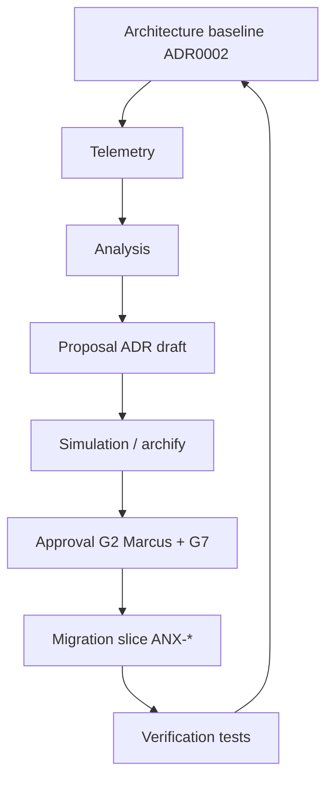

# Continuous Architecture Loop

**Framework:** `.cursor/orchestration/AI-PRODUCT-COMPANY-ENGINE.md` §23

## Fluxo

## Sinais observados

| Sinal | Fonte P0 | Fonte P2 |
| --- | --- | --- |
| Traffic / latency | Monitor node manual | observability |
| Costs | issue comments | billing module |
| Failures | incidents + runbooks | operations |
| Dependencies | graphify + ADR | Neo4j traversal |
| Security | G4 findings | security scans |

## Product Graph

- `Monitor` → `FEEDS_BACK` → `Problem`
- `ResearchArtifact` → `DERIVES_FROM` → `Requirement`
- ADR aceito → `Capability` ENABLES → `Feature`

## Cursor P0

- Marcus `consult` antes de mudança arquitetural
- `npm run archify:validate` + `archify:build`
- Novo ADR em `brain/project-docs/decisions/` via OKF

## Gates

| Mudança | Gate mínimo |
| --- | --- |
| Doc/ADR | G0 + Marcus |
| Código módulo | G2 Fernanda |
| Deploy | G7 Owner exceção |

## Critérios P1 doc

- [x] Fluxo Mermaid
- [x] Integração ADR + archify
- [ ] Automated telemetry→ADR draft (P3+)
