# Atlas de diagramas — 23 módulos físicos

Cada bloco: o que o módulo **possui**, o que **não possui**, e o fluxo de comando → evento → projeção. Ownership: [R02 do debate](../docs/orchestration/modules/) e [alinhamento 30→23](./anxionos-product-company-module-alignment.md). Sistema completo: [atlas](./anxionos-diagram-atlas.md).

Agentes e orchestration têm debate em `docs/orchestration/structure-debate/` (pastas não duplicadas em `modules/`).

## identity

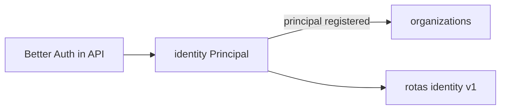

Não possui: Agency, grants, sessão Better Auth no domain (BA fica em apps/api).

Debate serial: [PC 02](./anxionos-pc02-organization-debate.md).

## organizations

Fonte: [R06](../docs/orchestration/modules/organizations/R06-dependencies.md) · [PC 02](./anxionos-pc02-organization-debate.md).

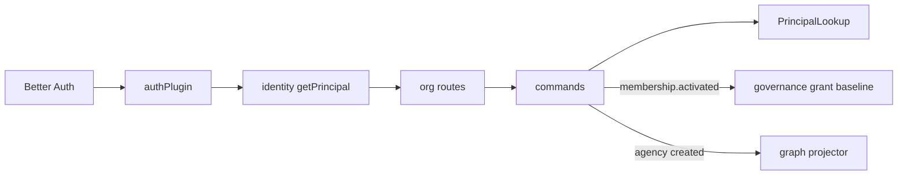

## governance

Fonte: [R02](../docs/orchestration/modules/governance/R02-boundaries.md).

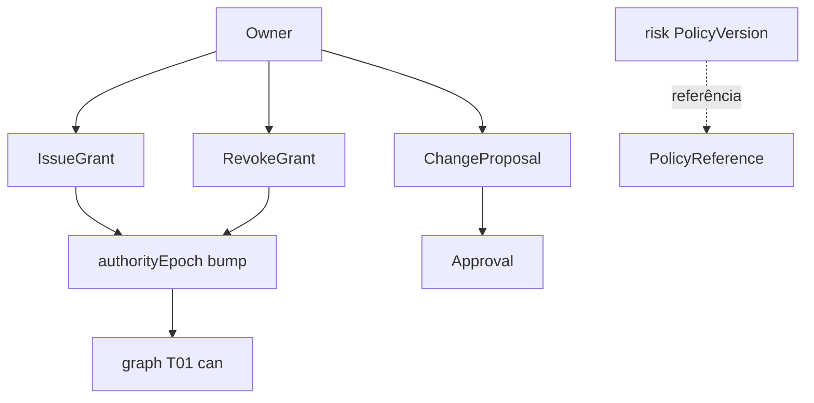

Não possui: RiskPolicy, kill switch, ExecutionPermit final, Cypher, pasta `approvals`/`policies`.

**CTO 2026-09-10 (M01):** Approval / ChangeProposal / PolicyReference genérico neste módulo; PolicyVersion kind=RISK em `risk`; DecisionRecord em `decisions`. Debate: [PC 01](./anxionos-pc01-governance-debate.md).

## graph

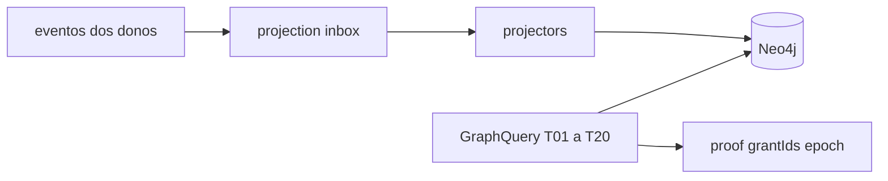

## agents

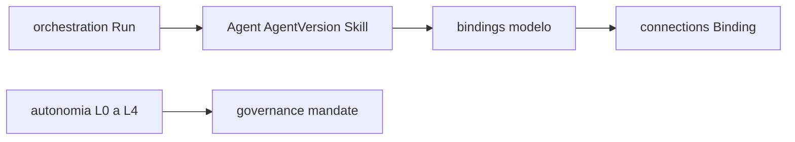

## orchestration

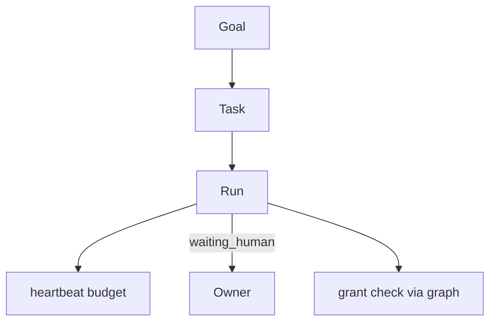

## knowledge

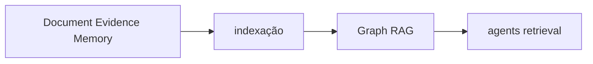

## connections

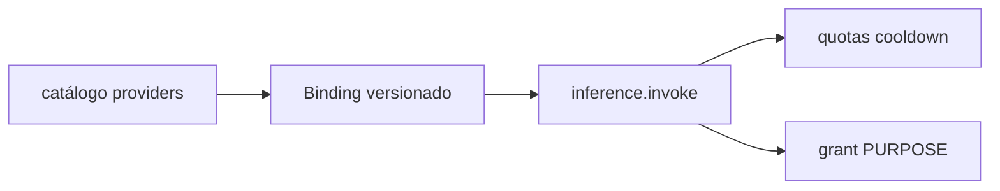

Transversal: modelos, MCP, APIs, engines. Não concede trading.

## market-data

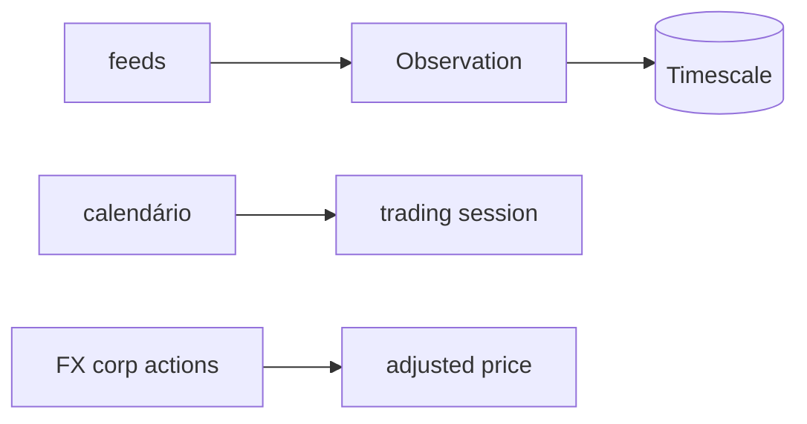

## strategies

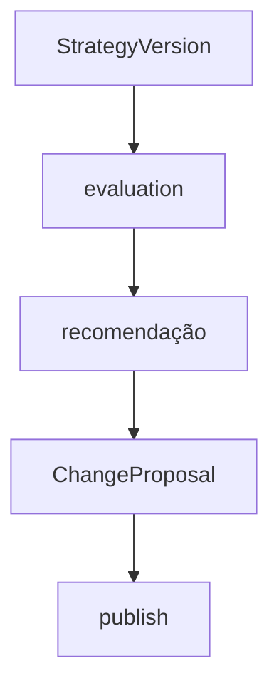

## capital

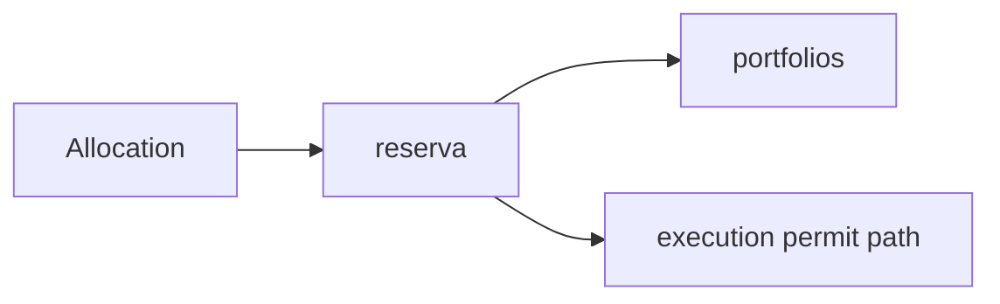

## portfolios

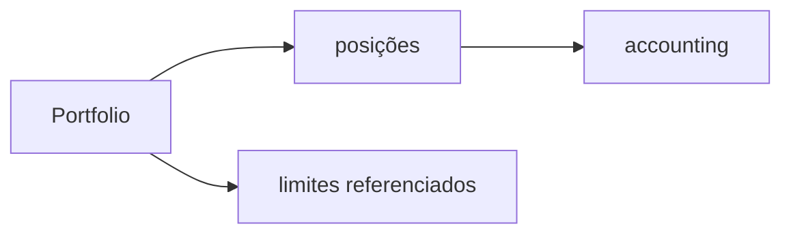

## decisions

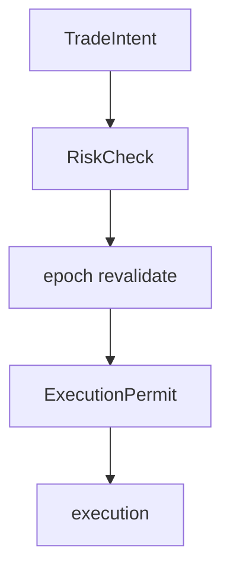

Não duplica Approval de ChangeProposal (governance).

## risk

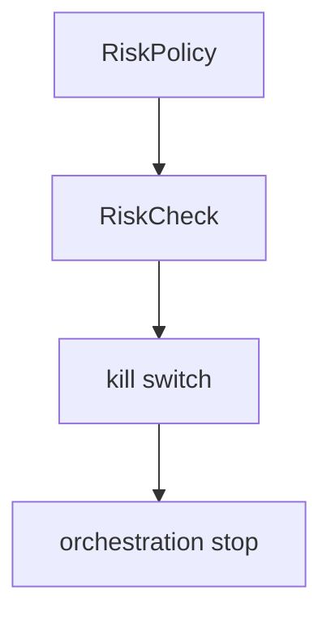

## execution

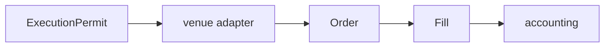

## accounting

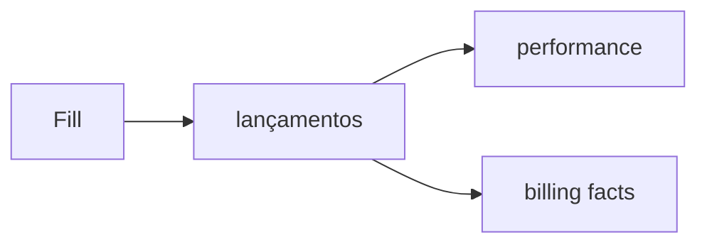

## performance

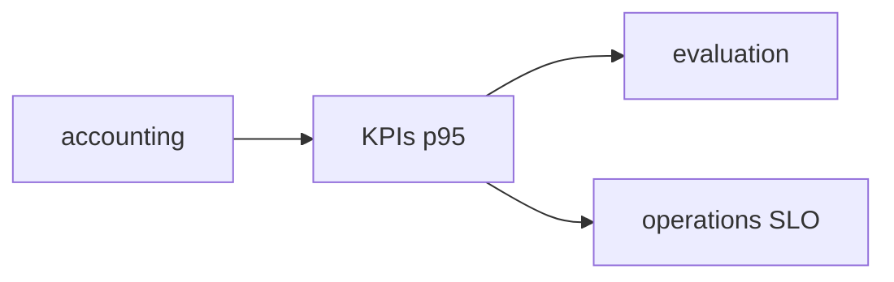

## audit

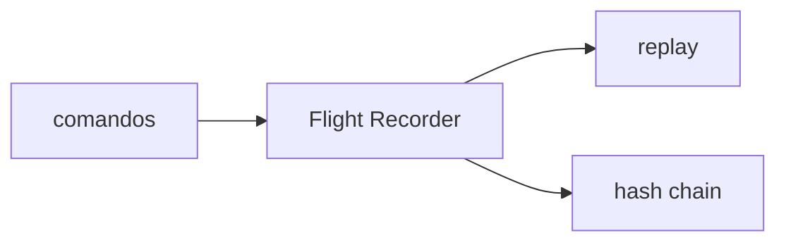

## billing

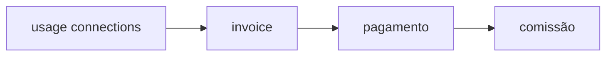

## partners

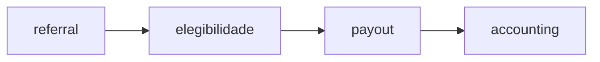

## operations

```mermaid
flowchart TD
  probe[probes] --> inc[Incident]
  inc --> runbook[runbook]
  runbook --> deploy[deploy catalog]
  deploy --> rec[recovery]
```

## evaluation

```mermaid
flowchart LR
  run[SimulationRun / backtest] --> score[score]
  score --> cert[certificado]
  cert --> rec[recomendação promoção]
```

Não aprova sozinho — governance ResolveApproval.

## simulation

```mermaid
flowchart LR
  snap[Snapshot] --> twin[SimulationRun]
  twin --> diff[diff]
  diff --> cp[ChangeProposal]
```

## Ciclo financeiro integrado

```mermaid
flowchart LR
  md[market-data] --> st[strategies]
  st --> cap[capital]
  cap --> dec[decisions]
  dec --> rsk[risk]
  rsk --> ex[execution]
  ex --> acc[accounting]
  acc --> perf[performance]
  acc --> aud[audit]
```

## Fundação P02

```mermaid
flowchart LR
  id[identity] --> org[organizations]
  org --> gov[governance]
  gov --> gr[graph T01]
```

## Runtime agentes P04–P05

```mermaid
flowchart LR
  ag[agents] --> orc[orchestration]
  orc --> kn[knowledge]
  ag --> cn[connections]
  orc --> gov[governance]
```
