# Atlas de diagramas — sistema completo

> [!NOTE]
> Fonte de verdade dos **módulos físicos**: [estrutura aceita](./../brain/notes/anxionos-backend-structure.md) (23 contexts, ADR0002). A taxonomia de 30 nomes do briefing Owner é **mapa de capacidades**, não 30 pastas novas — ver [alinhamento](./anxionos-product-company-module-alignment.md).
>
> Archify (HTML/SVG): `.archify/specs/` → `npm run archify:build` → `.archify/artifacts/`.
>
> Diagramas **por módulo**: [atlas módulos](./anxionos-diagram-atlas-modules.md).

## Índice visual

| Camada | Tipo | Onde ver |
| --- | --- | --- |
| Plataforma | Archify architecture | `.archify/artifacts/anxionos-platform.architecture.html` |
| Entrega P01–P09 | Archify workflow | `.archify/artifacts/anxionos-delivery-p01-p09.workflow.html` |
| Product Company 12 etapas | Archify workflow | `.archify/artifacts/anxionos-product-company.workflow.html` |
| Connections / inferência | Archify workflow | `.archify/artifacts/anxionos-connections-inference.workflow.html` |
| Storage / autoridade | Archify dataflow | `.archify/artifacts/anxionos-storage-authority.dataflow.html` |
| Plataforma visual-check | Archify HTML + PNG | `.archify/artifacts/anxionos-platform.architecture.visual-check.html` |
| Ciclo PC (Mermaid) | [lifecycle](./anxionos-ai-product-company-lifecycle.md) | abaixo |
| 23 módulos | Mermaid + fichas | [atlas módulos](./anxionos-diagram-atlas-modules.md) · [CAPABILITY-MAP](/docs/orchestration/system-capabilities/CAPABILITY-MAP) |
| Briefing Owner | Ingest OK | [briefing 2026-09-10](/external-sources/owner-briefing-product-company-2026-09-10) |

## 1. Visão da plataforma

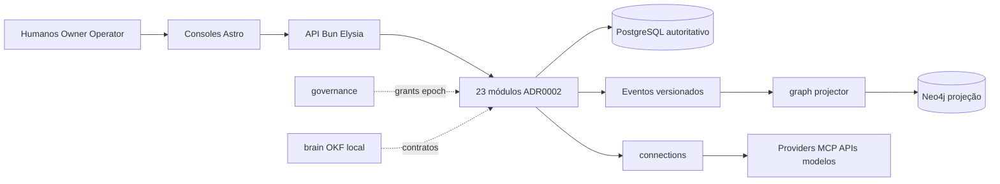

Cita: [estrutura](./../brain/notes/anxionos-backend-structure.md) · spec Archify `anxionos-platform.architecture.json`.

## 2. Grafo como estado cognitivo

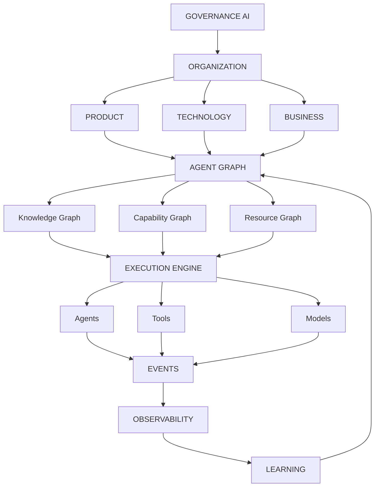

Cita: [índice PC](./anxionos-ai-product-company-index.md) · spec [006 Product/Agent Graph](./../brain/project-docs/specs/006-product-agent-graph/spec.md).

> [!WARNING]
> `graph` **projeta**; não é ledger de capital, grants ou ordens. [ADR0004](./../brain/project-docs/decisions/0004-postgresql-timescaledb-pgvector.md).

## 3. Cadeia Product Graph (por que a feature existe)

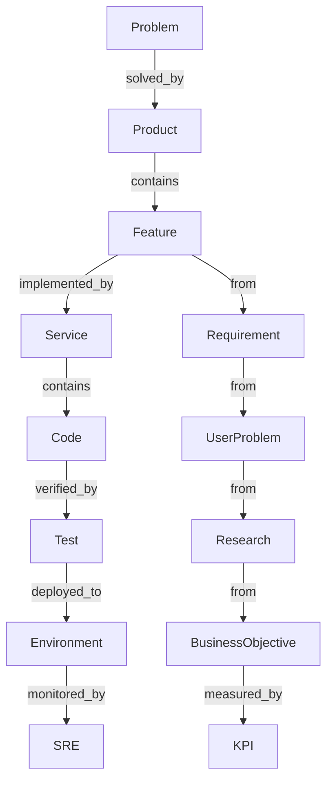

## 4. Ciclo AI Product Company (12 etapas)

Fonte: [lifecycle](./anxionos-ai-product-company-lifecycle.md).

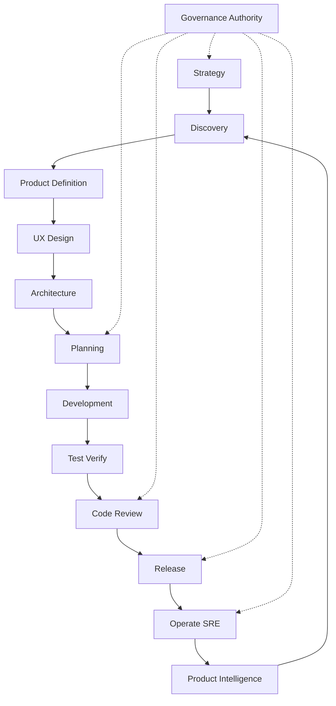

## 5. Empresa virtual (organização de agentes)

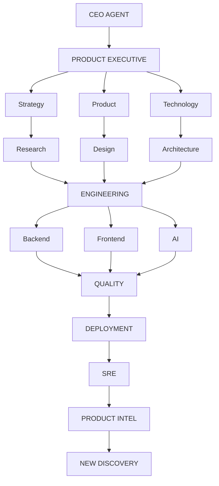

Personas Cursor (Renata, Lucas…) **não** são os agentes institucionais de `modules/agents`. Ver SCOPE do framework.

## 6. Governança e níveis de autoridade

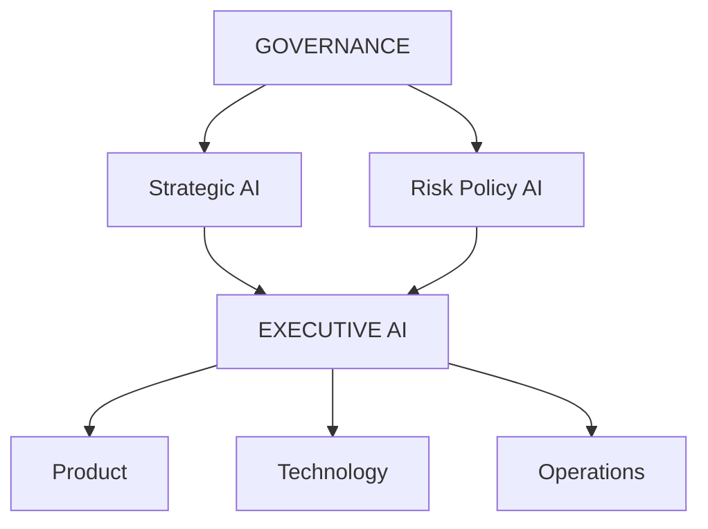

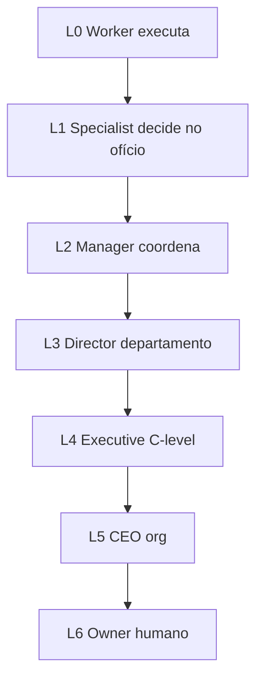

Autonomia de **investimento** L0–L4 (spec 004 / ANX-137) é eixo **distinto** destes níveis organizacionais. Não misturar no mesmo enum sem ADR. Mapeamento fechado no [debate M01](./anxionos-pc01-governance-debate.md) (ANX-349).

Fronteira física: [governance R02](./../docs/orchestration/modules/governance/R02-boundaries.md) — grants/epoch vs `risk` vs `decisions`.

**CTO 2026-09-10:** nós Approval / ChangeProposal / PolicyReference → `governance`; PolicyVersion kind=RISK → `risk`; DecisionRecord / TradeIntent / ExecutionPermit → `decisions`. Sem pastas `approvals` ou `policies`.

## 7. Decision Engine

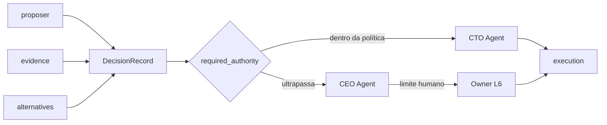

Cita: ANX-265 · [governance bridge](./../docs/orchestration/modules/governance/R08-decision-log.md).

## 8. Storage e autoridade

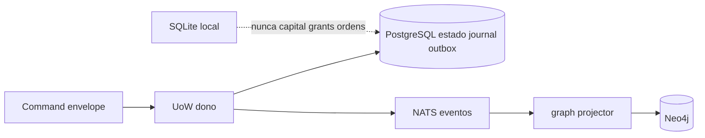

Cita: [storage ownership](./../brain/notes/anxionos-storage-ownership.md) · Archify dataflow.

## 9. Pipeline de qualidade G0–G7

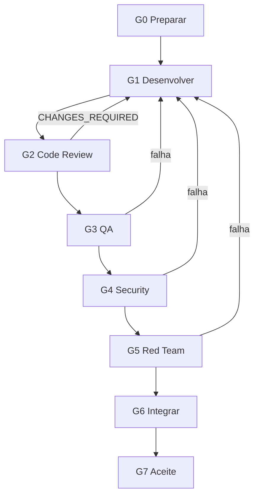

Cita: [AGENTS.md](./../AGENTS.md) · [PIPELINE](./../.cursor/orchestration/PIPELINE.md).

## 10. Mapa 30 capacidades → 23 módulos

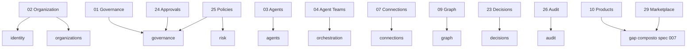

Tabela completa: [alinhamento](./anxionos-product-company-module-alignment.md).

## 11. Entrega P01–P09

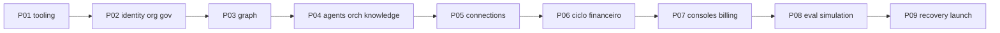

Cita: SDD [001](./../brain/project-docs/specs/001-institutional-contract/spec.md).

## Cobertura visual (ANX-343, 2026-09-10)

**Archify plataforma (5/5 validate PASS):** `anxionos-platform.architecture`, `anxionos-delivery-p01-p09.workflow`, `anxionos-product-company.workflow`, `anxionos-connections-inference.workflow`, `anxionos-storage-authority.dataflow`.

**Visual-check** da architecture: HTML + PNG 1440x900 e 2048x1320 (light/dark) em `.archify/artifacts/`.

| Módulo físico | Mermaid | Archify |
| --- | --- | --- |
| identity, organizations, governance | [atlas módulos](./anxionos-diagram-atlas-modules.md) | platform architecture |
| graph | atlas + T01–T20 na ficha | platform architecture |
| agents, orchestration, knowledge | atlas + ciclo P04 | platform + product-company workflow |
| connections | atlas + PC 06/07/30 | connections-inference workflow |
| market-data … audit (ciclo financeiro) | atlas + ciclo P06 | storage-authority dataflow |
| billing, partners | atlas módulos | platform architecture |
| operations, evaluation, simulation | atlas + PC 15–21 | delivery P01–P09 |

HTML Archify **por módulo** (23 specs) **não** foi criado — seria 23º+ artefato visual, não um 24º módulo. Cobertura do **sistema** fecha ANX-343; specs por módulo ficam como follow-up opcional do coordenador.

## Questões abertas

1. Debate serial 01-30? **Fechada em docs:** [indice](./anxionos-pc-serial-index.md). ANX-342 aberto para auditoria.
2. Não promover a taxonomia 30 a ADR de layout — **reafirmado** CTO: rejeitado 30 pastas. ADR0002 permanece.
3. Archify por módulo: **não bloqueia** ANX-343. Plataforma 5/5 + visual-check + preview OK + Mermaid dos 23.

## Fontes

- [estrutura backend](/brain/notes/anxionos-backend-structure.md) — se o link interno falhar, o doc vive em `brain/notes/` (OKF local).
- [alinhamento 30→23](./anxionos-product-company-module-alignment.md)
- [lifecycle PC](./anxionos-ai-product-company-lifecycle.md)
- [governance R02](./../docs/orchestration/modules/governance/R02-boundaries.md)
- [atlas 23 módulos](./anxionos-diagram-atlas-modules.md)
- `.archify/specs/` (cinco specs no repo; validate 2026-09-10 PASS)
- [briefing Owner](/external-sources/owner-briefing-product-company-2026-09-10) (ANX-344)
- [CAPABILITY-MAP e fichas](/docs/orchestration/system-capabilities/CAPABILITY-MAP) (ANX-346/347)
