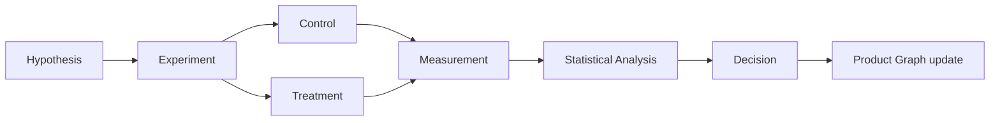

# Experimentation Engine — hipótese a decisão

**Framework:** `.cursor/orchestration/AI-PRODUCT-COMPANY-ENGINE.md` §21 · **Issue:** ANX-280

## Fluxo

## Agent roles (proposed)

| Role | Capability | Authority |
| --- | --- | --- |
| Experiment Designer | `design_experiment` | L2 |
| Statistician | `analyze_experiment` | L2 |
| Experiment Reviewer | `verdict_experiment` | L3 |
| A/B Testing Agent | `run_ab_test` | L1 sandbox |

## Product Graph nodes

| Node | Campos obrigatórios |
| --- | --- |
| `Experiment` | hypothesisRef, status, environment |
| `Hypothesis` | statement, metric, expectedDelta |
| `Monitor` | metricName (outcome) |

## Edges

- `TESTS` (Experiment → Feature)
- `MEASURES` (Experiment → Monitor)
- `VALIDATES` (Experiment → Hypothesis)
- `FEEDS_BACK` (Experiment → Problem | Requirement)

## Gates

| Fase | Gate | Evidência |
| --- | --- | --- |
| Design | G0 consult Marcus | ADR se arquitetural |
| Run | G3 QA | Ambiente sandbox |
| Ship | G7 Owner se produto | DecisionRecord |

## P0 oráculo (sem runtime)

OKF `search` + issue `ANX-*` com hipótese e métrica documentadas.

## P2 runtime (proposed)

- Módulo `evaluation` + eventos versionados
- Nenhum experimento em produção sem G7

## Critérios aceite P1 doc

- [x] Fluxo Mermaid
- [x] Nodes/edges no grafo
- [x] Roles e authority
- [ ] 1 exemplo instanciado (futuro ANX-281)
