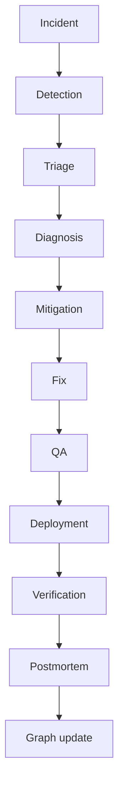

# Incident Management — grafo e postmortem

**Framework:** `.cursor/orchestration/AI-PRODUCT-COMPANY-ENGINE.md` §22 · **Issue:** ANX-280

## Fluxo operacional



## Product Graph — postmortem loop

```text
Incident → ROOT_CAUSED_BY → SystemComponent
  → OWNED_BY → AgentTeam
  → PREVENTED_BY → Requirement
  → TRACKED_IN → WorkItem ANX-*
```

## Node types (proposed P2)

| Node | ownerDomain |
| --- | --- |
| `Incident` | product |
| `RootCause` | product |
| `PreventiveAction` | product |
| `Postmortem` | product |

## Edges

| Edge | From → To |
| --- | --- |
| `ROOT_CAUSED_BY` | Incident → Service/CodeArtifact |
| `MITIGATED_BY` | Incident → Deployment |
| `DOCUMENTED_IN` | Incident → Postmortem |
| `PREVENTED_BY` | Postmortem → Requirement |
| `FEEDS_BACK` | Postmortem → Problem |

## Integração Cursor P0

- Skill `write-a-postmortem`
- Dialogue types: `incident`, `postmortem`, `block`/`unblock`
- Runbooks self-healing ANX-273 para mitigação determinística

## Gates

| Gate | Quem | Quando |
| --- | --- | --- |
| G4 | Isa | Incidente com dados sensíveis |
| G3 | Edu | Verificação pós-fix |
| G7 | Owner | Severidade critical |

## P0 oráculo

Postmortem em `brain/` com links a `ANX-*` e componentes afetados.

## Critérios aceite P1 doc

- [x] Fluxo + grafo postmortem
- [x] Integração runbooks + skill
- [ ] Módulo `operations`/`incidents` runtime (P2+)
