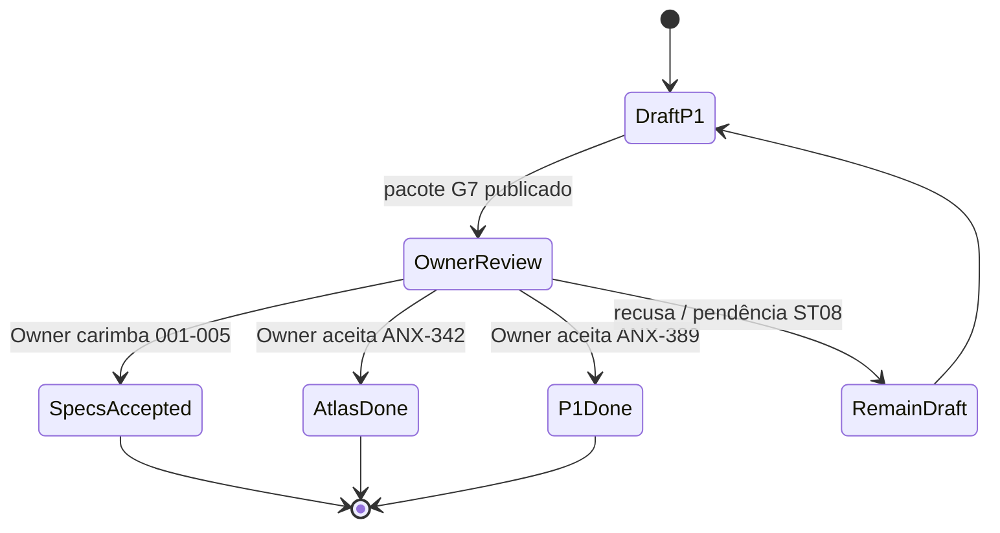

# Pacote G7 Owner — P1 documental + atlas (draft)

**Este pacote é rascunho OKF.** Não executa aceite. Specs 001–005 permanecem `draft` até o Owner carimbar. ANX-342 permanece `todo`. ANX-389 permanece `in_review` (não `done`).

**Issues:** ANX-389 (P1) · ANX-342 (atlas PC 01–30)  
**ST08:** 0/23 — aceite de spec, se o Owner quiser, é **exceção explícita** apesar de ST08 incompleto.



## O que o Owner deve aceitar (lista fechada)

### 1. Specs 001–005: `draft` → `accepted` (apesar de ST08 0/23)

Só o Owner (G7) muda `status:` nestes arquivos:

| Spec | Path |
| --- | --- |
| 001 institucional | [spec](../project-docs/specs/001-institutional-contract/spec.md) |
| 002 agents/knowledge | [spec](../project-docs/specs/002-agents-knowledge/spec.md) |
| 003 investimento | [spec](../project-docs/specs/003-investment-lifecycle/spec.md) |
| 004 evolução | [spec](../project-docs/specs/004-institutional-evolution/spec.md) |
| 005 connections | [spec](../project-docs/specs/005-connections-integration/spec.md) |

Checklist P1 (sem carimbo): [anxionos-p1-spec-promotion-checklist](./anxionos-p1-spec-promotion-checklist.md).

**Ressalva obrigatória no aceite:** ST08 (storage homologado 23/23) continua **0/23**. Aceitar spec ≠ homologar engines reais / REAL_EXECUTION.

### 2. ANX-342 — atlas visual + serial PC 01–30

- Status atual: **`todo`** (não hijack; não `done` por agente).
- Evidência documental: hub [anxionos-pc-serial-hub](./anxionos-pc-serial-hub.md); Archify 23 workflows de módulo + platform + product-company.
- Aceite Owner: mover ANX-342 para `done` **somente** se o atlas (PC + diagramas) for aceito como entrega visual.

### 3. ANX-389 — programa P1 documental DEV_READY

- Status atual: **`in_review`**.
- Escopo entregue (documental): índice PC, storage-ownership consolidável (ainda draft), R-packs 23 módulos, CAPABILITY-MAP, alinhamento 23 vs adapter-gateway.
- Aceite Owner: `done` **somente** com G7 explícito. Filhos ANX-390–393 em `in_review` acompanham o mesmo aceite.

## Fora do pacote (não pedir aceite agora)

- D-GOV-010 PolicyReference — deferido P06.
- ADR0003 `tools/` — permanece proposta.
- Marcar ST08 23/23 sem engines reais.
- Apagar `backend/modules/adapter-gateway` — **KEEP**; ver [alinhamento](./anxionos-product-company-module-alignment.md).

## Comandos de evidência (colar stdout)

```bash
npm run taskboard:ensure
ls docs/orchestration/system-capabilities/modules/*.md | wc -l
find docs/orchestration/modules -name 'R10-g0-handoff.md' | wc -l
ls .archify/specs/anxionos-module-*.json | wc -l
ls .archify/artifacts/anxionos-module-*.html | wc -l
ls .archify/specs/*adapter-gateway* 2>&1 || true
test ! -e docs/orchestration/system-capabilities/modules/adapter-gateway.md && echo ABSENT_FICHA_ADAPTER_GATEWAY
test ! -d backend/modules/approvals && test ! -d backend/modules/policies && echo ABSENT_APPROVALS_POLICIES
node scripts/taskboard.mjs get ANX-389
node scripts/taskboard.mjs get ANX-342
# specs ainda draft:
# OpenKnowledge: grep ^status: project-docs/specs/00{1,2,3,4,5}-*/spec.md
```

## Decisão pedida ao Owner

Responder no board (ANX-389 e/ou ANX-342), uma linha por item:

1. Specs 001–005 → `accepted` apesar de ST08 0/23? **sim / não**
2. ANX-342 atlas → `done`? **sim / não**
3. ANX-389 P1 → `done`? **sim / não**
