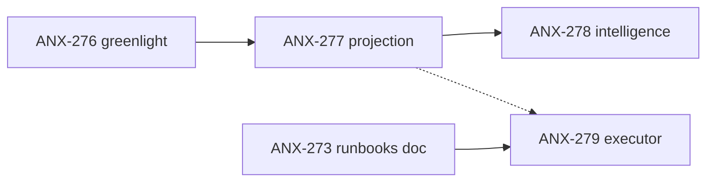

# P2 slices — critérios de aceite

**Bloqueio:** ANX-276 Owner greenlight · **Design:** `brain/project-docs/specs/006-product-agent-graph/projection-worker-p2-design.md`

## ANX-277 — Neo4j projection worker (sandbox)

| Campo | Valor |
| --- | --- |
| Owners | graph-executor + graph-critic |
| Dependências | ANX-276, ANX-271 (done) |
| Gates | G0 → G1 → G2 → G3 |

### Inputs

- ADR0005 `decision_status: accepted`
- Schema registry `createProductAgentGraphSchemaRegistry()`
- Padrão inbox: `governance-projector.ts`, `governance-projection-worker.ts`

### Outputs

| Artefato | Path |
| --- | --- |
| Product projector | `backend/modules/graph/src/application/projections/product/product-graph-projector.ts` |
| Agent projector | `backend/modules/graph/src/application/projections/agents/agent-graph-projector.ts` |
| Worker | `backend/apps/workers/src/graph/product-graph-projection-worker.ts` |
| Event contracts | `backend/packages/contracts/src/graph/events/` |
| Tests | `backend/tests/graph/product-graph-projector.test.ts` |
| Env | `ENABLE_PRODUCT_GRAPH_PROJECTION` em `backend/.env.example` |

### Critérios de aceite (todos obrigatórios)

- [ ] Sandbox Neo4j sobe via docker profile `graph-sandbox`
- [ ] 1 evento `work_item.status_changed` → 1 nó `WorkItem` idempotente
- [ ] Reprocessar mesmo `eventId` não duplica nó (inbox ACK)
- [ ] Rebuild from inbox passa (`full-generation-swap`)
- [ ] Labels prefixados `ProductGraph_*` / `AgentGraph_*` — separados do grafo institucional
- [ ] `bun test backend/tests/graph` green
- [ ] G2 Fernanda PASS com blast radius documentado
- [ ] Zero escrita direta sem evento versionado

### Riscos

| Risco | Mitigação |
| --- | --- |
| Neo4j não homologado prod | Sandbox only; flag env |
| Eventos v1 incompletos | Escopo mínimo 3 eventos; expandir em issue filha |

---

## ANX-278 — Product Intelligence runtime FEEDS_BACK

| Campo | Valor |
| --- | --- |
| Owners | Lucas `backend-executor` + Marina `backend-critic` |
| Dependência | ANX-277 done |
| Gates | G3 |

### Critérios de aceite

- [ ] Telemetria PC12 registrada como edge `FEEDS_BACK` no Product Graph
- [ ] 1 ciclo automático: métrica → insight → trigger Discovery (sandbox)
- [ ] Doc: `brain/notes/anxionos-product-intelligence-loop.md` atualizado com evidência runtime
- [ ] G3 Edu PASS com comando reproduzível

---

## ANX-279 — Self-healing runbook executor (staging) — **done G7**

| Campo | Valor |
| --- | --- |
| Owners | Rafael `infra-executor` + Beatriz `infra-critic` |
| Dependências | ANX-273 (doc done), G4 Isa review |
| Gates | G4 → G3 |

### Critérios de aceite

- [x] 1 runbook P1 executado em staging autorizado (não prod)
- [x] Evidência: log estruturado + rollback documentado
- [x] G4 Isa PASS antes de ativar
- [x] Doc: `brain/notes/anxionos-self-healing-runbooks.md` com seção runtime

**Oráculos:** `node --test .cursor/orchestration/tests/self-healing-executor.test.mjs` (6/6); `npm run orchestration:self-healing -- run --runbook sh-rb-002-http-5xx --issue ANX-279 --environment staging --simulate --json`

## Sequência

