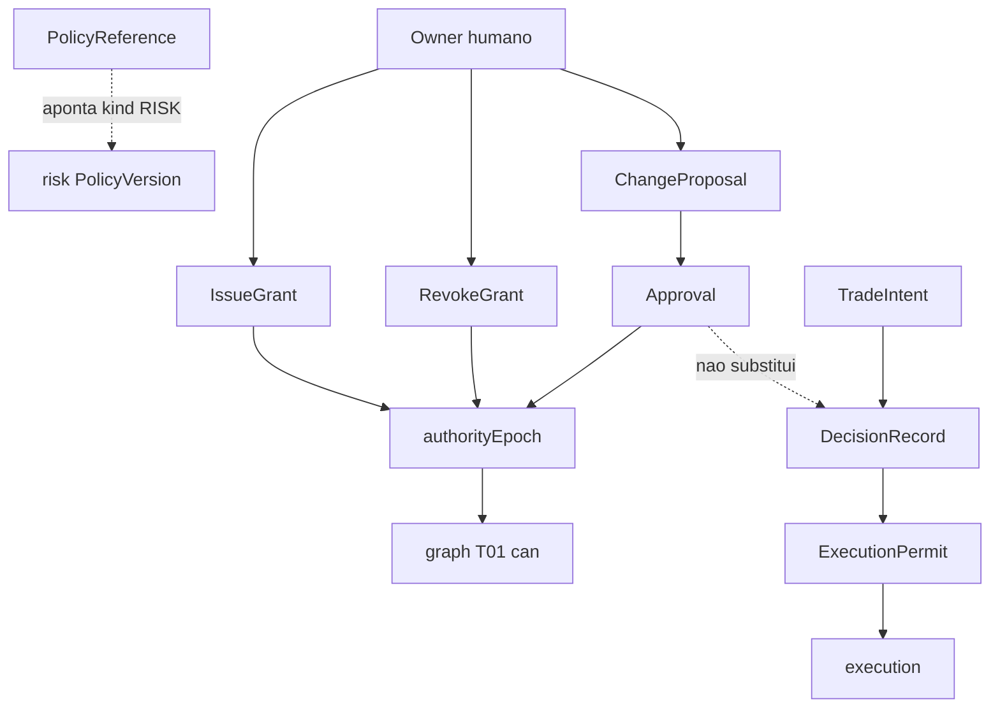
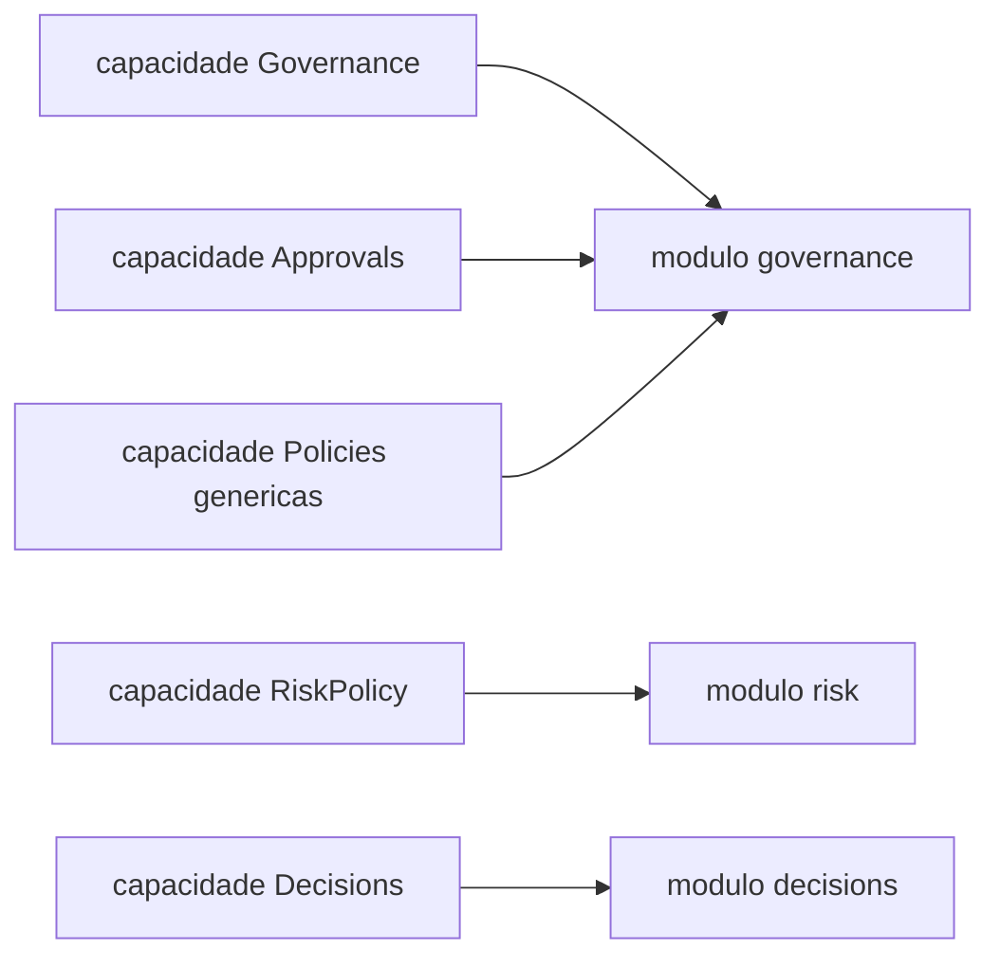
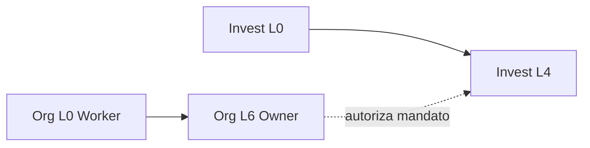

# PC 01 Governance — debate e diagramas (M01)

**Unidade serial:** PC 01 · **Issue:** ANX-351 · **Status documental:** fechado (2026-09-10)
**Owner fisico:** `governance` (ADR0002). Nao criar pastas `approvals` nem `policies`.

Relacionadas: [atlas](./anxionos-diagram-atlas.md) · [spec capacidade](./anxionos-governance-capability-spec.md) · [alinhamento](./anxionos-product-company-module-alignment.md).

> [!IMPORTANT]
> Decisao CTO 2026-09-10 (fecha a pergunta do M01): **nao criar** modulos fisicos `approvals` nem `policies`. Taxonomia Owner de 30 nomes = mapa de capacidades. Rejeitado: (A) 30 pastas — viola ADR0002. (B) RiskPolicy dentro de governance — viola D-GOV-002 e spec 003 (authority vs risk).

## Product Graph — ownership de nos (decisao CTO)

| No / agregado | Owner fisico | Nao e |
| --- | --- | --- |
| Approval, ChangeProposal, PolicyReference generico | `governance` | pasta approvals / policies |
| PolicyVersion kind=RISK (RiskPolicy, limites, kill switch) | `risk` | corpo de politica em governance |
| DecisionRecord, TradeIntent, ExecutionPermit | `decisions` | Approval institucional |

Cita: [R02 fronteiras](./../docs/orchestration/modules/governance/R02-boundaries.md) · [R08 D-GOV-001/002](./../docs/orchestration/modules/governance/R08-decision-log.md).

## O modulo POSSUI (in)

- Grant versionado, Delegation com escopo temporal, Mandate de agente
- Approval e ChangeProposal (SOFTWARE ou INSTITUTIONAL)
- `authorityEpoch` monotonico por scope (organization / agency)
- PolicyReference: ponteiro `policyId` + `kind` + `version` — sem copiar corpo
- Facade T01 via port publico (epoch local + delegacao ao kernel `graph`)
- Eventos `ownerDomain: governance` (`.v1`)

## O modulo NAO POSSUI (out)

| Item | Dono |
| --- | --- |
| Principal, sessao Better Auth | `identity` |
| Agency, Membership, convite | `organizations` |
| Cypher / traverse T01 a T20 | `graph` |
| RiskPolicy, RiskCheck, kill switch, limites | `risk` |
| DecisionRecord, TradeIntent, ExecutionPermit final | `decisions` |
| Snapshot / SimulationRun | `simulation` |
| Ordens, fills | `execution` / `accounting` |

## Non-goals (esta unidade documental)

- Nao abrir ADR de 24o modulo (`approvals`, `policies`, ou `adapter-gateway` como context ADR0002).
- Nao misturar Approval institucional com DecisionRecord de investimento.
- Nao implementar enforcement cross-risk de PolicyReference nesta fase (D-GOV-010).
- Nao colapsar Authority Levels L0-L6 (org / Product Company) com autonomia de investimento L0-L4.

## Diagrama — fronteira authority vs risk vs decisions

## Diagrama — taxonomia Owner vs pasta fisica

## Dois eixos de autoridade (ANX-349)

Enums **separados**; nao colidir no mesmo campo sem ADR.

| Eixo | Escala | Onde vive | Uso |
| --- | --- | --- | --- |
| Authority Levels (Product Company / org virtual) | L0 Worker a L6 Owner | grants / requiredAuthority organizacional | quem pode aprovar ChangeProposal, release, politica institucional |
| Autonomia de investimento | L0 a L4 | spec 003 / 004, Mandate de agente, ANX-137 | o que um agente pode fazer com capital / TradeIntent |

Mapeamento operacional (nao e identidade de enum):

- Org L0-L1 executam tarefas; nao emitem Grant.
- Org L4-L5 (CTO/CEO agentes) resolvem Approval dentro da politica; L6 veta.
- Invest L0-L4 so sao validos se Mandate + Grant + epoch + RiskCheck permitirem — `decisions` consome, `governance` nao emite ExecutionPermit.

## D-GOV-010

**Disposicao M01 (ANX-350):** permanece **deferido ate P06** (ciclo financeiro / risk runtime). v1 de governance persiste PolicyReference como ponteiro; **nao** enforce o corpo RISK. Enforcement do kill switch e limites e `risk`. Sem v1 minima cross-module neste serial documental.

Fonte: [R08](./../docs/orchestration/modules/governance/R08-decision-log.md).

## Spec dedicada (ANX-348 / gap R01)

R01 registrou ausencia de spec SDD numerada so para governance. Esta unidade nao inventa um 24o context: a spec de **capacidade** esta em [anxionos-governance-capability-spec](./anxionos-governance-capability-spec.md). Spec SDD em `project-docs/specs/` continua follow-up de implementacao (nao bloqueia fechar PC 01).

## Questoes abertas

1. Pastas fisicas Approvals/Policies? **Fechada** — nao criar.
2. Enforcement PolicyReference cross-risk — **aberta operacionalmente**, disposicao = P06 (D-GOV-010).
3. Contratos `packages/contracts/src/governance/` — fora deste serial documental; issue de implementacao.

## Fontes

- [R01 contexto](./../docs/orchestration/modules/governance/R01-context.md)
- [R02 fronteiras](./../docs/orchestration/modules/governance/R02-boundaries.md)
- [R08 decision log](./../docs/orchestration/modules/governance/R08-decision-log.md)
- [atlas sistema](./anxionos-diagram-atlas.md)
- [atlas 23 modulos](./anxionos-diagram-atlas-modules.md)
