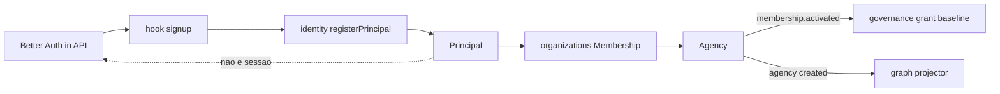
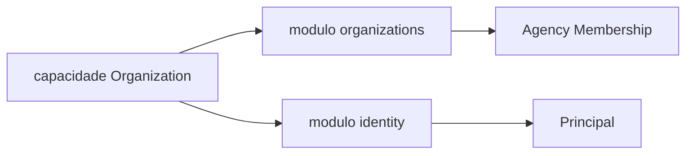

# PC 02 Organization — debate e diagramas (M02)

**Unidade serial:** PC 02 · **Issue:** ANX-352 · **Status documental:** fechado (2026-09-10)
**Owners fisicos:** `organizations` + `identity` (agrupamento conceitual da taxonomia Owner; **duas pastas ADR0002**).
**Predecessor:** [PC 01 Governance](./anxionos-pc01-governance-debate.md) (ANX-351 in_review).

> [!NOTE]
> Capacidade Owner **Organization** nao cria pasta unica. Membership/Agency/Owner → `organizations`. Principal institucional → `identity`. Sessao Better Auth → `apps/api` (composition root), nao o domain identity.

## O que POSSUI

### identity

- Principal (ancora humana; `authUserId` 1:1; status active/suspended)
- ServicePrincipal (sketch P02+; nao e pasta nova)
- Journal/outbox `ownerDomain: identity`
- Queries `getPrincipalById` / `getPrincipalByAuthUserId`

### organizations

- Agency, Owner (vinculo titular), Membership (convite, papeis, revogacao)
- Organization opcional v1 (agrupa Agencies do mesmo titular)
- OnboardingState no agregado Agency
- Eventos membership.activated / revoked → consumers governance

## O que NAO POSSUI (out)

| Item | Dono |
| --- | --- |
| Grant, Mandate, Approval, authorityEpoch | `governance` |
| Handler `/api/auth/*`, cookies, tabelas BA | `apps/api` |
| Invoice / assinatura | `billing` |
| Agent runtime / CEO blueprint | `agents` |
| Secrets de provider | `connections` + secrets |
| Cypher / nos Neo4j | `graph` (projecao) |
| ALLOW/DENY efetivo | `governance` + graph T01 |

## Non-goals

- Nao fundir `identity` e `organizations` numa pasta `organization`.
- Nao persistir `authUserId` em membership, grants ou payloads downstream.
- Nao decidir permissao sensivel em organizations (so publica fatos).
- Nao criar 24o modulo para "Company Settings".

## Diagrama — onboarding e fronteiras

## Diagrama — taxonomia vs pastas

## Questoes abertas

1. ServicePrincipal credencial (JWT vs mTLS) — **aberta** no R03 identity; nao bloqueia fechar PC 02 conceitual.
2. Organization agrupadora v1 vs so Agency — **proposta R02:** opcional; baseline um Owner por Agency.
3. Cascata `principal.suspended` → invalidar sessao BA — **aberta operacionalmente** (worker api vs consumer).

## Fontes

- [organizations R02](./../docs/orchestration/modules/organizations/R02-boundaries.md)
- [identity R02](./../docs/orchestration/structure-debate/identity/R02-boundaries.md)
- [alinhamento](./anxionos-product-company-module-alignment.md)
- [atlas modulos](./anxionos-diagram-atlas-modules.md)
