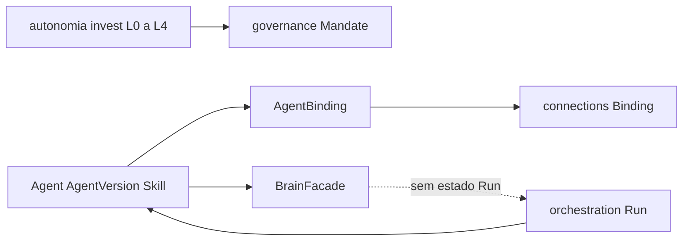

# PC 03 Agents — debate e diagramas (M03)

**Unidade serial:** PC 03 · **Issue:** ANX-353 · **Status documental:** fechado (2026-09-10)
**Owner fisico:** `agents` (ADR0002) · Predecessor: [PC 02](./anxionos-pc02-organization-debate.md).

Personas Cursor (Renata, Lucas) **nao** sao os agentes institucionais deste modulo. Ver SCOPE do framework.

## O modulo POSSUI (in)

- Agent (identidade estavel no tenant: CEO, operador, worker)
- AgentVersion (snapshot imutavel apos publish; mutacao = nova versao)
- Skill declarativa + bindings de skill (catalogo, nao secrets)
- AgentBinding Agent a Agency/scope; hierarquia TREE/CIRCULAR via governance
- BrainFacade de invocacao (sem estado de Run)
- Autonomia de investimento L0-L4 no Mandate/binding — eixo distinto dos Authority Levels L0-L6 ([M01](./anxionos-pc01-governance-debate.md))

## O modulo NAO POSSUI (out)

| Item | Dono |
| --- | --- |
| Goal, Task, Run, lease, heartbeat | `orchestration` |
| Grant, Approval, authorityEpoch | `governance` |
| Nos Agent no Neo4j | `graph` (projecao) |
| Provider keys, OAuth, inference.invoke | `connections` |
| Documentos, memoria longa, RAG | `knowledge` |
| ExecutionPermit / TradeIntent | `decisions` |

## Non-goals

- Nao criar pasta `agent-teams` (PC 04 = orchestration + organizations).
- Nao criar pasta `capabilities` (PC 05 = manifest transversal).
- BrainFacade nao persiste Run; nao substitui orchestration.
- AgentVersion nunca carrega secrets de provider.

## Diagrama

## Questoes abertas

1. Promotion AgentVersion a producao exige evaluation (P08) — **proposta R02**, nao bloqueia PC 03.
2. Relacao Skill institucional vs skill Cursor do framework — **fechada:** namespaces distintos.

## Fontes

- [R02 agents](./../docs/orchestration/structure-debate/agents/R02-boundaries.md)
- [alinhamento](./anxionos-product-company-module-alignment.md)
- [atlas modulos](./anxionos-diagram-atlas-modules.md)
