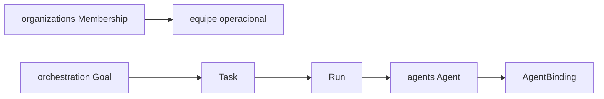

# PC 04 Agent Teams — debate e diagramas (M04)

**Unidade serial:** PC 04 · **Issue:** ANX-354 · **Status documental:** fechado
**Owners:** `orchestration` (Goal/Task/Run) + `organizations` (Membership/Agency). **Nao** pasta `agent-teams`.
Predecessor: [PC 03](./anxionos-pc03-agents-debate.md).

## POSSUI (capacidade)

- Equipe operacional = Membership + papéis em `organizations`
- Trabalho da equipe = Goal / Task / Run / lease / heartbeat em `orchestration`
- Hierarquia TREE/CIRCULAR de agentes: Mandate em `governance` + AgentBinding em `agents`

## NAO POSSUI

- Identidade Agent/Skill — `agents`
- Grants ALLOW/DENY — `governance` + graph T01
- Inferência — `connections`

## Non-goals

- Nao criar modulo fisico Agent Teams.
- Nao tratar personas Cursor como Agent institucional.

## Questoes abertas

1. Roster de 8 personas debate vs Agent nodes de produto — namespaces distintos; registry em notes/agent-graph-registry.

## Fontes

- [orchestration R03](./../docs/orchestration/structure-debate/orchestration/R03-domain-sketch.md)
- [agents R02](./../docs/orchestration/structure-debate/agents/R02-boundaries.md)
