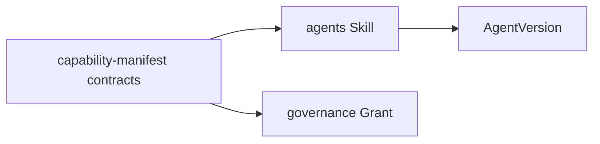

# PC 05 Capabilities — debate e diagramas (M05)

**Unidade serial:** PC 05 · **Issue:** ANX-355 · **Status documental:** fechado
**Owner:** transversal — `agents` (Skill/capabilities no AgentVersion) + `packages/contracts` capability-manifest. **Sem pasta `capabilities`.**

## POSSUI

- Manifesto de capability versionado em contracts
- Skills declarativas referenciando contratos (agents)
- Grants apontam capability/resource (governance consome o id, nao o catalogo)

## NAO POSSUI

- Runtime de ferramenta/MCP — `connections`
- Autorizacao efetiva — `governance` + graph
- Catalogo de modelos — `connections`

## Non-goals

- ADR0003 `tools` permanece proposta; nao vira 24o modulo por esta unidade.

## Questoes abertas

1. Aceite ADR0003 tools — **aberta**; nao cria pasta nesta serial.

## Fontes

- [alinhamento](./anxionos-product-company-module-alignment.md)
- [PC 03](./anxionos-pc03-agents-debate.md)
