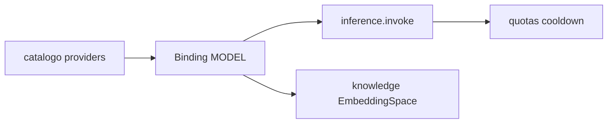

# PC 06 Models — debate e diagramas (M06)

**Unidade serial:** PC 06 · **Issue:** ANX-356 · **Status documental:** fechado
**Owner fisico:** `connections` (catalogo providers, Binding MODEL). **Nao** pasta `models`.

## POSSUI

- Catalogo de providers/modelos
- ConnectionBinding kind=MODEL versionado
- Quotas, cooldown, usage de inferencia

## NAO POSSUI

- AgentVersion / Skill — `agents`
- EmbeddingSpace / pgvector — `knowledge` (usa binding MODEL)
- Secrets em claro — packages/secrets
- REAL_EXECUTION / venue live — proibido v1 (R02 connections)

## Non-goals

- Nao criar modulo `models`.
- Nao conceder autoridade de trading via modelo.

## Questoes abertas

1. REAL_EXECUTION — **fechada v1:** proibido; reabrir so com ADR + G7.

## Fontes

- [connections R02](./../docs/orchestration/modules/connections/R02-boundaries.md)
