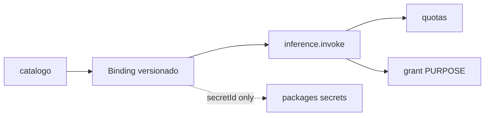

# PC 07 Connections — debate e diagramas (M07)

**Unidade serial:** PC 07 · **Issue:** ANX-357 · **Status documental:** fechado
**Owner fisico:** `connections` (transversal). Inferencia pertence aqui, nao a um 24o modulo.

## POSSUI

- ProviderSubscription, AIAccount, ConnectionBinding
- Quotas, leases, cooldowns, usage records
- Adapters de inferencia / MCP / APIs no limite externo governado
- Kinds v1: MARKET_DATA, SIMULATION, PAPER_ACCOUNT, MODEL, KNOWLEDGE, TASKBOARD

## NAO POSSUI

- REAL_EXECUTION / LIVE_TRADING — proibido v1
- Invoice plataforma — `billing`
- Ledger capital — `accounting` / `execution`
- Grants — `governance`
- adapter-gateway como context ADR0002 — **nao** (ADR0006 infra)

## Non-goals

- Nao escrever secrets em DTO, evento, prompt ou Neo4j.
- Nao criar pasta Integrations separada (PC 30 aponta de volta aqui).

## Questoes abertas

1. Migracao 9Router live → deferred — operacional P05, nao bloqueia esta unidade documental.

## Fontes

- [connections R02](./../docs/orchestration/modules/connections/R02-boundaries.md)
