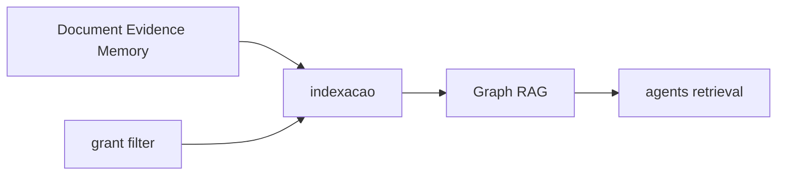

# PC 08 Knowledge — debate e diagramas (M08)

**Unidade serial:** PC 08 · **Issue:** ANX-358 · **Status documental:** fechado
**Owner fisico:** `knowledge`. Memory (PC 27) e o mesmo owner — nao pasta `memory`.

## POSSUI

- Document / DocumentVersion, Chunk, IndexGeneration
- EmbeddingSpace + pgvector
- Memory (working/episodic/semantic/procedural)
- Evidence + ContextManifest

## NAO POSSUI

- BrainFacade / AgentVersion — `agents`
- Traverse T05/T10 — `graph`
- Binding MODEL de embedding — `connections` (knowledge define o space)
- Run/checkpoint — `orchestration` (so refs em Evidence)
- ACL/grant — `governance` filtra **antes** do topK

## Non-goals

- Retrieval nunca promove permissao.
- Nao criar pasta Memory.

## Questoes abertas

1. RLS PG em knowledge — defer P09 (R02).

## Fontes

- [knowledge R02](./../docs/orchestration/modules/knowledge/R02-boundaries.md)
