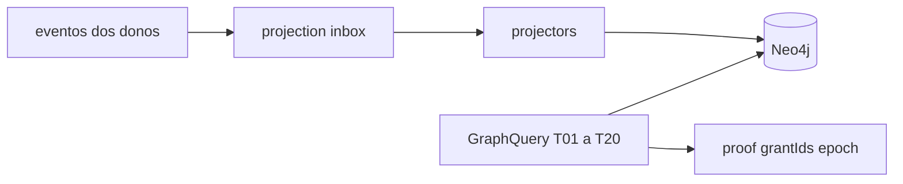

# PC 09 Graph — debate e diagramas (M09)

**Unidade serial:** PC 09 · **Issue:** ANX-359 · **Status documental:** fechado
**Owner fisico:** `graph` (projecao Neo4j). **Nao** ledger de capital, grants ou ordens.

## POSSUI

- Inbox de projecao, projectors, rebuild
- Queries T01-T20, proof grantIds/epoch
- Product Graph / Agent Graph como **modelo de relacao** sobre owners existentes

## NAO POSSUI

- Escrita autoritativa de Grant, Order, Allocation, DecisionRecord
- Cypher ad hoc em outros modulos (kernel so aqui)
- adapter-gateway como 24o context

## Non-goals

- graph projeta; PostgreSQL permanece autoritativo ([ADR0004](./anxionos-diagram-atlas.md)).

## Questoes abertas

1. Cobertura runtime de todos os nos da taxonomia 30 — incompleta; nao autoriza novos writers.

## Fontes

- [atlas](./anxionos-diagram-atlas.md) · [alinhamento](./anxionos-product-company-module-alignment.md)
