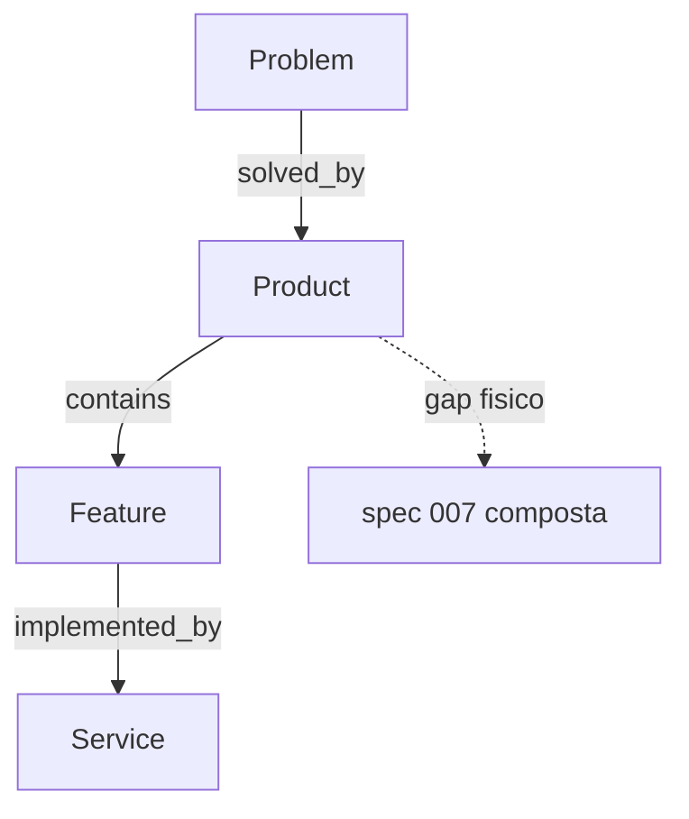

# PC 10 Products — debate e diagramas (M10)

**Unidade serial:** PC 10 · **Issue:** ANX-360 · **Status documental:** fechado (capacidade composta)
**Owner:** spec 007 composta — **sem modulo fisico `products`.** Marketplace (PC 29) compartilha o mesmo gap.

## POSSUI (conceito)

- Cadeia Product Graph: Problem → Product → Feature → Service → Code (projecao `graph`)
- Definition/discovery documental em OKF / lifecycle PC

## NAO POSSUI

- Pasta `backend/modules/products`
- Ledger de SKU/preco (billing/partners cobrem fatura e comissao, nao catalogo de produto institucional)

## Non-goals

- Nao scaffoldar products. Implementacao so apos Product Definition + ADR.

## Questoes abertas

1. Spec 007 aceite e ownership de persistencia — **aberta para implementacao**; unidade documental fechada como gap consciente.

## Fontes

- [alinhamento](./anxionos-product-company-module-alignment.md)
- [atlas cadeia Product Graph](./anxionos-diagram-atlas.md)
