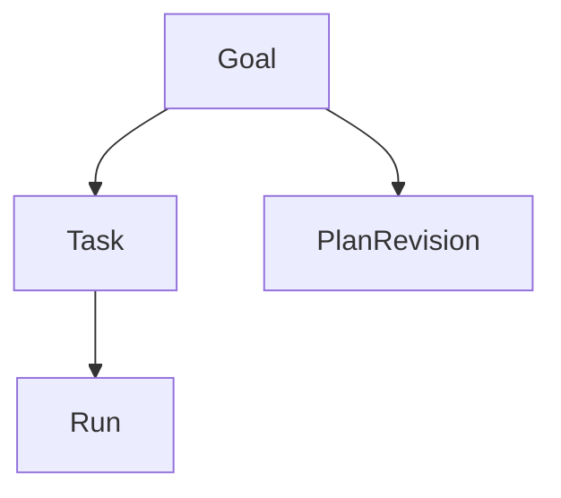

# PC 11 Projects — debate e diagramas (M11)

**Unidade serial:** PC 11 · **Issue:** ANX-361 · **Status documental:** fechado
**Owner fisico:** `orchestration` (Goal + ancestry). **Nao** pasta `projects`.

## POSSUI

- Goal decomponivel, parentGoalId, PlanRevision
- Ancestry em Task/Run

## NAO POSSUI

- Agency/Membership — `organizations`
- Agent identity — `agents`
- Issue Dashi ANX-* como fonte de verdade de produto — board e espelho, estado autoritativo e Goal/Task

## Non-goals

- Nao duplicar taskboard como ledger.

## Fontes

- [orchestration R03](./../docs/orchestration/structure-debate/orchestration/R03-domain-sketch.md)
