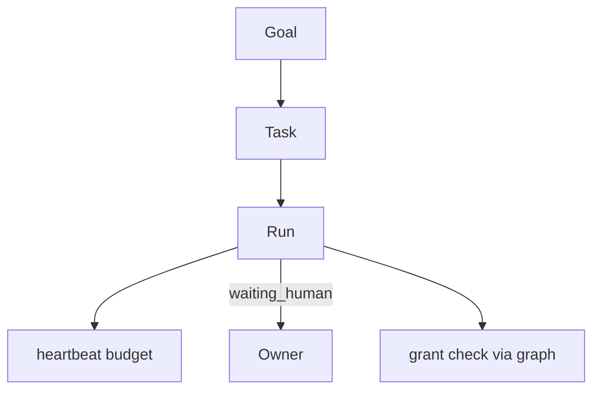

# PC 12 Tasks — debate e diagramas (M12)

**Unidade serial:** PC 12 · **Issue:** ANX-362 · **Status documental:** fechado
**Owner fisico:** `orchestration` (Task, Run, lease, heartbeat, GateBinding).

## POSSUI

- Task, Run, TaskLease, RunHeartbeat
- GateBinding G0-G7
- waiting_human / checkout

## NAO POSSUI

- Skill/AgentVersion — `agents`
- T01 ALLOW — `governance` + `graph`
- Evidence persistida — `knowledge` (so runId)

## Non-goals

- PC 11 e PC 12 compartilham o mesmo modulo; nao fundir conceitos Goal vs Task.

## Fontes

- [orchestration R03](./../docs/orchestration/structure-debate/orchestration/R03-domain-sketch.md)
