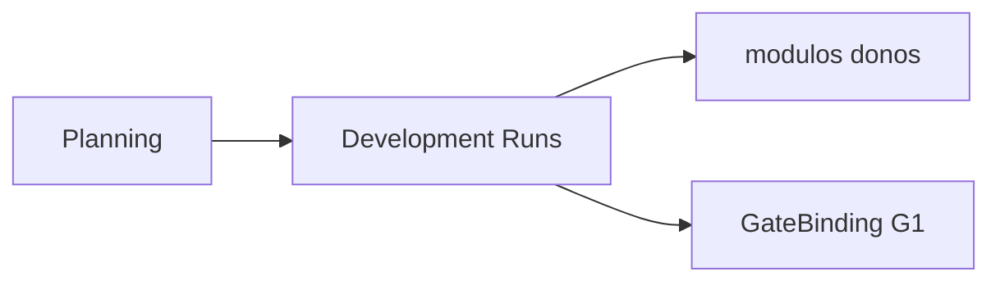

# PC 13 Engineering — debate e diagramas (M13)

**Unidade serial:** PC 13 · **Issue:** ANX-363 · **Status documental:** fechado
**Owner:** capacidade organizacional composta — `orchestration` + modulos executores. **Sem pasta `engineering`.**

## POSSUI

- Ciclo DEV do Product Company (lifecycle)
- Runs de implementacao orquestrados
- Executores por dominio (nao um modulo unico)

## NAO POSSUI

- Codigo-fonte como agregado (PC 14)
- Gates G2-G5 como estado de produto — framework Cursor + GateBinding

## Non-goals

- Nao criar Engineering como context ADR0002.

## Fontes

- [lifecycle](./anxionos-ai-product-company-lifecycle.md)
