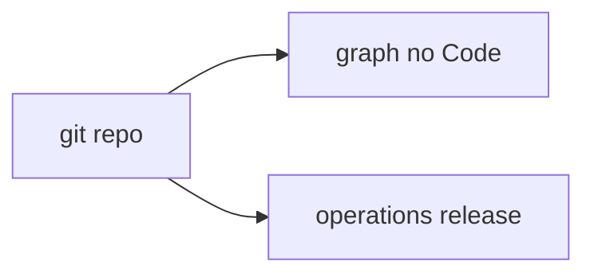

# PC 14 Code — debate e diagramas (M14)

**Unidade serial:** PC 14 · **Issue:** ANX-364 · **Status documental:** fechado
**Owner:** artefatos de repositorio + `operations` (catalogo de deploy). **Sem modulo `code`.**

## POSSUI

- Codigo no git como artefato (nao agregado PG)
- Referencia no Product Graph (no Code projetado)
- Catalogo/recovery em operations quando o artefato e release

## NAO POSSUI

- Pasta `backend/modules/code`
- Autoria institucional de Grant via commit

## Non-goals

- Nao persistir source tree no PostgreSQL de dominio.

## Fontes

- [alinhamento](./anxionos-product-company-module-alignment.md)
