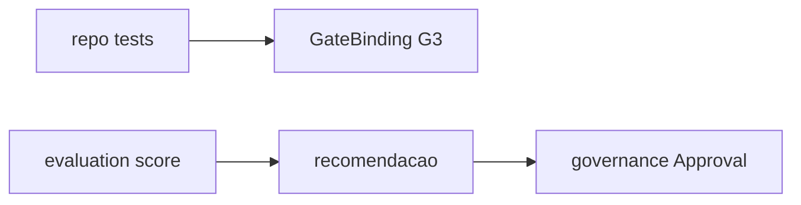

# PC 15 Testing — debate e diagramas (M15)

**Unidade serial:** PC 15 · **Issue:** ANX-365 · **Status documental:** fechado
**Owners:** `evaluation` + arvore `backend/tests` / `frontend/e2e`. **Sem pasta `testing`.**

## POSSUI

- Suites de modulo/contrato/integracao (repo)
- SimulationRun / backtest / score / certificado em `evaluation`
- Gate G3 como GateBinding (orchestration)

## NAO POSSUI

- Approval de promocao sozinho — `governance` ResolveApproval
- Mock em caminho de producao (politica AGENTS.md)

## Non-goals

- Nao criar modulo testing.

## Fontes

- [atlas evaluation](./anxionos-diagram-atlas-modules.md)
