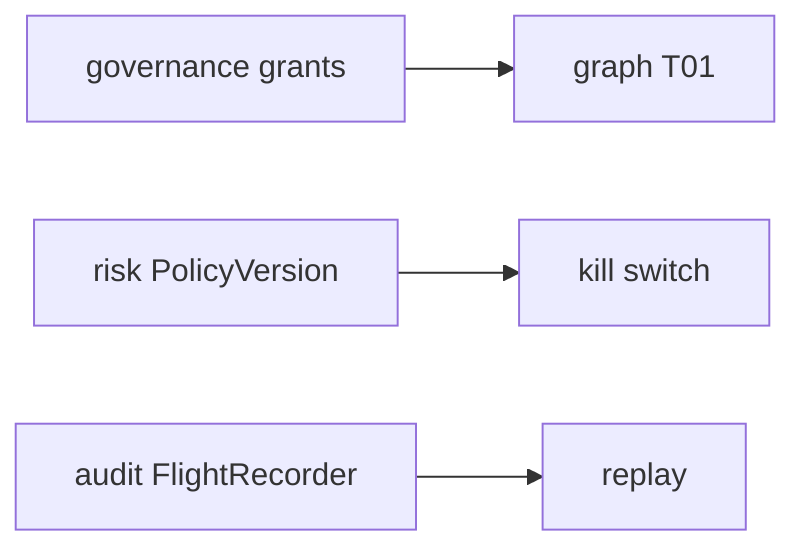

# PC 16 Security — debate e diagramas (M16)

**Unidade serial:** PC 16 · **Issue:** ANX-366 · **Status documental:** fechado
**Owners:** `risk` + `governance` + `audit` + spec 008 tenancy. **Sem pasta `security`.**

## POSSUI

- Isolamento tenant (spec 008) nas fronteiras de API
- Grants/epoch (`governance`)
- RiskPolicy / kill switch (`risk`)
- Flight recorder / integrity (`audit`)
- Gate G4 como processo, nao modulo

## NAO POSSUI

- Secrets store — packages/secrets + connections
- Pasta security

## Non-goals

- Nao colapsar Security com RiskPolicy (D-GOV-002).

## Fontes

- [M01](./anxionos-pc01-governance-debate.md)
