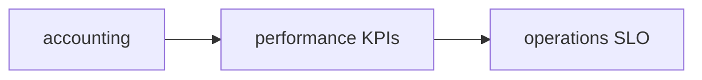

# PC 19 Observability — debate e diagramas (M19)

**Unidade serial:** PC 19 · **Issue:** ANX-369 · **Status documental:** fechado
**Owners:** `performance` + `operations` + package observability. **Sem pasta `observability`.**

## POSSUI

- KPIs / p95 em performance (derivados de accounting/eval)
- SLO / probes em operations
- Logs/traces no package, nao em modulo de dominio

## NAO POSSUI

- Ledger PnL autoritativo — `accounting`
- Kill switch — `risk`

## Non-goals

- Não criar pasta `observability`.
- Package observability não vira módulo físico.

## Fontes

- [atlas performance](./anxionos-diagram-atlas-modules.md)
